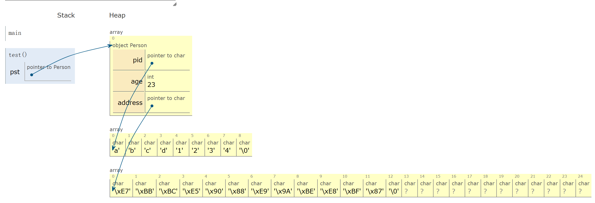
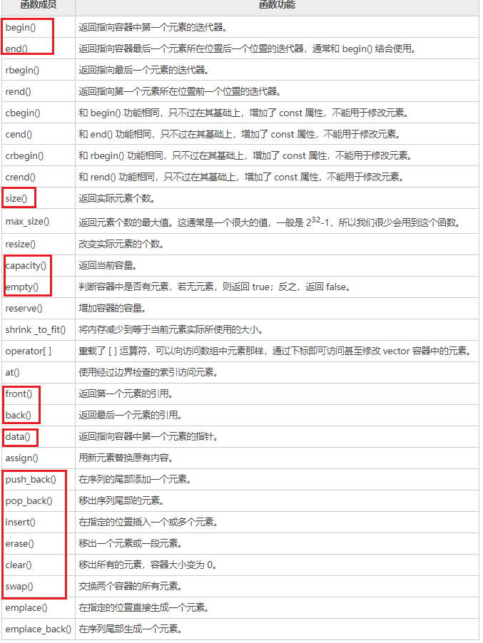
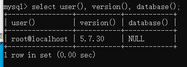
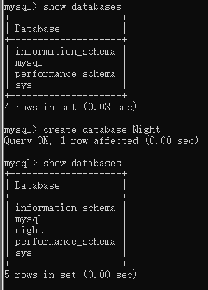

<!--more-->
寻思着要好好学一学所以写笔记是最好的途径


  ## 目录

- 指针的高级应用

  

- C++11中的Lambda表达式、匿名函数

  

- STL·vector模板

  

- C++排序问题：qsort

  

- Qt5.9

  

- MySQL数据库（x32 5.7.30）

  

- 项目实现

  
  

# Day 1

  

## 练习一

  

**从键盘上输入一个人的年龄并输出**

  

```cpp

void age(){

    int age;

    cout << "enter an age: ";

    cin >> age;

    cout << "this age: " << age << endl;

}

```

  

**问题：**

缺少对输入数据的有效性的检验，具体来说，只想到上限是可以无限的（神奇物种在哪里），没有考虑到下限——-1岁？

  

进一步修改

  

```cpp

void age(){

    int age;

    cout << "enter an age: ";

    cin >> age;

    if(age < 0){

        cout << "Wrong!" << endl;

    }

    //如果加上else语句，在出现错误之后就只会输出上面的Wrong。

    cout << "this age: " << age << endl;

}

```

  
  

当声明多个变量时，无论是否属于同一类型（简单变量或指针变量或数组），一个变量占一行，如果变量没有有效值，应赋相应类型的零值。数组则是对其中每一个元素都赋零值。

  

举例：

  

```cpp

int n, i ,j = 0;

int a[100];

  

//转变为

  

#define MAX 100

int n = 0;

int i = 0;

int j = 0;

int array[MAX] = {0};

  

//higher

#define MAX 100

int n{0};

int i{0};

int j{0};

int array[MAX]{0};

  

```

  

## 练习二

  

**问题**：有一个数组，用来存放1-9之间的数字，计9个元素，int numbers[9]={4,1,3,2,6,5,8,9,};从1~9中，将数组中的7找出来；

  

```cpp

//method 1：通过计算完整10个数之和再减去数组中数字之和得到

void test(){

    int sum1 = 0;

    int sum2 = 0;

    int numbers[9] = {4, 1, 3, 2, 6, 5, 8, 9};

  

    for(int i = 0; i < 10; ++i){

        sum1 += i;

    }

  

    for(int i = 0; i < 9; ++i){

        sum2 += numbers[i];

    }

  

    int result = sum1 - sum2;

  

    cout << "result->" << (result) << endl;

}

  

//method 2:利用异或运算——相同数字结果为0，不同数字结果为其本身

void test(){

    int result = 0;

    int numbers[9] = {4, 1, 3, 2, 6, 5, 8, 9};

  

    for(int i = 0; i < 10; ++i){

        result ^= i;

    }

    for(int i = 0; i < 9; ++i){

        result ^= numbers[i];

    }

  

    cout << "result->" << (result) << endl;

}

```

  

## 练习三

  

**问题**：

有一个正整数12345，求它的二进制表示；

- 1、转换的概念：对于将10进制到N进制的转换（值大小不变，只是换种方式表示）；

- 2、转换方式：除以N，取余，反写；

- 3、具体；

    - i.数组方式；

    - ii.自定义数据结构方式；

    - iii.预定义的STL模板方式；stack

        - 1.push，进栈、入栈、压栈；

        - 2.top，显示头元素；

        - 3.pop，出栈，弹栈；

        - 4.empty，判断栈是否为空；

    - iv.思路：将余数入栈，值缩小2倍；循环直到值为0；当栈非空，不断弹栈，得到结果；

  

```cpp

void test(){

    int number = 12345;

  

    cout << "number->" << (number) << endl;

    stack<int>bin;

    while(number){

        int mod = number % 2;

        bin.push(mod);

        number /= 2;

  

    }

  

    while(!bin.empty()){

        cout << setw(2) << bin.top();

        bin.pop();

    }

  

    cout << endl;

}

  

```

  
  

## 练习四

  

**问题**：

正整数12345转换为16进制

  

```cpp

void test(){

    int number = 12345;

  

    cout << "number->" << (number) << endl;

    stack<char>bin;

    while(number){

        int mod = number % 16;

        if(mod < 10){

            bin.push(mod + 48);

        }

        else{

            bin.push(mod + 'a' - 10);

        }

  

        number /= 16;

  

    }

  

    while(!bin.empty()){

        printf("%-2c", bin.top());

        bin.pop();

    }

  

    cout << endl;

}

```

  

- **第一个 while 循环**：在这个循环中，程序通过不断取十六进制数的每一位，并将其压入栈 bin 中。具体步骤如下：

取 number 除以 16 的余数（mod），并根据余数的大小压入相应的字符到栈中。余数小于 10 时，直接将其加上字符 '0'（ASCII码值为48）；余数大于等于 10 时，将其转换为对应的十六进制字符（'a' - 10）。

  

- 将 number 除以 16，继续处理高位的十六进制数。

  

这样，栈中的元素顺序表示了该十进制数的十六进制表示的**逆序**。

  

- **第二个 while 循环**：在这个循环中，程序将栈中的元素依次弹出并输出，以还原正确的十六进制表示。通过 bin.top() 获取栈顶元素，然后弹出栈顶元素。

  

## auto

  

>是C++11引入的关键字，用于自动推导变量的类型。使用 auto 可以让编译器根据初始化表达式的类型推断出变量的类型，从而简化代码书写。

  

例子一：

  

```cpp

auto x = 42;       // x 的类型将被推断为 int

auto y = 3.14;     // y 的类型将被推断为 double

auto str = "hello"; // str 的类型将被推断为 const char*

```

  

例子二：

  

```cpp

void test(){

    auto a = 12;

    cout << "typeid(a) ->" << typeid(a).name() << endl;

    auto b = 12L;

    cout << "typeid(b) ->" << typeid(b).name() << endl;

  

}

typeid(a) ->i//int

typeid(b) ->l//long

```

  

## 指针初步

  

**指针**是**指针变量**的简称，从某个角度上说，指针变量与整型变量没有区别；大家都是变量，都有值，值都会放在内存中；

  

既然是变量，它就要保存数据；与整型变量age所表示的整数值不同；指针变量保存的是**地址值**；

  

举个例子：

  

```cpp

void test(){

    int a = 10;

    cout << "a ->" << (a) << endl;

    //a的地址，&是一个符号——取地址

    cout << "&a ->" << (&a) << endl;

  

    //指向a的地址的指针pa，*是一个符号——解引用

    int* pa = &a;

  

    int b = *pa;

    cout << "pa ->" << (pa) << endl;

    cout << "*pa ->" << (*pa) << endl;

    cout << "b->" << (b) << endl;

  

}

  

//结果

a ->10

&a ->0x61fdec

pa ->0x61fdec

*pa ->10

b->10

```

  

### 指针的用途

  

**指向**

  

- 指向*单个变量*

  - 简单变量，内置类型

  - 复杂变量，类或者结构对象

- 指向*数组*

- 指向*函数*

  
  

## 练习五

  

利用下述半成品进行：

  

- 1.将声明的showStudent函数实现

- 将对象stu1进行赋值并输出

  

- 通过指针变量pst向堆区申请内存，并给分量赋值后输出

  

```cpp

struct Student

{

    int id;

    char name;

    int age;

    int scores[3];/* data */

};

  

void showStudent(const Student* stu);

  

void test(){

    Student stu1;

    Student* pst = nullptr;

  

}

  

```

  
  

```cpp

struct Student

{

    int id;

    char name;

    int age;

    int scores[3];/* data */

};

  

void showStudent(const Student* stu);

Student input();

  

void test(){

    Student stu1 = input();

    cout << endl;

    showStudent(&stu1);

    Student* pst = nullptr;

    pst = new Student;

    if(!pst){

        cout << "failed to ask for ram" << endl;

        return;

    }

    *pst = input();

    cout << endl;

    //使用指针和使用非指针的最明显区别：

    showStudent(pst);

  

}

  

//指向结构体的指针stu

void showStudent(const Student* stu){

    if(!stu){

        return;

    }

    cout << stu->name << " " << stu->id << " " << stu->age << " " << stu->scores[0] << " " << stu->scores[1] << " " << stu->scores[2] << endl;

}

  

Student input(){

    Student std;

    cout << " input ID: ";

    cin >> std.id;

    cin.get();//接受键盘缓冲区中遗留的字符（这里是换行符）

    cout << " input name: ";

    cin.getline(std.name, sizeof(std.name));

    cout << "input age: ";

    cin >> std.age;

    cout << " input scores(3): ";

    cin >> std.scores[0] >> std.scores[1] >> std.scores[2];

    return std;

}

  
  
  

int main(){

    test();

    return 0;

}

```

  
  

## C++中的运算符重载

  
  

重载；函数名相同，参数列表不同；只须符合下面一条就是重载；

  

- 1.参数个数不同；

- 2.个数相同，类型不同；

- 3.个数同，类型同，顺序不同；

  
  

因为之前学过，所以贴个例子就行

  

```cpp

#include<iostream>

#include<iomanip>

  

using namespace std;

  

struct Students

{

    int id;

    char name[41];

    int gae;

    int score[3];

};

  

//重载input>>

istream& operator>>(istream& input, Students& stu)

{

    cout << "输入学生ID: ";

    input >> stu.id;

  

    cout << "输入学生姓名: ";

    input.ignore();  

    input.getline(stu.name, 41);

  

    cout << "输入学生年龄: ";

    input >> stu.gae;

  

    cout << "输入学生分数 (3个): ";

    for (int i = 0; i < 3; ++i)

    {

        input >> stu.score[i];

    }

  

    return input;

}

  

//重载output <<

ostream& operator<<(ostream& output, const Students& stu)

{

    output << "学生 ID: " << stu.id << endl;

    output << "学生姓名: " << stu.name << endl;

    output << "学生年龄: " << stu.gae << endl;

    output << "分数: ";

    for (int i = 0; i < 3; ++i)

    {

        output << stu.score[i] << " ";

    }

    output << endl;

  

    return output;

}

  

int main()

{

    Students stu;

  

    cout << "请输入学生信息:" << endl;

    cin >> stu;

  

    cout << "学生信息如下:" << endl;

    cout << stu;

  

    return 0;

}

  

```

  

<hr>

<hr>

  
  

# Day 2

  

## 指针指向数组

  

- 1.**指向静态数组**

  

在栈区中分配内存的数组，这种数组是由编译器自动分配内存，自动回收，整个过程不需要程序员干预，只使用即可；这种数组存活均在栈区中；

  

- 2.**指向动态数组**

  

在堆区存活的数组；需要向堆区中申请内存来存放数组中的所有元素，使用前需要检测内存是否申请成功，使用完后，还需要释放内存，返还堆区；

  

3、在线测试指针指向数组的功能；https://pythontutor.com/visualize.html#mode=edit

  

数组名是一个常量指针，因为一个数组一旦确定，数组名与它所表示的数组永远绑定，其内存区域永不可改!

  
  

## 测试存活于堆区的带指针分量的结构或类

  

这样的结构或类对象，只须活动于内存中，不能写到文件里；

无论C语言还是C++，基本操作中不能将指针指向的数组写入到文件中并取出来；

  

```cpp

#include <iostream>

#include <stack>

#include <cstring>

#include <iomanip>

  

struct Person

{

    char* pid;

    int age;

    char* address;/* data */

};

  
  

void test(){

    Person* pst = nullptr;

    pst = new Person;

  

    if(!pst){

        cout << "failed" << endl;

        return;

    }

  

    pst->age = 23;

    pst->pid = new char[9];

    strcpy(pst->pid, "abcd1234");

  

    pst->address = new char[25];

    strcpy(pst->address. "综合难过");

    cout << endl;

  

    cout << "id: " << pst->pid << endl;

    cout << "age: " << pst->age << endl;

    cout << "addr: " << pst->address << endl;

  

    delete []pst->pid;

    delete []pst->address;

    delete pst;

    pst = nullptr;

}

  

int main(){

    test();

    return 0;

}

```

  



  

如图所示，指针指向的**结构体**以堆(Heap)存在，而堆区的内存必须释放。

  

在C语言或C++中，对于内存的使用遵循一个大的原则：**尽量少使用栈区内存，尽量多使用堆区内存；**

  

## 指针指向函数

  

函数指针就是一个指针变量，用来指向某个函数，也就是保存了这个函数的地址

  

从某个角度上说，函数也是一个指针类型，它和数组一样，也是个不带 * 号的常量指针；在C语言和C++中，只有*两个内置的常量指针*，就是**数组名**和**函数名**；

  
  

## 课堂练习3

  

1和2太重复所以删了。这个题目有趣的是之前好像没见过这种函数定义。

  

**问题**：

有一个函数：`void apply(int *array,int nn,int (*func)(int))`;其中参数1和参数2为一个整型数组和数组的长度，参数3为对数组元素的操作。要求自行提供数据，实现这个函数的以下几个功能；

  

- 1、将每个元素值扩大 2 倍；

  

- 2、将每个元素值缩小 3 倍；

  

- 3、将每个元素值平方；

  

```cpp

#include <iostream>

using namespace std;

  

void apply(int* array, int nn, int (*func)(int, int));

  

int doubleValue(int x, int y){

    return x*2;

}

  

int halveValue(int x, int y){

    return x /3;

}

  

int squareValue(int x, int y){

    return x * x;

}

  

int main(){

    int data[] = {1, 2, 3, 4, 5};

    int size = sizeof(data) / sizeof(data[0]);

  

    cout << "数组： " << endl;

    for(int i = 0; i < size; i++){

        cout << data[i] << " ";

    }

    cout << endl;

  

    cout << "扩大 2倍：" << endl;

    //直接引用函数名，下面两个一样

    apply(data, size, doubleValue);

    for(int i = 0; i < size; i++){

        cout << data[i] << " ";

    }

    cout << endl;

  

    cout << " 缩小 3倍：" << endl;

    apply(data, size, halveValue);

    for(int i = 0; i < size; i++){

        cout << data[i] << " ";

    }

    cout << endl;

  

    cout << "平方：" << endl;

    apply(data, size, squareValue);

    for(int i = 0; i < size; i++){

        cout << data[i] << " ";

    }

    cout << endl;

  

    return 0;

  

}

  

void apply(int* array, int nn, int (*func)(int, int)){

    for(int i = 0; i < nn; i++){

        array[i] = func(array[i], 0);

    }

}

```

不过这个是在原数组基础上覆盖重写，官方版本是：

```cpp

void test();

int main(int argc, char* argv[]){

    cout << endl;

    test();

    cout << endl;

    return 0;

}

  

void apply(int* array, int nn, int(*func)(int));

int two(int elem);

int divideByThree(int elem);

int square(int elem);

  

void apply(int* array, int nn, int (*func)(int)){

    if(!array || nn < 1){

        return;

    }

    for(int i = 0; i < nn; ++i){

        array[i] = func(array[i]);

    }

}

  

int two(int elem){

    return 2*elem;

}

  

int divideByThree(int elem){

    return elem/3;

}

  

int square(int elem){

    return elem*elem;

}

  

using PtrFunc = int (*)(int);

void test(){

    int aa[]{11, 2, 3, 47, 100, 78};

    int nn = sizeof(aa) / sizeof(*aa);

  

    cout << "original:" << endl;

    for(int i = 0; i < nn; ++i){

        cout << setw(5) << aa[i];

    }

  

    cout << endl;

    cout << endl;

  

    string descriptions[]{

        "******  twice ******",

        "******   Three times ********",

        "******   square up ********"

    };

    //简易化

    PtrFunc ff[]{two, divideByThree, square};

    int length = sizeof(ff) / sizeof(*ff);

    for(int i = 0; i < length; ++i){

        apply(aa, nn, ff[i]);

        cout << descriptions[i] << endl;

  

        for(int i = 0; i < nn; ++i){

            cout << setw(5) << aa[i];

        }

  

        cout << endl;

        cout << endl;

    }

}

```

  

这个里面有趣的两个是：

  

- `void apply(int* array, int nn, int(*func)(int));` 是一个函数声明，它声明了一个函数 `apply`，该函数接受一个整数数组 `array`、数组长度 `nn`，以及一个函数指针 `func`，该函数指针指向一个接受整数参数并返回整数的函数。

  

- `using PtrFunc = int (*)(int);` 是一个类型别名的定义。它创建了一个新的类型别名 `PtrFunc`，该别名表示一个指向接受整数参数并返回整数的**函数**的指针类型。

  

在代码中，这两者的关系是，`apply`函数声明使用了函数指针类型，而 `PtrFunc` 是这个类型的别名。你在 `apply` 函数中可以使用 `PtrFunc` 这个别名，使得代码更具可读性，而不必在每次使用该类型时写出完整的函数指针声明。这样的类型别名在提高代码可维护性和可读性方面非常有帮助

  

<br>

  

当数组名作函数参数时，它会自动进行了类型退化，变成了一个普通的指针，不再代表整个数组了

  
  

# Day3

  

## Lambda表达式

  

>一种匿名函数的表达方式，允许coder在代码中嵌入小型的匿名函数。

  

Lambda 表达式可以用于创建函数对象，这在需要一个简短的函数时非常有用。

  

一般语法：

  

```cpp

[capture](parameters) -> return_type {

    // 函数体

}

//capture:捕获列表，用于捕获外部变量

//paramets：参数列表，类似普通函数的参数列表

//return_type：返回类型

  

```

  

大概就是

5+5+5+5+5和5*5的区别，Lambda是后者。

  
  

一个简单的示例：

  

```cpp

auto add = [](int a, int b) -> int {

    return a + b;

};

  

// 使用 Lambda 表达式

int result = add(3, 4);

cout << result;

  

//结果为7

```

  

```cpp

void test(){

  int b = 10;

  auto add =[](int i, float f, double d){

    cout << "*** sum of three ****" << endl;

    return i+f+d

  };

  

  auto rr1 = add(10, 3.45f, 3.1415);

  cout << "rr1 ->" << rr1 << endl;

}

```

  

当一个匿名函数没有参数的时候，小括号可以省略。

  

```cpp

void test(){

  auto af = [](){

    cout << "hello" << endl;

  }

  

  af();

  

  auto bf = []{

    return 120;

  }

  

  cout << "bf()->" << []{

    return 120;

  }() << endl;

  

  af();

}

  

//结果是：

/*hello

bf->120

hello!*/

```

  

<hr>

  
  

- 1.常规的匿名函数；无参和带参的；

  - i.先生成匿名函数；

  - ii.调用匿名函数得到结果；

  - iii.输出匿名函数的调用结果；

- 2、捕获列表能够捕获什么东西？何为捕获？就是使用；

  - i.全局变量；

  - ii.局部变量

  

### 捕获列表

  

#### 只读捕获[=]

  

>Lambda 内部不能修改这些变量的值，但可以访问它们的当前值

  

```cpp

int x = 5, y = 10;

  

auto readOnlyCapture = [=]() {

    //x = 6;就会运行出错

    return x + y;

};

  

int result = readOnlyCapture();

// 在 Lambda 内部不能修改 x 和 y 的值

  

```

  

#### 可读写捕获[&]

  

> Lambda 内部可以修改这些变量的值

  

```cpp

int x = 5, y = 10;

  

auto readWriteCapture = [&]() {

    x++;

    y--;

    return x * y;

};

  

int result = readWriteCapture();

// 在 Lambda 内部可以修改 x 和 y 的值

```

  

#### 全部只读捕获[=]

  

```cpp

int x = 5, y = 10;

  

auto allReadOnlyCapture = [=]() {

    return x + y;

};

  

int result = allReadOnlyCapture();

// 在 Lambda 内部不能修改 x 和 y 的值

```

  

#### 全部可读写捕获[&]

  

```cpp

int x = 5, y = 10;

  

auto allReadWriteCapture = [&]() {

    x++;

    y--;

    return x * y;

};

  

int result = allReadWriteCapture();

// 在 Lambda 内部可以修改 x 和 y 的值

```

  

#### 混合捕获

  

- 只读和可读写[x, &y]

- [=, &x]，除x使用可读写捕获，其余均用自读捕获

- [&, x]，除x用只读捕获，其余用可读写捕获

  
  

```cpp

int x = 5, y = 10;

  

auto specificCapture = [x, &y]() {

    // 在 Lambda 内部不能修改 x 的值

    y++;

    return x * y;

};

  

int result = specificCapture();

  

```

  

<hr>

<hr>

  

一个比较完整的代码test：

  

```cpp

int gg = 10; //全局变量；

void test() {

    cout << "gg -> " << (gg) << endl;

    int hh = 100; //局部变量

    int ii = 10;

    auto af = [ii, hh] { //只读捕获

        gg++;

        return gg + hh * ii;

    };

  

auto rr1 = af();

cout << "rr1 -> " << (rr1) << endl;

cout << "gg -> " << (gg) << endl;

printf("\n");

auto bf = [&ii, &hh] { //可读写捕获

    ii *= 10;

    hh /= 10;

    gg /= 5;

    return gg + hh + ii;

    };

auto rr2 = bf();

cout << "rr2 -> " << (rr2) << endl;

cout << "gg -> " << (gg) << endl;

cout << "ii -> " << (ii) << endl;

cout << "hh -> " << (hh) << endl;

printf("\n");

  

//两个局部变量，一可读，一不可改；

auto cf = [ii, &hh] { //ii只读，hh可读写

    hh++;

    return ii * hh;

    };

auto rr3 = cf();

cout << "rr3 -> " << (rr3) << endl;

printf("\n");

  

//如果说所有局部变量都不可改，捕获列表用 = 表示；

auto df = [=] {

    /*ii++;

    ++hh;*/

    return ii + hh;

    };

auto rr4 = df();

cout << "rr4 -> " << (rr4) << endl;

printf("\n");

  

//如果说所有局部变量都可读写，捕获列表用 & 表示；

auto ef = [&] {

    ii++;

    --hh;

    return ii - hh;

    };

auto rr5 = ef();

cout << "rr5 -> " << (rr5) << endl;

printf("\n");

  

/*

 * 如有100个局部变量，99个可改，1个不可改；ii,hh

 */

auto jj = 3;

auto ff = [&, jj] {

    ++ii;

    hh--;

    //++jj;

    return ii + hh + jj;

    };

auto rr6 = ff();

cout << "rr6 -> " << (rr6) << endl;

printf("\n");

auto gf = [=, &jj] {

    jj *= 10;

    /*++ii;

    hh--;*/

    return ii + hh * jj;

    };

auto rr7 = gf();

cout << "rr7 -> " << (rr7) << endl;

printf("\n");

auto hf = [=](int a, int b) {

    //jj++;

    return a * b + (ii + hh + jj);

    };

auto rr8 = hf(10, 20);

cout << "rr8 -> " << (rr8) << endl;

}

  
  
  

```

  
  
  
  

## 练习

  

**题目**：有如右函数：`void apply(int *array, int nn, int (*func)(int))；`将每个元素扩大 2 倍、和 平方 的功能，用Lambda技术实现；

  

参考代码：

  

```cpp

void apply(int *array, int nn, int (*func)(int));

void showIntegerArray(int *aa, int nn);

void test() {

    int aa[]{11, 2, 3, 100, 55,};

    int nn = sizeof aa / sizeof *aa;

    showIntegerArray(aa, nn);

    printf("\n");

    //如何将扩大2倍的功能用Lambda表达式实现

    apply(aa, nn, [](int elem) {

        return elem * 2;

    });

    showIntegerArray(aa, nn);

    //如何将元素平方的功能用Lambda表达式实现

    apply(aa, nn, [](int elem) {

        return elem * elem;

    });

    showIntegerArray(aa, nn);

}

void showIntegerArray(int *aa, int nn) {

    if (!aa || nn < 1)

        return;

    for (int i = 0; i < nn; ++i) {

        cout << setw(10) << aa[i];

    }

    printf("\n");

}

void apply(int *array, int nn, int (*func)(int)) {

    if (!array || nn < 1) {

        return;

    }

    for (int i = 0; i < nn; ++i) {

        array[i] = func(array[i]);

    }

}

```

  
  

**问题**：基于一维整型数组的 << 运算符重载

  

参考代码：

  

```cpp

#include <iostream>

#include <cstring>  //表示C语言中的string.h

#include <string>  //C++中的string类

#include <iomanip>

using namespace std;

//基于整型一维数组的 << 运算符重载

template<int N>

ostream &operator<<(ostream &out, const int (&raa)[N]) {

    if (!raa || N < 1) {

        return out;

    }

    for (int i = 0; i < N; ++i) {

        out << setw(5) << raa[i];

    }

    out << endl;

    return out;

}

void test();

int main(int argc, char *argv[]) {

    test();  

    return 0;

}

struct Aa {

    int id;

    char name[40];

    friend ostream &operator<<(ostream &out, const Aa &obj) {

        return out << "{" << obj.id << "," << obj.name << "}";

    }

};

void test() {

    double pi = 3.14159; //内置类型

    cout << pi << endl;

    printf("\n");

    Aa aa{1024, "张三 xiao ming"};  //结构对象

    cout << aa << endl;

    printf("\n");

    int array[]{11, 2, 3, 100, 55, 78, 87,};// 数组

    cout << array << endl;

    double dd[]{3.14159, 2.71828, 0.618,};

    cout << dd << endl;

}

```

  

这里值得学习的是`template<int N>`及其运用。

  
  

`template<int N>`是C++中的模板声明语法，表示一个带有一个非类型参数`N`的模板。

在该模板中，`N`是一个int类型的非类型参数，可以在模板实例化时被具体的整数值替代。

  

在`ostream &operator<<(ostream &out, const int (&raa)[N])`中，`N`就是数组raa的数组大小。当你调用这个模板函数时，编译器会根据传递的数组的大小自动替代 `N`。相当方便。

  

<hr>

  

**plus:**依照一维整型的输出运算符重载实现代码，将对于一维双精度类型的数组，进行重载；以便于对实型数组用cout << dd << endl; 进行遍历；

  

```cpp

#include <iostream>

using namespace std;

template<int N>

ostream &operator<<(ostream &out, const double (&raa)[N]) {

    for (int i = 0; i < N; ++i) {

        out << raa[i] << " ";

    }

    return out;

}

  

int main() {

    double myDoubleArray[] = {1.1, 2.2, 3.3, 4.4, 5.5};

  

    // 使用模板函数输出双精度数组

    cout << "Double Array: " << myDoubleArray << endl;

  

    return 0;

}

  

```

  
  

## C++中的引用概念

  

- C++特有（另外一个是运算符重载）

- 引用就是变量的别名，即笔名和本名的区别与联系

- 在很多情况下，引用使用更多，代替指针，用法更直观。

- 引用是变量的别名，指针是指向变量的地址。

  

一个经典例子：**两数交换**

  
  

用**指针**：

  

```cpp

#include <iostream>

using namespace std;

void swapUsingPointer(int* a, int* b) {

    int temp = *a;

    *a = *b;

    *b = temp;

}

  

int main() {

    int x = 5, y = 10;

    cout << "Before swap: x = " << x << ", y = " << y << endl;

    //先指针后引用

    swapUsingPointer(&x, &y);

    cout << "After swap: x = " << x << ", y = " << y << endl;

    return 0;

}

  

```

  
  

用**引用**：

  

```cpp

#include <iostream>

using namespace std;

//引用，类似上面那个模板int<N>

void swapUsingReference(int& a, int& b) {

    int temp = a;

    a = b;

    b = temp;

}

  

int main() {

    int x = 5, y = 10;

    cout << "Before swap: x = " << x << ", y = " << y << endl;

    swapUsingReference(x, y);

    cout << "After swap: x = " << x << ", y = " << y << endl;

    return 0;

}

  

```

  

### More(类的多态操作)

  
  

i.在C语言中，通过指针完成两数交换；<br>

ii.在C++中，既可通过指针，也可以通过引用；<br>

iii.在C++中，既可通过指针，完成类的多态操作；也可通过引用，完成类的多态操作；

  

详细说一下最后一条**类的多态操作**(Polymorphism)：

  

>在C++中，多态（Polymorphism）是一种面向对象编程的概念，它允许使用不同的类型（通常是基类或接口）的对象来调用相同的方法，从而实现统一的接口。C++中的多态性通过两种主要的机制来实现：虚函数（通过指针）和引用。

  

#### 通过指针实现多态

  

>在使用指针的多态中，通常是通过基类的指针指向派生类对象，然后通过虚函数实现多态。这允许在运行时根据实际对象的类型调用相应的函数。

  

一个简单的示例：

  

```cpp

//定义类Base

class Base {

public:

    virtual void polymorphicFunction() {

        // 虚函数的实现

    }

};

  

//定义Derived类，继承自Base

class Derived : public Base {

public:

  //override表示派生类中的虚函数是对基类中同名虚函数的重写。

    void polymorphicFunction() override {

        // 派生类的实现

    }

};

  

int main() {

    //类指针指向Derived类的实例

    Base* ptr = new Derived();

    ptr->polymorphicFunction();  // 多态调用，调用的是Deived类的函数

    delete ptr;

    return 0;

}

```

  

#### 通过引用实现多态

  

```cpp

class Base {

public:

    virtual void polymorphicFunction() {

        // 虚函数的实现

    }

};

  

class Derived : public Base {

public:

    void polymorphicFunction() override {

        // 派生类的实现

    }

};

  

int main() {

  //实例化Derived类

    Derived derivedObj;

    //Base类引用

    Base& ref = derivedObj;  // 引用指向派生类对象

    ref.polymorphicFunction();  // 多态调用

  

    return 0;

}

  

```

  
  
  

```cpp

struct A {

    virtual void aa() {

        cout << "*** A::aa() ***" << endl;

    }

};

struct B : public A {

    void aa() {

        cout << "*** B::aa() ***" << endl;

    }

};

//父类: virtual void aa();

//子类；void aa();

class Aa {

  public:

      virtual void aa() {  //虚函数，标明这个函数可以在子类中重写

          cout << "*** A::aa() ***" << endl;

      }

};

class Bb : public Aa {

  public:

      void aa() {

          cout << "*** B::aa() ***" << endl;

      }

};

//用父类型的指针或引用来调用子类中从父类中继承来的方法；

void test() {

    Aa aa;

    Bb bb;

    aa.aa();

    bb.aa();

    printf("\n");

    //引用

    Aa &ra = bb; //ra就是bb的别名；父类型的引用调用子类的方法；

    ra.aa();

    printf("\n");

    //指针，指向现有的

    Aa *pa = &bb;

    pa->aa();

    printf("\n");

    //指针，指向新的实例

    Aa *pb = new Bb();

    pb->aa();

    delete pb;

    pb = nullptr;

}

  

```

  

## 自定义头文件

  

C++中的头文件有两类：

  

- 一是预定义的头文件，如iostream,stdio,time,math等；

- 还有一类就是自定义的头文件；

  

<br>

  

自定义头文件包含：

  

- **预定义**头文件；

- 通用的辅助性的**自定义的函数**；

- 针对某些数据类型**重载的运算**符；

  
  

和HTML中调用CSS或者JS一样。没啥值得说的。

  

```cpp

//examlp.hpp

#ifndef CPP17_EXAMPLE_HPP

#define CPP17_EXAMPLE_HPP

/*...*/

  

//引用该自定义头文件

#include 'example.hpp'

```

  

<hr>

  

# Day 4

  

## 排序

  

排序是一种算法（解决某个特定问题的步骤），分析算法时，从**时间复杂度**和**空间复杂度**两个方面进行考虑和平衡；

  

- 1、**时间复杂度**：时间；同一台电脑运行不同的算法程序，进行时间的比较；时间越短，算法越优秀；快排远好于冒泡；

- 2、**空间复杂度**：内存；解决了同样的问题，使用内存越少，算法越优秀；

  
  

本节重点：

  

- 冒泡排序

- 选择排序

- 快速排序

  

## qsort()

  
  

c语言的，C++说是更推荐用`sort()`

来自`stdlib.h`头文件

`qsort()`函数可对任何类型的数组进行快速排序

  

分析该函数：

  

- qsort，函数名

- void，没有返回值

- 参数

  - array，数组名

  - 10，数组长度

  - sizeof(int)，每个元素长度

  - 函数指针

  
  

```c

#include <stdio.h>

#include <stdlib.h>

  

// 比较函数，用于告诉 qsort 如何比较数组元素

int compare(const void *a, const void *b) {

/*在C语言中，(*(int*)a) 是一个将a强制转换为int指针类型，然后解引用该指针得到的整数值。这是因为qsort的比较函数需要以通用的方式比较元素，而a和b是const void*类型的指针，因此在比较时需要转换为实际的类型。*/

    return (*(int*)a - *(int*)b);

}

  

int main() {

    int array[] = {5, 2, 8, 1, 3};

  

    size_t array_size = sizeof(array) / sizeof(array[0]);

  

    // 使用 qsort 进行升序排序

    qsort(array, array_size, sizeof(int), compare);

  

    // 打印排序后的数组

    printf("Sorted array in ascending order: ");

    for (size_t i = 0; i < array_size; ++i) {

        printf("%d ", array[i]);

    }

    printf("\n");

  

    return 0;

}

```

  
  

## C++快速排序

  

`#include <algorithm>`

  

所谓算法，它是用通过**函数模板**来实现的；这里的模板，是指可选择的数据类型；

模板所代表的不同**数据类型**，在面向对象的编程语言中，称为“**泛型**”；

模板编程和泛型编程，是一个意思；

包含了 算法 头文件，根据需要，就可以使用这个头文件中的大量函数模板；

  

现在我们只说 数组 的排序，用算法函数：sort(数组头，数组尾，排序规则);

  
  

```cpp

#include <iostream>

#include <vector>

#include <algorithm>

  

using namespace std;

  

int main() {

    vector<int> array = {5, 2, 8, 1, 3};

  

    // 使用 sort 进行升序排序

    sort(array.begin(), array.end());

  

    // 打印排序后的数组

    cout << "Sorted array in ascending order: ";

    //表示对于容器 array 中的每个元素，将其赋值给变量 element，然后执行循环体内的语句。

    for (const auto& element : array) {

        cout << element << " ";

    }

    cout << endl;

  

    return 0;

}

```

  
  

结合Lambda表达式进行排序：

  

```cpp

#include <iostream>

#include <vector>

#include <algorithm>

using namespace std;

  

int main() {

    vector<int> array = {5, 2, 8, 1, 3};

  

    // 使用 sort 和 lambda 表达式进行升序排序

    sort(array.begin(), array.end(), [](int a, int b) {

        return a < b;

    });

  

    // 打印排序后的数组

    cout << "Sorted array in ascending order: ";

    for (const auto& element : array) {

        cout << element << " ";

    }

    cout << endl;

  

    return 0;

}

```

  
  

## qsort vs sort

  

C++中在 算法 头文件提供的 sort 算法功能更强。它完全涵盖 qsort 算法的所有功能；

  

- **适用的开发环境**：qsort 只能应用C语言开发环境；而在C++开发环境中，两种排序算法都可以用；

- **基于排序规则参数的区别**:无论哪种算法，都有用 **函数指针** 设置的排序规则；

  - qsort 算法的函数指针，无论对于何种数据类型的数组，其要实现的参数是固定的（const void*）；

  - 在 排序 算法中，做为排序规则的参数，参数是灵活的；`(int a,int b)` | `(int &a,int &b)` | `(const Student &a,const Student &b)`等多种写法

  
  

## vector

  

>为了解决常规数组的伸缩性问题，在C++中的STL中创建了一个动态数组vector模板。

  

`#include <vector>`

  

vector函数功能一览：



  

<br>

  

一个运用的简单例子：

  

```cpp

#include <iostream>

#include <vector>

  

// 使用了 using namespace std

using namespace std;

  

int main() {

    // 创建一个空的 vector

    vector<int> myVector;

  

    // 在 vector 尾部添加元素

    myVector.push_back(1);

    myVector.push_back(2);

    myVector.push_back(3);

  

    // 访问 vector 中的元素

    cout << "Elements in the vector: ";

    for (const auto& element : myVector) {

        cout << element << " ";

    }

    cout << endl;

  

    // 修改 vector 中的元素

    myVector[1] = 5;

  

    // 获取 vector 的大小

    cout << "Size of the vector: " << myVector.size() << endl;

  

    // 删除 vector 尾部的元素

    myVector.pop_back();

  

    // 打印修改后的 vector

    cout << "Modified vector: ";

    for (const auto& element : myVector) {

        cout << element << " ";

    }

    cout << endl;

  

    return 0;

}

  

/*结果：

Elements in the vector: 1 2 3

Size of the vector: 3

Modified vector: 1 5

*/

```

### 问题：

  

设计一个如下的员工类或结构；

```cpp

struct Worker{

? id; //工号为 5 位格式为 00000 ~ 99999

    char name[31];  //不要使用string 类；

int sal;

};

```

  

1、  通过键盘输入的方式，生成若干（三个以上）员工对象，放到一个 数组 中；

  

2、  通过 cout 输出这个员工数组；

  

3、  对员工通过薪水降序排序（使用Lambda表达式）；

  

4、  对员工数组通过工号升序排序；

  

5、  排序前后，均要显示；

  

**参考完整代码**：

  

```cpp

#include <iostream>

#include <vector>

#include <algorithm>

  

// 定义员工类

struct Worker {

    int id; // 工号为5位格式为00000~99999

    char name[31]; // 不使用string类

    int sal;

};

  

int main() {

    // 使用 vector 存储员工对象

    std::vector<Worker> workers;

  

    // 通过键盘输入生成员工对象

    for (int i = 0; i < 3; ++i) {

        Worker worker;

        std::cout << "Enter worker details (ID Name Salary): ";

        std::cin >> worker.id >> worker.name >> worker.sal;

        workers.push_back(worker);

    }

  

    // 输出员工数组

    std::cout << "\nOriginal Workers:\n";

    for (const auto& worker : workers) {

        std::cout << "ID: " << worker.id << ", Name: " << worker.name << ", Salary: " << worker.sal << std::endl;

    }

  

    // 对员工通过薪水降序排序（使用 Lambda 表达式）

    std::sort(workers.begin(), workers.end(), [](const Worker& a, const Worker& b) {

        return a.sal > b.sal;

    });

  

    // 输出排序后的员工数组

    std::cout << "\nWorkers sorted by salary (descending order):\n";

    for (const auto& worker : workers) {

        std::cout << "ID: " << worker.id << ", Name: " << worker.name << ", Salary: " << worker.sal << std::endl;

    }

  

    // 对员工数组通过工号升序排序

    std::sort(workers.begin(), workers.end(), [](const Worker& a, const Worker& b) {

        return a.id < b.id;

    });

  

    // 输出排序后的员工数组

    std::cout << "\nWorkers sorted by ID (ascending order):\n";

    for (const auto& worker : workers) {

        std::cout << "ID: " << worker.id << ", Name: " << worker.name << ", Salary: " << worker.sal << std::endl;

    }

  

    return 0;

}

  

```

  
  

# Day 5

  

## 统计程序运行的时间

  

用于比较不同排序算法的效率。

  

`ctime()`,`clock()` from `time.h`

  

```cpp

#include <time.h>

void test() {

    auto t1 = clock();

    for (int i = 0; i < 1000000LL; ++i);

    auto t2 = clock();

    cout << "t2-t1 -> " << (t2 - t1)/1000.0 << "秒!" << endl;

}

  

```

  

`sleep()` from `unistd.h`

  

```cpp

#include <unistd.h>

  

void test() {

    int tt = 10;

    for (int i = tt; i > 0; --i) {

        cout << "-> 倒计时 " << i << " 秒" << endl;

        sleep(1);

    }

}

```

  
  

## C++中的文件操作

  
  

- 1、**程序中的数据**会在这些地方出现：

  - i.**内存**中；这样的数据不会保存，程序结束或断电后，数据会丢失；

  - ii.**文件**中；可以是本地文件，也可以保存在云盘中；

  - iii.**数据库**中；将数据保存到数据库的过程，称之“持久化”；

  

- 2、C语言中的文件和C++中的文件；从大的方面来说，没有太大区别，都分**两大类**；

  - i.**文本文件**:由字符组成，可读性强；但耗费空间较大；从开发角度上说，这类文件用处不大；

  - ii.**二进制文件**：可读性差，看着像乱码。数据库也是如此；

  

- 3、向硬盘的文件中写入二进制文件，写入若干学生对象；

  - i.二进制文件的文件格式，通常以 dat 或 bin 为扩展名；

  - ii.存到本地硬盘上：`d:/students.bin` | `const char*` | `string`

- 4、写二进制文件的步骤；

  - i.创建并打开文件，这一步通常都会成功；如果文件存在，则覆盖原文件；如果不存在，则新建一个；`ostream output(filename,ios::out|ios::binary)`;

  - ii.检测文件创建或覆盖是否成功；`if(!output){; return;} `如果没成功，则退出；

  - iii.每次写入一个对象；如果是一个数组或`vector`，要通过循环，一次一个；

  - iv.关闭文件指针，释放文件资源；`output.close()`;

- 5、向堆区或文件域申请内存时，无论申请于少的资源，第二步的检测是不可或缺的一步；检测时有两种方式；

  - i.常用方式：`if(!output){.....; return;}`

  - ii.断言方式：assert(返回值为真的条件);

  

### 读取文件内容

  

主要步骤：

  

- 打开文件并检查是否成功打开。

- 使用vector存储文件内容。

- 使用Lambda表达式输出vector中的内容。

  

```cpp

#include <iostream>

#include <fstream>

#include <vector>

#include <algorithm>

  

using namespace std;

  

vector<string> readText(const string& filename){

    ifstream input(filename);

    vector<string> lines;

    string line;

  

    while(getline(input, line)){

        lines.push_back(line);

    }

  

    input.close();

    return lines;

}

  

vector<char> readBinary(const string& filename){

    ifstream input(filename, ios::binary);

    vector<char> content((istreambuf_iterator<char>(input)), (istreambuf_iterator<char>()));

    input.close();

    return content;

}

  

string getExtension(const string& filename){

        size_t dotIndex = filename.find_last_of('.');

        if(dotIndex != string::npos && dotIndex < filename.length() -1){

            return filename.substr(dotIndex +1);

        }

        return "";

}

  

int openor(ifstream& input, const string& filename){

    input.open(filename);

    if(!input.is_open()){

        cerr << "Error opening the file." << endl;

        return 1;

    }

    return 0;

}

  

auto output = [](const auto& content){

    for(const auto& line : content){

        cout << line << " ";

    }

};

  
  

int OnR(const string& filename){

    ifstream input(filename);

    if(openor(input, filename) != 0){

        return 1;

    };

  

    string ex = getExtension(filename);

    if(ex == "txt"){

        cout << " a txt file" << endl;

        auto content = readText(filename);

        output(content);

    }

  

    if(ex == "bin"){

        cout << " a bin file" << endl;

        auto content = readBinary(filename);

        output(content);

    }

    input.close();

    return 0;

}

  

int main(){

    string name = "stu.bin";

    OnR(name);

    return 0;

}

  

```

  
  

### 写入文件

  

前面代码相同，这里只写出实现这个功能的函数

  

```cpp

void write(const string& filename) {

  

    ofstream output(filename, ios::out | ios::binary);

  

    if (!output.is_open()) {

        cerr << "Error opening the file." << endl;

        return;

    }

  

    string ex = getExtension(filename);

  

    vector<string> textContent;

    vector<unsigned char> binaryContent;

  

    if (ex == "txt") {

        cout << "Enter text content. Press Enter with an empty line to end input:" << endl;

        string line;

        while (getline(cin, line) && !line.empty()) {

            textContent.push_back(line);

        }

    }

  

    if (ex == "bin") {

        cout << "Enter binary content. Press '#' to end input:" << endl;

        char c;

        while (cin.get(c) && c != '#') {

            binaryContent.push_back(static_cast<unsigned char>(c));

        }

    }

    //根据文件类型写入相应的内容

    auto writeContent = [&output](const auto& content) {

        for (const auto& element : content) {

            output << element;

        }

    };

    //分类写入

    if (ex == "txt") {

        writeContent(textContent);

    } else if (ex == "bin") {

        writeContent(binaryContent);

    } else {

        cerr << "Unsupported file type." << endl;

    }

  

    output.close();

}

```

  

## 登录时的密码问题

  

- 1、当注册时，至少老百姓账号和密码两项，登录时亦然；

- 2、注册；注册时，我们将合法的账号和密码在表单上输入后提交；数据提交给网站的服务器，服务器接受到你注册时提交的数据，分配给相应的WEB程序，来负责处理你的数据；将数据写到数据库的用户表中；

- 3、登录；提示你输入账号和密码；服务器接受到你登录的数据，分配给相应的WEB程序，来处理你登录的数据；访问数据库的用户表，表中的每行记录都是一个用户的信息。逐行进行比较，比较到某行记录时，如果行记录中的账号等于你输入的账号，表中的密码等于你输入的密码，此时证明表中有你这个用户，登录成功；如果整表查询完毕，没有返回条件的记录，则说明你不是会员。

- 4、为了数据的安全，我们考虑对密码进行加密；123456 -> fdkfdkjkkdkjfdkj

  - i.明文和密文；

    - 通过加密算法，将明文变成密文；

    - 对密文进行解密，将密文变成原来的明文；

  - ii.密码分为两大类：

    - 1.对称加密；明文-密文-明文；情报；毒药、解药；

    - 2.非对称加密；只有加密，没有解密；只有毒药没有解药；

  - iii.最早的密码？凯撒密码；abcdef => 5 => fghijk

  
  

## 一个基于文件的字符界面项目最小的功能交集；

  

- 1、增；增加员工信息；

  - i.文件中有三名员工；

  - ii.访问文件，从文件中读取三名员工信息，读入内存（vector）中，v.push_back(e)，此时内存中就有了四名员工；

  - iii.重新将新数据（4名）写入文件；此时文件中有就了四名员工；

- 2、删；删除离职员工；

- 3、改；更新员工信息；加薪，减薪；

- 4、查；查询员工信息；

  
  

参考代码：

  

```cpp

#include <iostream>

#include <fstream>

#include <vector>

#include <algorithm>

#include <iomanip>

  

using namespace std;

  

struct Employee

{

    int id;

    string name;

    double salary;

    //默认构造函数

    Employee() = default;

    //带参构造函数

    Employee(int _id, const string& _name, double _salary):id(_id), name(_name), salary(_salary){}

    //重载函数

    friend ostream& operator<<(ostream& out, const Employee& emp){

        return out << emp.id << " " << emp.name << " " << emp.salary;

    }

};

  

vector<Employee> readEmployees(const string& filename){

    ifstream input(filename);

    vector<Employee> employees;

    Employee emp;

  

    while(input >> emp.id >> emp.name >> emp.salary){

        employees.push_back(emp);

    }

  

    input.close();

    return employees;

}

//写入

void writeEmployees(const string& filename, const vector<Employee>& employees){

    ofstream output(filename);

    for(const auto& emp : employees){

        output << emp << endl;

    }

  

    output.close();

}

//查找

void searchIt(const vector<Employee>& emps, const string& it){

    //定义了一个 Lambda 表达式 isMatch，该表达式接受一个员工对象 emp，并判断该员工的 ID、Name 或 Salary 是否与用户输入的内容匹配。

    auto isMatch = [&it](const Employee& emp){

        return to_string(emp.id) == it || emp.name == it || to_string(emp.salary) == it;

    };

  

    //使用 find_if 算法，在员工容器 employees 中查找第一个满足条件的员工。isMatch Lambda 表达式用于判断条件。

    auto itself = find_if(emps.begin(), emps.end(), isMatch);

    //find_if 算法返回一个迭代器，指向找到的第一个满足条件的元素，如果没有找到满足条件的元素，它将返回迭代器 end()，表示超出范围。

    //itself 没有达到容器的末尾，那么就表示找到了符合条件的元素。

    if(itself != emps.end()){

        cout << " ID: " << itself->id << " , Name: " << itself->name << " , salary: " << itself->salary << endl;

    }

    else{

        cout << "404" << endl;

    }

}

  

void printEmp(const vector<Employee>& emps){

    for(const auto& emp : emps){

        cout << emp << endl;

    }

}

  

int main(){

    const string name = "d.txt";

    vector<Employee> emps = readEmployees(name);

    //增加

    Employee newEmp(4, "Miyawaki", 500000.0);

    emps.push_back(newEmp);

    //增加多个

    vector<Employee> newEmployees{

        {4, "John Doe", 50000.0},

        {5, "Alice Smith", 60000.0},

        {6, "Bob Johnson", 55000.0}

    };

  

    // 将新员工信息添加到现有的员工列表中

    employees.insert(employees.end(), newEmployees.begin(), newEmployees.end());

  

    //通过Lambda删除指定信息，这里删除了Jane Doe和John Smith的信息

    //将满足条件的员工移到容器末尾，然后使用 erase 函数将它们从容器中删除。

    emps.erase(remove_if(emps.begin(), emps.end(), [](const Employee& emp){return emp.name == "Jane Doe" || emp.name == "John Smith";}),employees.end());

  

    //输出所有信息

    printEmp(emps);

    //将操作完毕的信息写入文件

    writeEmployees(name, emps);

    //查找

    string input;

    cin >> input;

    searchIt(emps, input);

  

    return 0;

}

```

  

需要了解的是 **默认构造函数**和 **带参数的构造函数**

  

- **默认构造函数**： 默认构造函数是一个不带参数的构造函数，它允许创建对象时不提供任何参数。

  - 如果你不提供任何构造函数，C++编译器会自动生成一个默认构造函数，但是如果你提供了带参数的构造函数，编译器就不会再生成默认构造函数。

  - 在某些情况下，你可能想手动提供默认构造函数，使得对象可以以不提供任何参数的方式创建。（在这里readEmployees函数中Employee emp就是需要该默认函数的情况。）

  

- **带参数的构造函数**： 带参数的构造函数允许你在创建对象时传递特定的参数，以便在初始化对象时设置成员变量的初始值。这使得你可以在创建对象时指定对象的属性。（在这里，带参数的构造函数接受员工的id、姓名和薪水。）

  

<hr>

<hr>

  

# Day 6

  

## 断言 assert

  

断言是一种在程序中**用于检查特定条件是否满足的机制**。

  

assert 是 C++ 中的一个宏，用于在运行时检查表达式是否为 true。

  

- 如果表达式为 true，则程序继续执行；

- 如果表达式为 false，则 assert 会引发一个错误，并中断程序的执行。

  

具体地说，assert(真) 中的**括号中的值应该是一个条件表达式**，如果这个条件为 false，那么 assert 会触发错误，输出错误信息，并中断程序的运行。

这有助于在开发阶段及早发现一些意外的错误或不符合预期的情况，帮助程序员迅速定位问题。

  

在发布版本中，**assert 通常被禁用，以避免中断程序的执行**。

  

因此，assert(真) 的含义是：“如果括号中的值为 false，则程序至此中断。”

  
  

```cpp

#include <cassert>

  

int main() {

    int x = 5;

  

    // 使用 assert 检查条件

    assert(x == 10);

  

    // 如果 x == 10 为 false，以下的代码将不会执行

    // ...some code

  

    return 0;

}

  

```

  

## hpp

  

>通常指的是 C++ 头文件（Header File）的扩展名，"hpp" 实际上是 "Header Plus Plus" 的缩写。C++ 头文件包含了声明、宏定义、结构体和类的定义等信息，它们通常以 ".hpp" 或者 ".h" 为文件扩展名。

  

头文件的作用是将**代码模块化**，**将声明和定义分离**，以便在**多个文件中共享代码**。头文件通常包含在 C++ 源文件中，并通过 `#include `预处理指令引入到程序中。

  

hpp文件格式：

  

```cpp

//ediva.hpp

  

#ifndef EDIVA_HPP

#define EDIVA_HPP

  

/*code

*/

#endif // EDIVA_HPP

```

  

想要在其他文件中引用，就用`#include "ediva.hpp"`即可。

  

在这里可以简单实现一个项目，会在另一个地方上传的。

  

## class 类

  
  

- 1、类的发展分为三个阶段；

  - **i.C语言中的结构（体）**；结构是C语言中七大构造类型之一；结构中只有成员分量，没有函数；C语言中的结构没有访问级别，都是公有的；

  - **ii.C++中的结构**；功能进行了增强；在C++中的结构不但可以设置成员字段，还可以根据需要包装自己的方法；除此之外，还可以设置成员的访问级别；

    - C++中共有的三种访问级别

      - 1.私有；private

      - 2.保护；protected

      - 3.公有；public;

  - **iii.C++中的结构与C++中的类几乎没有区别**；结构中也可以使用三种访问级别；对于结构，没有访问级别关键字修饰，默认为公有；对于类则默认私有；

- 2.关于C++、Java和C#中类的关系：

  - C++语言是基于对象的语言，不是纯粹的面向对象的语言： C++在设计时兼容了C语言，因此它既支持面向对象编程（通过类和对象），也可以编写传统的C代码。C++中的类可以包含成员函数、数据成员等，但它仍然可以使用C风格的代码。

  

  - Java和C#是纯粹的面向对象语言： Java和C#是纯粹的面向对象编程语言，它们没有C++中的兼容性，所有的代码都必须写在类中。在这两种语言中，类是构建程序的基本单元，所有的操作都是通过类和对象完成的。

从**C中的结构**到**C++中的结构和类**，再到**Java和C#中的类**，可以看出是一种逐步演变和发展的过程，其中每个阶段都在前一个基础上增强了功能和特性。

所以说，C++语言是一种 “面向过程”到“面向对象”的过渡性语言；

  
  

# Day 7

  

## 类的默认操作

  

1、**默认构造器**；一类如果没有显式设计构造器，则类会自动提供一个默认的构造器，使得程序员可以创建类对象；

  

2、**默认析构器**；当类对象的生命周期超出范围内，会自动调用析构器销毁对象；

  

3、**默认拷贝构造器**；利用一个旧的类作参数，生成一个新的类对象；

  

4、**默认赋值函数**；给一个类对象赋值；此功能是通过对 = 重载完成的；

  

5、**默认取地址操作**；任何类型的类对象，都可以通过重载 & 完成；

  

用一个例子说明：

  

```cpp

#include <iostream>

#include <cstring>

  

class Person {

public:

    // 默认构造器

    Person() {

        std::cout << "Default Constructor called" << std::endl;

        name = nullptr;

        age = 0;

    }

  

    // 构造器

    Person(const char* n, int a) {

        std::cout << "Constructor called" << std::endl;

        name = new char[strlen(n) + 1];

        strcpy(name, n);

        age = a;

    }

  

    // 默认析构器

    ~Person() {

        std::cout << "Destructor called" << std::endl;

        delete[] name;

    }

  

    // 默认拷贝构造器

    Person(const Person& other) {

        std::cout << "Copy Constructor called" << std::endl;

        name = new char[strlen(other.name) + 1];

        strcpy(name, other.name);

        age = other.age;

    }

  

    // 默认赋值函数

    Person& operator=(const Person& other) {

        std::cout << "Assignment Operator called" << std::endl;

        if (this != &other) {

            delete[] name;

            name = new char[strlen(other.name) + 1];

            strcpy(name, other.name);

            age = other.age;

        }

        return *this;

    }

  

    // 默认取地址操作

    const char* getName() const {

        return name;

    }

  

private:

    char* name;

    int age;

};

  

int main() {

    // 默认构造器

    Person p1;

  

    // 构造器

    Person p2("Alice", 25);

  

    // 默认拷贝构造器

    Person p3 = p2;

  

    // 默认赋值函数

    Person p4;

    p4 = p2;

  

    // 默认取地址操作

    const char* name = p2.getName();

    std::cout << "Person's name: " << name << std::endl;

  

    return 0;

}

  

/*运行结果：

Default Constructor called

Constructor called

Copy Constructor called

Default Constructor called

Assignment Operator called

Person's name: Alice

Destructor called

Destructor called

Destructor called

Destructor called

*/

  

```

  

## MySQL数据库介绍

  

在一种编程语言的代码中，一定会遇到使用数据进行各种运算的情况；数据会出现在计算机的三个地方：**内存、文件、数据库；**

  

学习的目标就是将数据持久化到数据库；

  

项目之所以说是项目，就因为数据库的存在；

  

数据库有广义和狭义之分；有时，文件也可以称为简单版本的“数据库”；

  

- 1、**数据库是什么？**data-base; 从字面上说就是“存储数据的仓库”；

- 2、**数据库存放哪些数据**？总的来说，有两类数据；以结构为例来说明两类数据的区别；

  - i.**常规数据**；Student std{1024,”张三”,24,....}；

  - ii.**元数据**；类信息；类名 Student，分量名（id,name,age,sex,...），分量的数据类型（int,char[],int...）

- 3、按照功能，将现今流行的关系型数据库分为三大类；

  - i.**小型**数据库；MySQL为代表，主要用于小型项目中；Oracle公司；它是绿色开源；免费；

  - ii.**中型**数据库；SQL Server xxxx; 微软；

  - iii.**大型**数据库；Oracle，世界上最强大的数据库，归Oracle所有；

所谓小型项目，50万行以内；中型：50-100万行；大型：100万行以上；

开发项目时，如何选择数据库；

- 4、MySQL的版本；无论下面的哪个版本，又分 32 位和 64 位；

  - i.安装版本；

  - ii.绿色版本；不需要安装；提供一个压缩文件，解压后直接使用；我们用 32 位；因为Qt5.9是 32 位；

  
  

<hr>

  

因为之前和SQL injection斗争，已经和MySQL有点熟了，所以目前重点是如何安装这个家伙的。

  

### install

  

不是很想在本机下载太多东西，flaskon虚拟机也安装过了8.0版本的，于是新建一个win10虚拟机holiday来搞。

  

把teacher发的zip解压然后添加路径，按要求在命令提示符输入`mysql --version`进行测试，得到一个 **缺失MSVCP120.dll**的错误提示。(在文档后面发现此teacher标出来有这个问题并表示同学们自己加油……)

  

在互联网的海洋里淹死之前找到了**解决方法**：

  

- [ddl文件下载](https://cn.dll-files.com/msvcp120.dll.html)到对应位置，32位到`c:\Windows\SystemWOW64`，64位到`c:\Windows\System32`

  

- 或者[下载](https://www.microsoft.com/zh-cn/download/details.aspx?id=40784)**vcredist_x64**和**vcedist_x84**然后安装。

  

完美解决。

  

### 运行

  

- `mysqld --initialize --console`

  

```mysql

C:\Windows\system32>mysqld --initialize --console

2024-01-20T13:03:34.622488Z 0 [Warning] InnoDB: New log files created, LSN=45790

2024-01-20T13:03:34.675132Z 0 [Warning] InnoDB: Creating foreign key constraint system tables.

2024-01-20T13:03:34.784902Z 0 [Warning] No existing UUID has been found, so we assume that this is the first time that this server has been started. Generating a new UUID: 51a35e28-b794-11ee-9202-000c29af2595.

2024-01-20T13:03:34.798132Z 0 [Warning] Gtid table is not ready to be used. Table 'mysql.gtid_executed' cannot be opened.

2024-01-20T13:03:36.494287Z 0 [Warning] CA certificate ca.pem is self signed.

2024-01-20T13:03:36.963179Z 1 [Note] A temporary password is generated for root@localhost: iGQ#)&eWg6zn

  

```

  

这里面随机分配了一个密码给初始化的数据库，就是最后一行的`A temporary password is generated for root@localhost: iGQ#)&eWg6zn`

  

修改密码：

  

- `alter user 'root'@'localhost' identified with mysql_native_password by 'new-password';`

  

显示目前时间：

  

- `select now();`

  

退出：

  

- `exit()`

  

显示用户、版本、数据库

  

- `select user(), version(), database();`

  



  
  
  

### 一些基本操作：

  

MySQL 是一个流行的关系型数据库管理系统，以下是一些基本的 MySQL 操作命令：

  

**连接到 MySQL 服务器:**

  

```sql

mysql -u 用户名 -p

```

  

**显示数据库列表:**

  

```sql

SHOW DATABASES;

```

  
  

**选择数据库:**

  

```sql

USE 数据库名;

```

  

**显示当前选择的数据库:**

  

```sql

SELECT DATABASE();

```

  

**显示所有表:**

  

```sql

SHOW TABLES;

```

  

**显示表结构:**

  

```sql

DESCRIBE 表名;

```

  

**创建数据库:**

  

```sql

CREATE DATABASE 数据库名;

```

  

**创建表:**

  

```sql

CREATE TABLE 表名 (

    列1 数据类型,

    列2 数据类型,

    ...

);

```

  

**插入数据:**

  

```sql

Copy code

INSERT INTO 表名 (列1, 列2, ...) VALUES (值1, 值2, ...);

```

  

**查询数据:**

  

```sql

SELECT 列1, 列2, ... FROM 表名 WHERE 条件;

```

  

**更新数据:**

  

```sql

UPDATE 表名 SET 列1 = 值1, 列2 = 值2 WHERE 条件;

```

  

**删除数据:**

  

```sql

DELETE FROM 表名 WHERE 条件;

```

  

**删除表:**

  

```sql

DROP TABLE 表名;

```

  

**删除数据库:**

  

```sql

DROP DATABASE 数据库名;

```

  

**调用sql文件**

  

-` source C:/Users/parro/Desktop/mysqlone/e.sql;`

  

被调用文件中内容：

  

```sql

---e.sql

  

use night;

create table if not exists myday(

    id INT PRIMARY KEY,

    name VARCHAR(255)

);

  

insert into myday (id, name) values (1, 'minji'), (2, 'haerin');

  

select * from myday;

  

```

  

运行结果：

  
  

```txt

Database changed

Query OK, 0 rows affected (0.11 sec)

  

Query OK, 2 rows affected (0.02 sec)

Records: 2  Duplicates: 0  Warnings: 0

  

+----+--------+

| id | name   |

+----+--------+

|  1 | minji  |

|  2 | haerin |

+----+--------+

2 rows in set (0.00 sec)

```

  
  

**一些运算输出：**

  

- `select 12*123*14.98 as Result;`

  

结果是：

```txt

+----------+

| Result   |

+----------+

| 22110.48 |

+----------+

1 row in set (0.00 sec)

```

  

或者

  

- `select 10*23, 34/7, 78+6*3/68;`

  

```txt

+-------+--------+-----------+

| 10*23 | 34/7   | 78+6*3/68 |

+-------+--------+-----------+

|   230 | 4.8571 |   78.2647 |

+-------+--------+-----------+

1 row in set (0.00 sec)

```

  

<hr>

<hr>

  

**另外一些操作的结果：**

  



  
  
  

# Day 8~10

  
  

**uuid()**

函数与16进制有关，它由0-9及a-f，共计16个字符组成；

2、  用法：select uuid(); 36位的一个随机字符串；8-4-4-4-12

3、  保证主键值的唯一性；一秒钟生成这样的字符串，三千亿年内没有重复值；uuid()做主键值是完全没有问题的；

  

<hr>

  

整体来说就是MySQL的一些基本操作，可以参考菜鸟教程的。