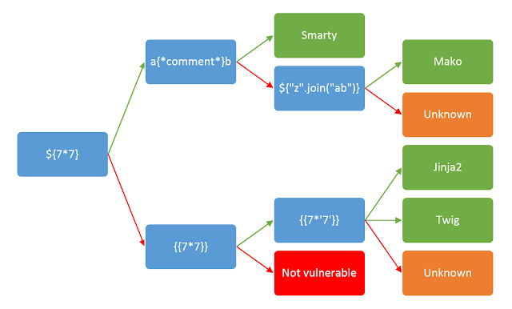
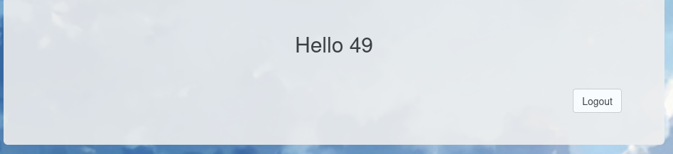
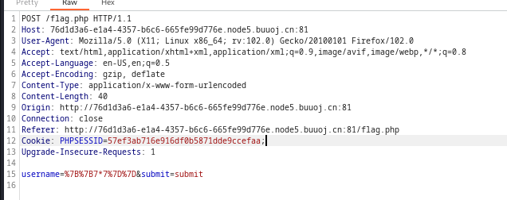
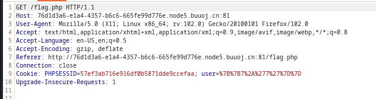
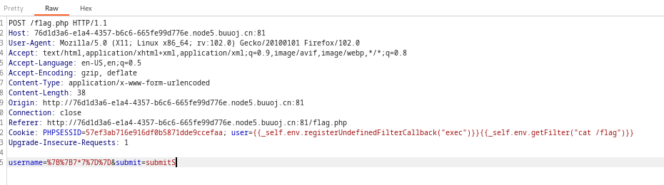

just a practice.

  

if you want to [learn more about SSTI](https://tryhackme.com/room/learnssti)

  


  

至于为什么是SSTI，在尝试SQL Injection和XSS没什么效果之后（其实专门找的for SSTI）

  

和写的笔记[SSTI](https://66lueflam144.github.io/SSTI/)中的内容一样，我们要分几个主要步骤进行：

  


判断是否可SSTI<br>

判断注入点<br>

判断template engine类型<br>

Syntax<br>

Payload


  
  
  

# 判断

  
  

可SSTI才来做的，所以next。

  

## template engine

  

把图片搬出来

  



  

- `{7*7}`

  


  

- `{{7*7}}`和`{{7*'7'}}`一样

  



  

依照之前经验，猜是Twig

  

<br>

  

## 注入点

  

然后我们看request

  

在submit阶段：

  



  

login状态：

  



  
  

看到cookie的改变，也就明白为什么叫做cookie is so stable了。

  

通过response也可以轻松看到显现点在哪里。

  

所以注入点找到，在cookie后的`user`变量。

  

## Syntax

  
  

打开这个库[SSTI payloads](https://github.com/swisskyrepo/PayloadsAllTheThings/tree/master/Server%20Side%20Template%20Injection)，找到关于Twig的部分。

  

我们需要利用的是`Code Execution`部分的`{{_self.env.registerUndefinedFilterCallback("exec")}}{{_self.env.getFilter("id")}}`不过要做一些修改。

  

我们想要得到的是`flag`，所以修改为:

  

```payload

{{_self.env.registerUndefinedFilterCallback("exec")}}{{_self.env.getFilter("cat /flag")}}

```

  


  

<b>registerUnderfinedFilterCallback("exec")</b>这一部分注册了一个名为 "exec" 的未定义过滤器回调函数。在模板引擎的上下文中，"exec" 通常会与执行某些命令或代码相关联。<br>

<b>getFilter("cat /flag")</b>接着调用了 "getFilter" 方法，并传递了一个字符串参数 "cat /flag"。这意味着尝试使用注册的 "exec" 过滤器执行特定的命令，这里是 "cat /flag"，即查看一个文件的内容。


  

<br>

  

<hr>

  

最后将payload加载到注入点上

  



  

在response的显现点得到flag