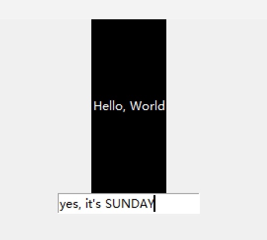
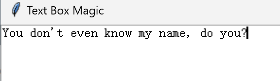
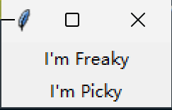
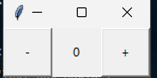

# 环形公路与加油站

  

>贪心算法

  

**题目：**

  

我们有一个环形的公路，上面有 N 个加油站。每个加油站有两个信息：

  

- 1.gas[i] 表示第 i 个加油站的汽油量，即你从这个加油站出发时，拥有的汽油数量。

- 2.cost[i] 表示从第 i 个加油站到下一个加油站的消耗汽油量。

  

你有一辆油箱容量无限的汽车，从其中的一个加油站出发，开始时油箱为空。

你可以行驶距离为 d 的距离，每前进一个加油站需要消耗一单位的汽油。当你到达一个加油站时，可以选择在这里加油。

  

你的目标是找到一座加油站，从该加油站出发，绕整个环形公路一周，使得你最终的汽油量足够支撑你绕一周。

  

实现代码：

```python

def can_travel(gas, cost):

    n = len(gas)

    total_gas = 0

    current_gas = 0

    start_station = 0

  

    for i in range(n):

        total_gas += gas[i] - cost[i]

        current_gas += gas[i] - cost[i]

  

        if current_gas < 0:

            start_station = i + 1

  

            current_gas = 0

    if total_gas < 0:

        return -1

    else:

        return start_station

  
  

gas = [1, 3, 4, 5, 6]

cost = [1, 4, 1, 2, 1]

print(can_travel(gas, cost))

  

```

  

# 逆序

  
  
  

题目：

  

给定一个字符数组 s，将该数组中的元素反转。

  

请不要使用额外的数组空间，必须在原地修改输入数组。

不能使用额外的空间复杂度为 O(1) 的辅助数组。【如果一个算法只使用了固定数量的变量、常数个指针或常数大小的数组，而这些额外的存储空间不随输入规模的增加而变化，那么这个算法的空间复杂度就是 O(1)。】

  

```python

def reverse(s):

    if not s or len(s) ==0:

        return s

    left, right = 0, len(s) - 1

    while left < right:

        s[left], s[right] = s[right], s[left]

        left += 1

        right -= 1

    return s

  

x = ["q", "w", "s"]

n = reverse(x)

print(n)

```

  

就代码而言，比c++简单明了了不止一点两点。也可能是因为没有好好学。

  
  
  

# 简单文本编辑

  

使用Tkinter

  

Tkinter是唯一一个python标准库中的GUI框架，并且跨平台，从Windows到macOS再到Linux。

不过这个的外观比较outdated，如果你喜欢复古像素风也许可以试试。

  

## 一些用得到的组件(widgets)

  

|widget class|description|

|---|---|

|Lable|在屏幕上输出文字|

|Button|包含文字且单击时进行一个操作|

|Entry||允许单行文本输入|

|Text|允许多行文本输入|

|Frame|用于对相关widget进行分组或者在widget之间提供用于填充的矩形区域|

  
  

<hr>

  

## .pack()

  

>使用packing algorithm将widgets按照指定的顺序放在框架或者窗口里

  

- 1.计算一个parcel矩形区域，该区域的大小足以容纳widgets，剩余的区域用空白填充

  

- 2.默认把widgets放在parcel中间，可以设定以修改

  

<hr>

  

### Label & Entry

  

```python

import tkinter as tk

  

window = tk.Tk()

window.title("Simple Text Editor")

  

lable = tk.Label(

    text="Hello, World",

    foreground="white",

    background="black",

    width=10,

    height=10

)

entry = tk.Entry()

  

lable.pack()

entry.pack()

window.mainloop()

```

  



  

<hr>

  

## Text box

  

```python

import tkinter as tk

window = tk.Tk()

window.title("Text Box Magic")

  

text_box = tk.Text()

text_box.pack()

  

window.mainloop()

```

  

效果如下：



  

<hr>

  
  

## Frame

  

```python

import tkinter as tk

  

window = tk.Tk()

window.title("Text Box Magic")

  

frame_a = tk.Frame()

frame_b = tk.Frame()

  

label_a = tk.Label(master=frame_a, text="I'm Freaky")

label_a.pack()

  

label_b = tk.Label(master=frame_b, text="I'm Picky")

label_b.pack()

  

frame_a.pack()

frame_b.pack()

#告诉Python运行Tkinter Event loop

window.mainloop()

```

  

效果如下：



  
  

frame的上下位置取决于`.pack()`的位置

这里是

```python

frame_a.pack()

frame_b.pack()

```

所以是

```txt

I'm Freaky

I'm Picky

```

交换以下结果也会随之交换

  
  

<hr>

  

## Button

  

```python

btn = tk.Button(text="step right", command=f(x))

  

#举个例子：

import tkinter as tk

  

window = tk.Tk()

  

window.rowconfigure(0, minsize=50, weight=1)

window.columnconfigure([0, 1, 2], minsize=50, weight=1)

  

btn_decrease = tk.Button(master=window, text="-")

btn_decrease.grid(row=0, column=0, sticky="nsew")

  

lbl_value = tk.Label(master=window, text="0")

lbl_value.grid(row=0, column=1)

  

btn_increase = tk.Button(master=window, text="+")

btn_increase.grid(row=0, column=2, sticky="nsew")

  

window.mainloop()

  

```

  

效果如下：



  
  

<hr>

  

## 简单的代码

  

```python

import tkinter as tk

from tkinter.filedialog import askopenfilename, asksaveasfilename

import os

  

def open_file():

    """Open a file for editing."""

    filepath = askopenfilename(

        filetypes=[("Text Files", "*.txt"), ("All Files", "*.*")]

    )

    if not filepath:

        return

    txt_edit.delete("1.0", tk.END)

    with open(filepath, mode="r", encoding="utf-8") as input_file:

        text = input_file.read()

        txt_edit.insert(tk.END, text)

    window.title(f"Simple Text Editor - {filepath}")

  

def save_file():

    """Save the current file as a new file"""

    filepath = asksaveasfilename(

        defaultextension=".txt",

        filetypes=[("Text Files", "*.txt"), ("All Files", "*.*")],

    )

    if not filepath:

        return

    with open(filepath, mode="w", encoding="utf-8") as output_file:

        text = txt_edit.get("1.0", tk.END)

        output_file.write(text)

    window.title(f"Simple Text Editor - {filepath}")

  

def save_to_original():

    """Save the edited content to the original file"""

    filepath = window.title()[21:]  # Extract the filepath from the window title

    if not filepath or "Simple Text Editor - " not in window.title():

        return

    with open(filepath, mode="w", encoding="utf-8") as output_file:

        text = txt_edit.get("1.0", tk.END)

        output_file.write(text)

    window.title(f"Simple Text Editor - {filepath}")

  

def delete_file():

    """Delete the current file"""

    filepath = window.title()[21:]  # Extract the filepath from the window title

    if not filepath or "Simple Text Editor - " not in window.title():

        return

    os.remove(filepath)

    txt_edit.delete("1.0", tk.END)

    window.title("Simple Text Editor")

  

window = tk.Tk()

window.title("Simple Text Editor")

  

window.rowconfigure(0, minsize=800, weight=1)

window.columnconfigure(1, minsize=800, weight=1)

  

txt_edit = tk.Text(window)

frm_buttons = tk.Frame(window, relief=tk.RAISED, bd=2)

btn_open = tk.Button(frm_buttons, text="Open", command=open_file)

btn_save = tk.Button(frm_buttons, text="Save As...", command=save_file)

btn_save_original = tk.Button(frm_buttons, text="Save to Original", command=save_to_original)

btn_delete = tk.Button(frm_buttons, text="Delete", command=delete_file)

  

btn_open.grid(row=0, column=0, sticky="ew", padx=5, pady=5)

btn_save.grid(row=1, column=0, sticky="ew", padx=5)

btn_save_original.grid(row=2, column=0, sticky="ew", padx=5)

btn_delete.grid(row=3, column=0, sticky="ew", padx=5)

  

frm_buttons.grid(row=0, column=0, sticky="ns")

txt_edit.grid(row=0, column=1, sticky="nsew")

  

window.mainloop()

  
  

```
