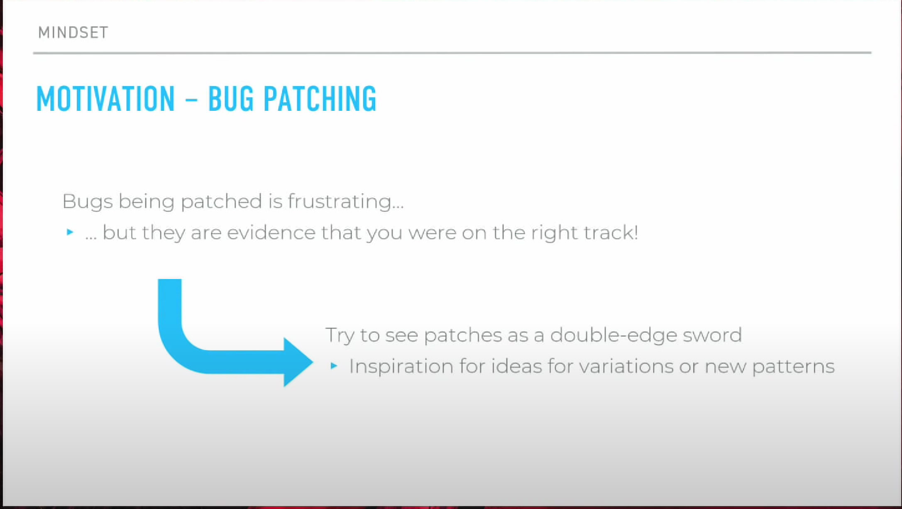
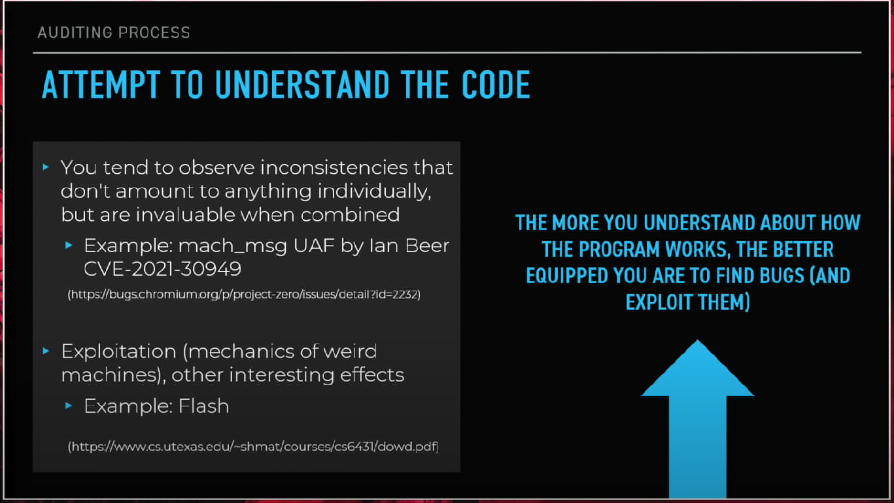
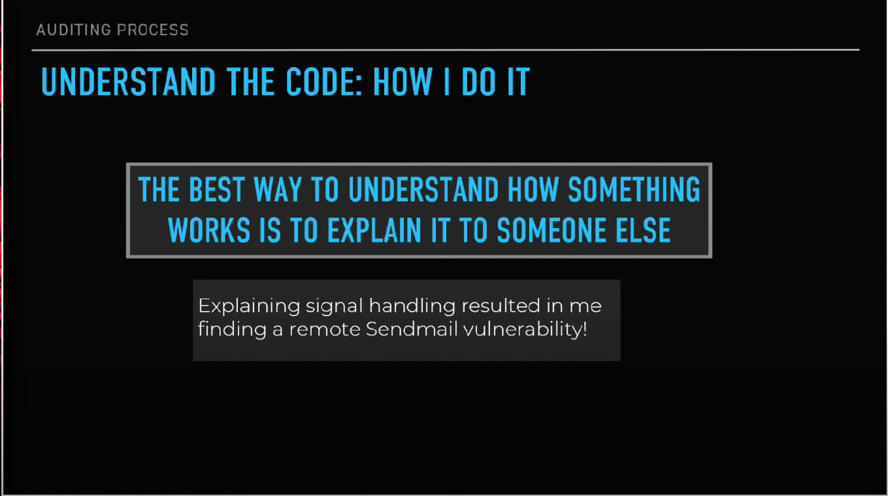
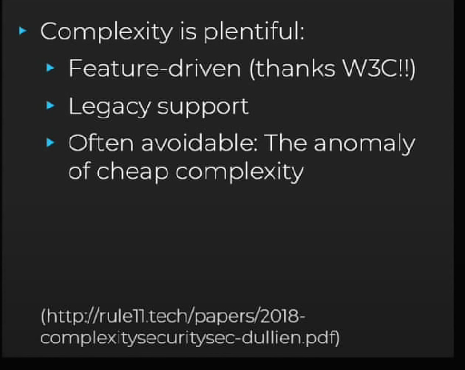

读了Mark Dowd在Offensive Con的演讲的一些摘要。

<!--more-->

  

# 我的摘要

  

不是全部，只是摘写了我认为重要的。

  

## 方法论

  
  

### 心态

  

  

允许我用某三部曲来形容（因为真的很贴）

  

- <table><tr><td bgcolor=CCCCFF>FEARLESS</td></tr></table>

- <table><tr><td bgcolor=CCCCFF>ANTIFRAIGLE</td></tr></table>

- <table><tr><td bgcolor=CCCCFF>UNFORGIVEN</td></tr></table>

  

如果你懂那么你就会懂...

  

因为代码审计，寻找漏洞是一个Odessa的过程。Odessa不仅体现在读代码，也体现在如何利用，因为有些漏洞你找到了，却不知道怎么用，有些甚至是，不能利用。

  
  
  

除了上面的三部曲，还有一个`curiousity`，其实感觉这一个适用任何一个活动或者行业。

>不仅好奇如何找到漏洞，更好奇漏洞如何诞生，如何运作。

  

----

  

### BUG PATCHING

  

  

安全补丁是一个双刃剑，一端对着漏洞，一端对着自己。

它会告诉你一些之前的漏洞信息，你可以推测漏洞成因、类型，推断一些漏洞变体/模式——没准又成功搞出一个漏洞。

  
  

----

  

### 傲慢与偏见

  

这里面提到两个有意思的例子

  

- <table><tr><td bgcolor=yellow>开源和闭源谁更安全</td></tr></table>

  
  

- <table><tr><td bgcolor=yellow>there are no more bugs in this.</td></tr></table>

  

一个普遍的认为是，开源更安全，毕竟那么多人都在eyes on it。但事实是，三个和尚没水喝。Mark在开源中找到很多漏洞，惊于这些地方无人维护。

  

一个漏洞解决了就是ending了吗？就像上面提到的漏洞变体/模式，还有相应的修复会引入一些微妙的问题——就像高中生物里面学的，遗传病，一个又一个微妙的基因通过生殖引入，最后snow crush。

  
  

----

  
  

### "MOTTO"

  

Mark认为

  

*对一个程序的工作原理了解得越多，就越有可能找到漏洞，并利用它们。*

  

  

本觉得对于我们还有一条，你首先要加载 漏洞 模块。

  

----

  

 

 

 

  
  

### 类似费曼学习法（感觉就是）

  

  

就像写例会PPT的时候，总在想如果对方在这里那里提出一个问题怎么办？OMG我好像答不上来。在想用比较“人话”的话来解释一个漏洞的原理和怎么运行怎么被利用的时候，就会发现自己好像也有很多不懂……准确来说，有点像“例会上的被害妄想症”。

  

这个方法对学习很有效，但我从来没用到我大学课程上面……不过最近看到数据结构与算法的课程设计有点挑战性，可以当作一次1 v 1的例会。

  

----

  

 

 

  

### Attention

  

每次提到这个词，脑海里都自动播放you got me looking for attention~

  

>攻击面

  

  

就如图所说，漏洞只是攻击面里面的一个子集，用一句话来说就是——有人发现了一个攻击面，然后全世界的漏洞都吻了上去。

  

 

 

>复杂性

  

  

其实没太懂这里的complexity指什么

  
  

个人理解：

  

- <table><tr><td bgcolor=yellow>应用功能的增加带来程序的复杂也带来漏洞或潜在漏洞的增加。Feature—Driven，生命不息，漏洞不止</td></tr></table>

  

- <table><tr><td bgcolor=yellow>而开发人员对代码库的引用带来“多余功能”——只是想用代码库里某个功能，但把人一整个家族搬来，家族里面人员混杂，复杂性带来了潜在的漏洞。</td></tr></table>

  

----

  

 

 

  

### "Findings"

  

也就是“随时记录”，idea、漏洞、错误什么的，一方面for积少成多，一方面for随时召回。

  

 

 

  
  

<table><tr><td bgcolor=yellow>随时召回</td></tr></table>：就是字面意思了，有时候有些东西要记下来才行啊，然后一看，哦原来要搞这些，当时是这么想的。

  

 

 

  

<table><tr><td bgcolor=yellow>记录失败很重要</td></tr></table>for me 平时一些install，调试，exec老是出错但都是改完就扔，下次还犯。所以多记录（document）吧……

  

----

  

### “shared experience”

  

 

  

这个其实是我自己取的名字

是对于bug patching和代码库的。当一个漏洞出现在a中，那么和a类似的b会不会也有这样的漏洞？——算法思想就那么多，这就是shared experience，再加上还是同类型，极大可能会有相同的bugs。如果没有，那么是怎么修补的呢？

可能人家b对于存在的bug from a的态度是：**I Don't Give A FUCK**，那么就可以*give it a fuck*了（bushi）

  

----

  

 

 

  

### 工具

  

Mark认为Best cooperation makes Best output，同时工具开发和漏洞研究是分成两个世界的——指工具开发的可能没有漏洞研究的那么了解漏洞，反之可能没那么了解工具开发。

  

以及新手过度依赖工具，阅读和理解代码能力可能会达不到要求。往大了说我们就到了Cyberpunk的道德议题了——高度工具化的人类是否还是人类？

  

跑远了……

  

 

 

  

不过工具开发确实也很有意思。

  

----

  

 

  

### “RULES”

  

- <table><tr><td bgcolor=yellow>Understanding The Code</td></tr></table>

- <table><tr><td bgcolor=yellow>Document Your Analysis</td></tr></table>

- <table><tr><td bgcolor=yellow>Revist Code Bases</td></tr></table>

- <table><tr><td bgcolor=yellow>Analyze Failures</td></tr></table>
