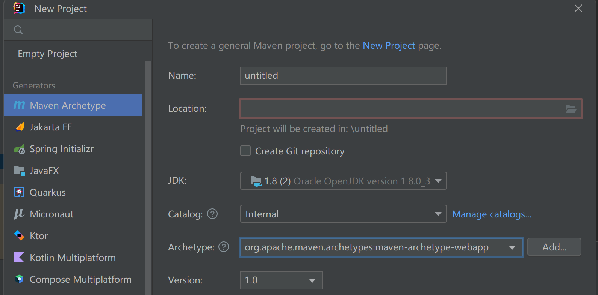
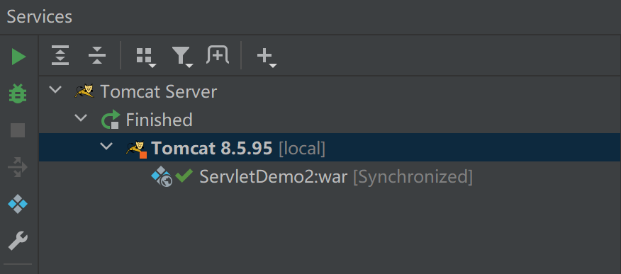

最近在随机学学，然后感觉这个挺有趣的就学着写写。

  

<!--more-->

  

# Servlet

  

>运行在web服务器上或应用服务器上的程序，作为来自Web浏览器或者其他HTTP客户端的请求和HTTP服务器上的数据库或应用程序之间的中间层。

>>从代码上来说，Servlet属于Java类，服务于HTTP请求并实现了javax.servlet.Servlet接口。

  

一个Servlet生命周期：

  

- init()

- service() ：服务阶段，主要处理来自客户端的请求，并可以根据HTTP请求类型来调用对应的方法，比如下面的两个

- doGet()，doPost() ：处理阶段，将主要代码逻辑写在这里，根据不同请求对应不同方法。

- destroy()

  

# First Servlet

  

创建第一个Servlet  by maven.

  

## IDEA

  

用的是

用IDEA的Maven archetype来创建。


  

如图所示：

  

- name什么的自己随心情写。

  

- JDK建议1.8或者16（反正找点能跑的，不然就会和我一样为JDK19换来一句“Java 错误：不支持发行版本 5”）（JDK 8 好像也要自己找。）

  

- Archetype选 webapp

- version是自动的，不用管。

  

其他的默认，create就行。

  

## Setting

  

create之后稍微等一下它初始化，然后就可以看到项目文件夹下有`.idea`，`src`等文件夹以及文件。

在`src/main`目录下创建new Directory，命名一下。（我直接写java）

然后在`java`里面创建class，（mine：FirstServlet）对其进行编写：

```java

import javax.servlet.ServletException;

import javax.servlet.http.HttpServletRequest;

import javax.servlet.http.HttpServletResponse;

import javax.servlet.http.HttpServlet;

import java.io.IOException;

import java.io.PrintWriter;

  

public class FirstServlet extends HttpServlet{

    @Override

    protected void doGet(HttpServletRequest req, HttpServletResponse resp) throws ServletException, IOException {

  

        resp.setContentType("text/html");

  

        PrintWriter out = resp.getWriter();

        out.print("<h1>blue blood.</h1>");//记住这个，成功创建界面应该是看见这行字。内容可以自己写。

    }

    @Override

    protected void doPost(HttpServletRequest req, HttpServletResponse resp) throws ServletException, IOException {

        doGet(req, resp);

    }

}

  

```

  

目录里面有个`pom.xml`，打开并添加配置：

```java

<dependency>

      <groupId>javax.servlet</groupId>

      <artifactId>javax.servlet-api</artifactId>

      <version>3.1.0</version>

      <scope>compile</scope>

    </dependency>

```

  

## tomcat

  

如果没下载请去<a href=https://tomcat.apache.org/download-80.cgi>下载</a>

版本随意，但选择`core`下的。

  

对tomcat进行配置：

在IDEA界面右上角那个绿色锤子和绿色三角形之间，一个`current file`，点击之后会有一个`edit configurations`,点进去，add new，下拉选择Tomcat Local。

  

- Deployment界面点击右下角fix，二选一建议二。

  

- 回到Server界面可以看到URL跟着变了。

  

- Apply then ok

  

就会看到



  

我这个是运行过的所以有个Finished。

到这里已经成功80%。

  

接下来是对来自于根目录下方`webapp/WEB-INF`的`web.xml`的配置，把servlet写进去，进行注册：

  

```java

<servlet>

    <servlet-name>FirstServlet</servlet-name>

    <servlet-class>FirstServlet</servlet-class>

  </servlet>

  <servlet-mapping>

    <servlet-name>FirstServlet</servlet-name>

    <url-pattern>/FirstServlet</url-pattern>

  </servlet-mapping>

```

  

>映射匹配流程：/FirstServlet路径绑定的servlet-name为FirstServlet，而FirstServlet绑定的class是FirstServlet，最终访问/FirstServlet，调用类也是FirstServlet.class

  

对于以上解释，需要注意的是：

  

- 这个类也就是class，名字是自己写的

- url-pattern这里可以填其他的，感觉看的这个博客的作者是故意想绕死初学者。才一堆重名。当然也可能是ctrl c + ctrl v比较方便。

  

## start

  

如果到这里，直接启动是可以的，不过你看到的界面是那个`index.jsp`的内容——一个`Hello World`。按理说，我们应该看见`blue blood`才对。

  

这是因为在tomcat的配置中，那个URL是访问默认页面的，在这里就是`index.jsp`。

修改的方法有两种（但本质是一种）：

  

- 1.可以在当前运行的local page上添加刚才写的url-pattern的内容。我这里就是`http://localhost:8080/ServletDemo2_war/FirstServlet`

  

- 2.右击左下角的你的tomcat选择`edit configuration`，在URL处修改成`http://localhost:8080/ServletDemo2_war/FirstServlet`就行了。记得apply再ok，重启服务即可。

  
  

# Filter

  

>Servlet中的过滤器，主要用于过滤字符编码，防止XSS，SQL injection，file upload等。

>>配置其即可获得统一过滤危险字符，比自己去写白名单、黑名单方便很多。

  

## 又来创建了

  

过滤器基于`javax.servlet.Filter`接口进行实现的，需要使用`doFilter()`方法实现拦截。

  

### 编写

  

以servlet为基础进行编写：

  

- `main/java/`中new package，创建个新filter，再建个new class `FilterTest`。（这里有趣的是，我最开始没注意到是要建一个filter，直接建了一个`com.test.filter`package，在里面建了一个类，但是也成功了。）

  

对类进行编写：

  

```java

package com.test.filter;

  

import javax.servlet.*;

import javax.servlet.http.HttpServletRequest;

import javax.servlet.http.HttpServletResponse;

import java.io.IOException;

  

public class FilterTest implements Filter {

    @Override

    public void destroy(){

    }

  

    @Override

    public void doFilter(ServletRequest req, ServletResponse resp, FilterChain chain) throws ServletException, IOException {

        HttpServletRequest request = (HttpServletRequest) req;

        HttpServletResponse response = (HttpServletResponse) resp;

  

        String requestURI = request.getRequestURI();

  

        if (requestURI.contains("/FirstServlet")){

            chain.doFilter(request, response);

        } else {

            request.getRequestDispatcher("/").forward(request, response);

        }

    }

  

    @Override

    public void init(FilterConfig config) throws ServletException {

    }

}

  

```

  

>重写了doFilter()方法

  

- 通过`String requestURI = request.getRequestURI();`获取URL路径，然后进行判断

- 如果路径中包含`/FirstServlet`，就放行，否则转到根目录下。

  
  

### 最后注册

  

也是在`pom.xml`里面写入：

```java

<filter>

    <filter-name>FilterTest</filter-name>

    <filter-class>com.test.filter.FilterTest</filter-class>

  </filter>

  

  <filter-mapping>

    <filter-name>FilterTest</filter-name>

    <url-pattern>/*</url-pattern>

  </filter-mapping>

```

  

过滤器标签需要在Servlet标签之上。程序会按照注册顺序进行执行。

  
  

然后你再次启动，当你把`http://localhost:8080/ServletDemo2_war/FirstServlet`改成`http://localhost:8080/ServletDemo2_war/Fi`或者`http://localhost:8080/ServletDemo2_war/hello`，都会回到`index.jsp`的

<h1>Hello World</h1>