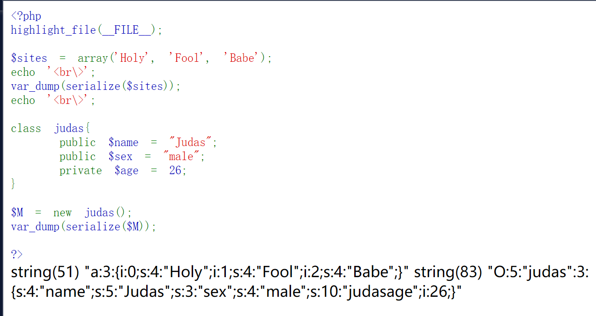
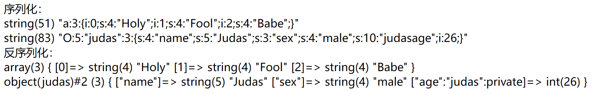
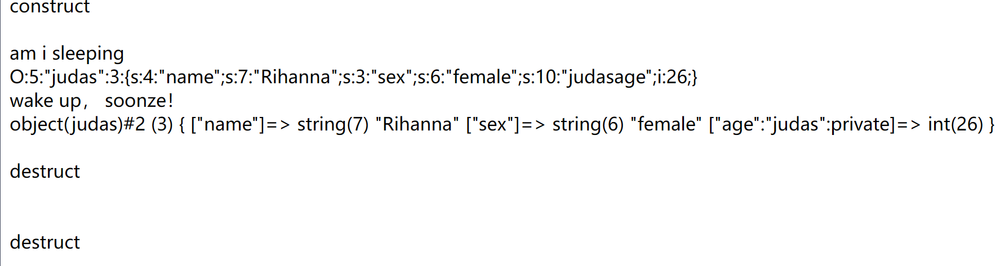

# 序列化与反序列化


  
  

# Introduction For Serialize()

  

&gt;序列化：将对象转换为字节序列的过程称为对象的序列化，举个例子，游戏的存档。

  

php中序列化函数`serialize()`用于序列化 `对象`或者`数组`，并返回一个`字符串`。

  

序列化后的结果可以方便的传递到其他地方if needed，且其**类型和结构**不会改变。

  

## example

  

```php

&lt;?php

highlight_file(__FILE__);

  

$sites = array(&#39;Holy&#39;, &#39;Fool&#39;, &#39;Babe&#39;);

echo &#39;&lt;br\&gt;&#39;;

var_dump(serialize($sites));

echo &#39;&lt;br\&gt;&#39;;

  

class judas{

    public $name = &#34;Judas&#34;;

    public $sex = &#34;male&#34;;

    private $age = 26;

}

  

$M = new judas();

var_dump(serialize(M));

  

?&gt;

```

  

效果如下：

  



对**数组的序列化**：

  

- a 代表数组

- 3 代表数组中有3个元素

- i 代表数组的下标

- 0 下标值

- s 代表元素Holy的数据类型是 字符型

- 4 元素Holy的长度

  

对**对象的序列化**：

  

- O 代表对象

- 5 代表类名judas的长度

- 3 代表类中的字段数，即 `$name`、 `$sex`、 `$age`

- s 代表属性 name 的类型为 字符型

- 5 代表属性 name 的长度，即 Judas 的长度

  

&lt;hr&gt;

  

# Introduction For unserialize()

  

php中反序列化函数是`unserialize()`，用于还原 被序列化后的字符串 为原来的 数组或对象。

  
  

## example

  

在之前的测试代码上修修改改

  

```php

&lt;?php

highlight_file(__FILE__);

  

$sites = array(&#39;Holy&#39;, &#39;Fool&#39;, &#39;Babe&#39;);

$ser1 = serialize($sites);

class judas{

    public $name = &#34;Judas&#34;;

    public $sex = &#34;male&#34;;

    private $age = 26;

}

  

$M = new judas();

$ser2 = serialize($M);

echo &#39;序列化：&#39;;

echo &#39;&lt;br&gt;&#39;;

var_dump($ser1);

echo &#39;&lt;br&gt;&#39;;

var_dump($ser2);

  

echo &#39;&lt;br&gt;&#39;;

  

echo &#39;反序列化：&#39;;

echo &#39;&lt;br&gt;&#39;;

var_dump(unserialize($ser1));

echo &#39;&lt;br&gt;&#39;;

var_dump(unserialize($ser2));

  

?&gt;

```

  

结果如图：



  
  

&lt;hr&gt;

  

# function

  

序列化和反序列化在系统中的作用：

  

- 把对象的字节序列永久放在磁盘中，需要时调用，节省磁盘占用空间。

- 在传输过程中直接传输字节序列而不是对象，提高传输速率

&lt;hr&gt;

  

# 反序列化漏洞利用

  

## 条件

  

- unserialize()参数可控

- 存在可利用的类，且类中有**魔术方法**

  

## 魔术方法

  

### __construct() &amp; __destruct()

  

&gt;__construct():拥有该函数的类在每次创建新对象的时候，先调用此方法

  

&gt;__destruct():拥有该函数的类，当某个对象的所有引用都被删除或者对象被销毁时执行。

  

用例子可以理解这两句话：

  

```php

&lt;?php

highlight_file(__FILE__);

  
  

class judas{

    public $name = &#34;Rihanna&#34;;

    public $sex = &#34;female&#34;;

    private $age = 26;

    public function __construct(){

        echo &#39;construct&lt;br&gt;&#39;;

    }

    public function num($a, $b){

        echo $c = $a &#43; $b;

        echo &#39;&lt;br&gt;&#39;;

        return $c;

    }

    public function __destruct(){

        echo &#39;destruct&lt;br&gt;&#39;;

    }

    public function person($per){

        echo &#34;we are $per &lt;br&gt;&#34;;

    }

}

  

$R = new judas();

$R-&gt;num(12, 13);

$R-&gt;person(female);

  

?&gt;

```

  

结果be like：

  

```txt

construct

25

we are female

destruct

```

  

### __wakeup() &amp; __sleep()

  

&gt;__wakeup()如果存在，就在unserialize()前被调用，用于预先准备对象需要的资源

&gt;__sleep()如果存在，就在serialize()前被调用，用于提交未提交的数据，或者类似的清理操作，如果没有返回属性的话，序列化时会将属性清空。

  

```php

&lt;?php

highlight_file(__FILE__);

  
  

class judas{

    public $name = &#34;Rihanna&#34;;

    public $sex = &#34;female&#34;;

    private $age = 26;

    public function __construct(){

        echo &#39;&lt;br&gt;construct&lt;br&gt;&#39;;

    }

    public function __destruct(){

        echo &#39;&lt;br&gt;&lt;/br&gt;destruct&lt;br&gt;&#39;;

    }

    public function __wakeup(){

        echo &#39;&lt;br&gt;wake up， soonze！&lt;br&gt;&#39;;

    }

    public function __sleep(){

        echo &#39;&lt;br&gt;am i sleeping&lt;br&gt;&#39;;

        return array(&#34;name&#34;, &#34;sex&#34;, &#34;age&#34;);

    }

}

$R = new judas();

echo $ser = serialize($R);

var_dump(unserialize($ser));

?&gt;

```

  

结果是：



  

ps:出现两次 destruct 是因为：

- construct 实例化对象

- 序列化

- wakeup

- 反序列化

- destruct 所有方法都执行完毕

- destruct 销毁对象

  

### __toString()

  

&gt;用于定义一个类被当作字符串的时候该怎么处理

  

```php

&lt;?php

highlight_file(__FILE__);

  
  

class judas{

    public $name = &#34;Rihanna&#34;;

    public $sex = &#34;female&#34;;

    private $age = 26;

    public function __construct(){

        echo &#39;&lt;br&gt;construct&lt;br&gt;&#39;;

    }

    public function __destruct(){

        echo &#39;&lt;br&gt;&lt;/br&gt;destruct&lt;br&gt;&#39;;

    }

    public function __wakeup(){

        echo &#39;&lt;br&gt;wake up， soonze！&lt;br&gt;&#39;;

    }

    public function __toString(){

        return &#39;&lt;br&gt;被当字符串中&#39;;

    }

}

$R = new judas();

echo $R;//类实例被当作字符用echo输出

?&gt;

```

  

结果：

  

```txt

construct

  

被当字符串中

  

destruct

```

  

### __invoke()

  

&gt;当尝试以调用函数的方式调用一个对象时，__invoke()会被自动调用，不过php version&gt;=5.3.0

  

```php

&lt;?php

highlight_file(__FILE__);

  
  

class judas{

    public $name = &#34;Rihanna&#34;;

    public $sex = &#34;female&#34;;

    private $age = 26;

    public function __construct(){

        echo &#39;&lt;br&gt;construct&lt;br&gt;&#39;;

    }

    public function __destruct(){

        echo &#39;&lt;br&gt;&lt;/br&gt;destruct&lt;br&gt;&#39;;

    }

    public function __wakeup(){

        echo &#39;&lt;br&gt;wake up， soonze！&lt;br&gt;&#39;;

    }

    public function __sleep(){

        echo &#39;&lt;br&gt;am i sleeping&lt;br&gt;&#39;;

        return array(&#34;name&#34;, &#34;sex&#34;, &#34;age&#34;);

    }

    public function __invoke(){

        echo &#39;&lt;br&gt;被当作函数中&lt;br&gt;&#39;;

    }

}

$R = new judas();

$R();

?&gt;

```

  

```txt

construct

  

被当作函数中

  
  

destruct

```

  

### __call()

  

&gt;在对象中调用一个不存在或者不可访问方法，会调用

  

```php

&lt;?php

highlight_file(__FILE__);

  
  

class judas{

    public $name = &#34;Rihanna&#34;;

    public $sex = &#34;female&#34;;

    private $age = 26;

    public function __construct(){

        echo &#39;&lt;br&gt;construct&lt;br&gt;&#39;;

    }

    public function __destruct(){

        echo &#39;&lt;br&gt;&lt;/br&gt;destruct&lt;br&gt;&#39;;

    }

    public function __wakeup(){

        echo &#39;&lt;br&gt;wake up， soonze！&lt;br&gt;&#39;;

    }

    public function __sleep(){

        echo &#39;&lt;br&gt;am i sleeping&lt;br&gt;&#39;;

        return array(&#34;name&#34;, &#34;sex&#34;, &#34;age&#34;);

    }

    public function __call($arg1, $arg2){

        echo &#39;&lt;br&gt;寻找一个不存在或者不可访问的方法&lt;br&gt;&#39;;

    }

}

$R = new judas();

$R-&gt;next(1, 2);

?&gt;

```

  

```txt

construct

  

寻找一个不存在或者不可访问的方法

  
  

destruct

```

  

### __set()

  
  

```php

&lt;?php

highlight_file(__FILE__);

  
  

class judas{

    public $name = &#34;Rihanna&#34;;

    public $sex = &#34;female&#34;;

    private $age = 26;

    private $weight = 100;

    public function __construct(){

        echo &#39;&lt;br&gt;construct&lt;br&gt;&#39;;

    }

    public function __destruct(){

        echo &#39;&lt;br&gt;&lt;/br&gt;destruct&lt;br&gt;&#39;;

    }

    public function person($per){

        echo &#34;&lt;br&gt;Fuck $per &lt;br&gt;&#34;;

    }

    public function __set($one, $two){

        echo &#34;访问不存在或者不能访问的属性赋值中&#34;;

    }

    public function people(){

        echo $this-&gt;name;

        echo $this-&gt;weight;

    }

  

}

$R = new judas();

$R-&gt;weight = 120;//在为不可访问的属性赋值

echo &#39;&lt;br&gt;&#39;;

$R-&gt;people();

?&gt;

```

  

```txt

construct

访问不存在或者不能访问的属性赋值中

Rihanna100

  

destruct

```

  

相同的还有 （对不可访问属性调用）：

  

- `__isset()`

- `__unset`

- `__get()`

  
  

&lt;hr&gt;

  

&lt;hr&gt;


---

> Author:   
> URL: https://66lueflam144.github.io/posts/2a957e7/  

