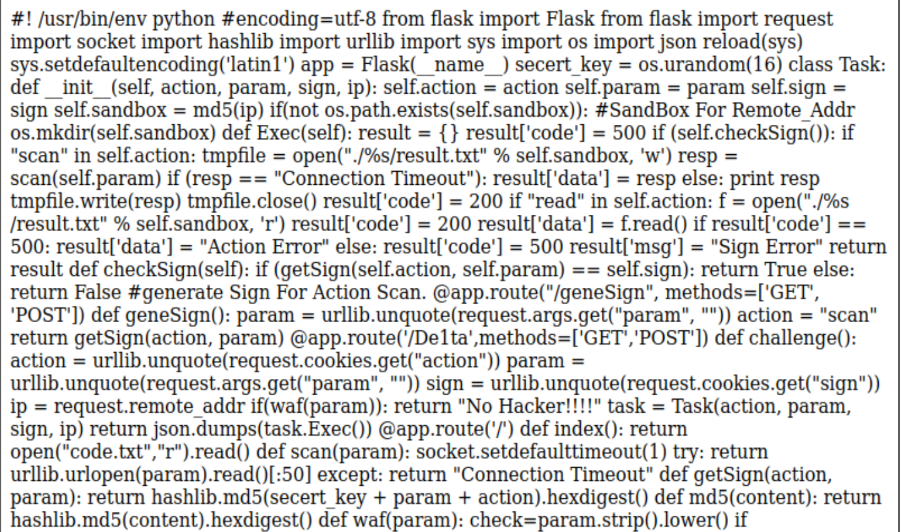
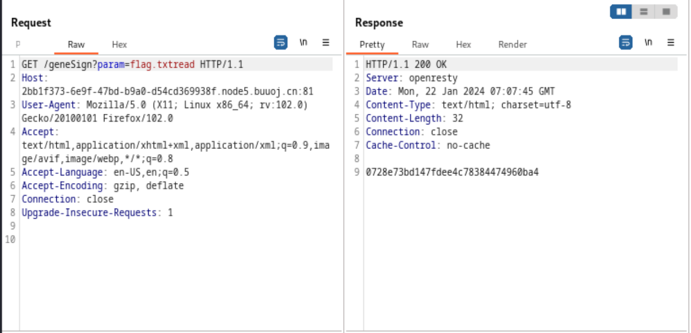
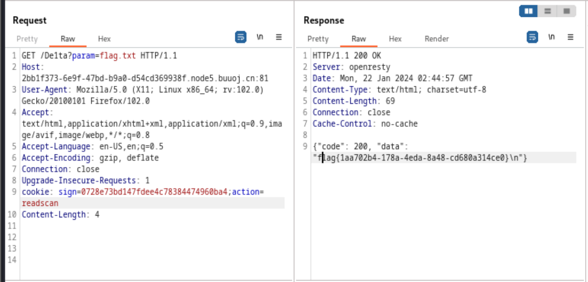

# SSRF Me


之前失败过的。

  

&lt;!--more--&gt;

  
  

# Start Python？

  

打开URL就是这么一个东西，不过可以看出来是个python flask 代码。

  



  

找专业人士快速排版一下：

  

```python

#! /usr/bin/env python

# encoding=utf-8

from flask import Flask, request

import socket

import hashlib

import urllib

import sys

import os

import json

  

reload(sys)

sys.setdefaultencoding(&#39;latin1&#39;)

  

app = Flask(__name__)

secret_key = os.urandom(16)

  
  

class Task:

    def __init__(self, action, param, sign, ip):

        self.action = action

        self.param = param

        self.sign = sign

        self.sandbox = md5(ip)

        if not os.path.exists(self.sandbox):  # SandBox For Remote_Addr

            os.mkdir(self.sandbox)

  

    def Exec(self):

        result = {}

        result[&#39;code&#39;] = 500

  

        if self.checkSign():

            if &#34;scan&#34; in self.action:

                tmpfile = open(&#34;./%s/result.txt&#34; % self.sandbox, &#39;w&#39;)

                resp = scan(self.param)

                if resp == &#34;Connection Timeout&#34;:

                    result[&#39;data&#39;] = resp

                else:

                    print resp

                    tmpfile.write(resp)

                tmpfile.close()

                result[&#39;code&#39;] = 200

  

            if &#34;read&#34; in self.action:

                f = open(&#34;./%s/result.txt&#34; % self.sandbox, &#39;r&#39;)

                result[&#39;code&#39;] = 200

                result[&#39;data&#39;] = f.read()

  

        if result[&#39;code&#39;] == 500:

            result[&#39;data&#39;] = &#34;Action Error&#34;

        else:

            result[&#39;code&#39;] = 500

            result[&#39;msg&#39;] = &#34;Sign Error&#34;

  

        return result

  

    def checkSign(self):

        if getSign(self.action, self.param) == self.sign:

            return True

        else:

            return False

  
  

# generate Sign For Action Scan.

@app.route(&#34;/geneSign&#34;, methods=[&#39;GET&#39;, &#39;POST&#39;])

def geneSign():

    param = urllib.unquote(request.args.get(&#34;param&#34;, &#34;&#34;))

    action = &#34;scan&#34;

    return getSign(action, param)

  
  

@app.route(&#39;/De1ta&#39;, methods=[&#39;GET&#39;, &#39;POST&#39;])

def challenge():

    action = urllib.unquote(request.cookies.get(&#34;action&#34;))

    param = urllib.unquote(request.args.get(&#34;param&#34;, &#34;&#34;))

    sign = urllib.unquote(request.cookies.get(&#34;sign&#34;))

    ip = request.remote_addr

  

    if waf(param):

        return &#34;No Hacker!!!!&#34;

  

    task = Task(action, param, sign, ip)

    return json.dumps(task.Exec())

  
  

@app.route(&#39;/&#39;)

def index():

    return open(&#34;code.txt&#34;, &#34;r&#34;).read()

  
  

def scan(param):

    socket.setdefaulttimeout(1)

    try:

        return urllib.urlopen(param).read()[:50]

    except:

        return &#34;Connection Timeout&#34;

  
  

def getSign(action, param):

    return hashlib.md5(secret_key &#43; param &#43; action).hexdigest()

  
  

def md5(content):

    return hashlib.md5(content).hexdigest()

  
  

def waf(param):

    check = param.strip().lower()

    if check.startswith(&#34;gopher&#34;) or check.startswith(&#34;file&#34;):

        return True

    else:

        return False

  
  

if __name__ == &#39;__main__&#39;:

    app.debug = False

    app.run(host=&#39;0.0.0.0&#39;, port=80)

```

  

这个代码主要分成三个部分，根据python的函数调用顺序导致的代码位置，我们**从下到上**看

  
  

## 第一部分

  
  

```python

def scan(param):

    # 设置套接字超时时间为1s

    socket.setdefaulttimeout(1)

    try:

      # 尝试打开param参数指定的URL，并读取内容，返回前50个字符

        return urllib.urlopen(param).read()[:50]

    except:

      # 打开异常则捕获异常返回报错信息

        return &#34;Connection Timeout&#34;

  
  

def getSign(action, param):

  # 用hashlib.md5对secret_key、param、action进行哈希计算并以十六进制字符串形式返回

    return hashlib.md5(secret_key &#43; param &#43; action).hexdigest()

  
  

def md5(content):

    return hashlib.md5(content).hexdigest()

  
  

def waf(param):

  # 用strip()移除字符串两段的空白符，用lower()将字符串全转为小写

    check = param.strip().lower()

    # 检查处理过的字符串是否以gopher 或者 file开头，进行安全性判断

    if check.startswith(&#34;gopher&#34;) or check.startswith(&#34;file&#34;):

        return True

    else:

        return False

  
  

if __name__ == &#39;__main__&#39;:

    app.debug = False

    app.run(host=&#39;0.0.0.0&#39;, port=80)

```

  

- `scan(param)`用于从指定的URL中读取内容返回前50个字符，如果有异常就报错。

- `getSign(action, param)`用于生成给定的参数的相关哈希值并以十六进制字符串形式返回。即创造签名(Sign)

- `md5(content)`和上一个一样，对content进行生成哈希值并以十六进制字符串形式返回。

- `waf(param)`进行对param参数的安全性检查

- `if __name__ == &#39;__main__&#39;`作用是在脚本被直接执行时，将 Flask 应用的调试模式关闭，并在 0.0.0.0:80 上启动应用。

  

&lt;hr&gt;

  

## 第二部分

  

```python

# generate Sign For Action Scan.

# 指定该函数处理的路由，即/geneSign的GET和POST请求

@app.route(&#34;/geneSign&#34;, methods=[&#39;GET&#39;, &#39;POST&#39;])

def geneSign():

  # 从请求中获取param参数，并进行解码

    param = urllib.unquote(request.args.get(&#34;param&#34;, &#34;&#34;))

    action = &#34;scan&#34;

    # 用getSign函数对参数进行处理并返回，由上面可知会返回一个十六进制字符串

    return getSign(action, param)

  
  

@app.route(&#39;/De1ta&#39;, methods=[&#39;GET&#39;, &#39;POST&#39;])

def challenge():

  # 从请求中获取action、param、sign三个参数

  # action和sign在cookie中，param是参数

    action = urllib.unquote(request.cookies.get(&#34;action&#34;))

    param = urllib.unquote(request.args.get(&#34;param&#34;, &#34;&#34;))

    sign = urllib.unquote(request.cookies.get(&#34;sign&#34;))

    # 获取请求的远程地址

    ip = request.remote_addr

    # 用waf()函数对param进行安全性检查，确保没有ghoper或者file

    if waf(param):

        return &#34;No Hacker!!!!&#34;

    # 创建Task类实例

    task = Task(action, param, sign, ip)

    # 调用 Task 实例的 Exec 方法，将结果使用 json.dumps 转换为 JSON 格式并返回。

    return json.dumps(task.Exec())

```

  

- `geneSign()`对/geneSign的参数param进行处理，返回一个十六进制字符串

- `challenge()`接收来自客户端的请求，解析请求中的参数和 cookie，进行一些条件检查（使用 waf 函数），然后创建 Task 实例并调用其 Exec 方法，最后将结果以 JSON 格式返回。

  
  

&lt;hr&gt;

  

## 第三部分

  
  

```python

class Task:

    def __init__(self, action, param, sign, ip):

        self.action = action

        self.param = param

        self.sign = sign

        self.sandbox = md5(ip)

        if not os.path.exists(self.sandbox):  # SandBox For Remote_Addr

            os.mkdir(self.sandbox)

  

    def Exec(self):

        result = {}

        result[&#39;code&#39;] = 500

  

        if self.checkSign():

            if &#34;scan&#34; in self.action:

                tmpfile = open(&#34;./%s/result.txt&#34; % self.sandbox, &#39;w&#39;)

                resp = scan(self.param)

                if resp == &#34;Connection Timeout&#34;:

                    result[&#39;data&#39;] = resp

                else:

                    print resp

                    tmpfile.write(resp)

                tmpfile.close()

                result[&#39;code&#39;] = 200

  

            if &#34;read&#34; in self.action:

                f = open(&#34;./%s/result.txt&#34; % self.sandbox, &#39;r&#39;)

                result[&#39;code&#39;] = 200

                result[&#39;data&#39;] = f.read()

  

        if result[&#39;code&#39;] == 500:

            result[&#39;data&#39;] = &#34;Action Error&#34;

        else:

            result[&#39;code&#39;] = 500

            result[&#39;msg&#39;] = &#34;Sign Error&#34;

  

        return result

  

    def checkSign(self):

        if getSign(self.action, self.param) == self.sign:

            return True

        else:

            return False

```

  

### apart

  
  

```python

def checkSign(self):

        if getSign(self.action, self.param) == self.sign:

            return True

        else:

            return False

```

  

如果getSign()函数通过`action`，`param`创造的Sign和实例的sign进行比较，匹配就True。

  
  

&lt;hr&gt;

  

```python

def Exec(self):

        # 字典result，将code键值设为500

        result = {}

        result[&#39;code&#39;] = 500

        # 如果sign值匹配

        if self.checkSign():

            # 如果 action字符串中有scan

            if &#34;scan&#34; in self.action:

                # 以w模式打开result.txt，%s替换为self.sandbox的值

                tmpfile = open(&#34;./%s/result.txt&#34; % self.sandbox, &#39;w&#39;)

                # 用scan函数获取param解析出的前50个字符

                resp = scan(self.param)

                # 如果内容是

                if resp == &#34;Connection Timeout&#34;:

                    result[&#39;data&#39;] = resp

                else:

                    print resp

                    # 将resp写入tempfile

                    tmpfile.write(resp)

                tmpfile.close()

                result[&#39;code&#39;] = 200

            # 如果action字符串中有read

            if &#34;read&#34; in self.action:

                # 以r模式打开result.txt，%s替换为self.sandbox属性的值

                f = open(&#34;./%s/result.txt&#34; % self.sandbox, &#39;r&#39;)

                result[&#39;code&#39;] = 200

                # 将读取的内容存入result[&#39;data&#39;]

                result[&#39;data&#39;] = f.read()

  

        if result[&#39;code&#39;] == 500:

            result[&#39;data&#39;] = &#34;Action Error&#34;

        else:

            result[&#39;code&#39;] = 500

            result[&#39;msg&#39;] = &#34;Sign Error&#34;

        # 返回最后的字典，包括着result[&#39;code&#39;]、result[&#39;data&#39;]

        return result

```

  

`if self.checkSign()`用于检查Sign是否有效，有效就往下执行：

  

- `action`中包含`scan`，则打开`result.txt`将scan(param)结果写入。

- `action`中包含`read`，则打开`result.txt`，将其内容读取存入`result[data]`并返回

  
  

&lt;hr&gt;

  

```python

def __init__(self, action, param, sign, ip):

        self.action = action

        self.param = param

        self.sign = sign

        self.sandbox = md5(ip)

        if not os.path.exists(self.sandbox):  # SandBox For Remote_Addr

            os.mkdir(self.sandbox)

```

  

在创建 Task类 进行实例化的时候，用`action`、`param`、`sign`、`ip`四个属性进行初始化。

  

`self.sandbox = mad5(ip)`sandbox接收`ip`的MD5哈希值。

  

最后一个if语句是判断是否存在`self.sandbox`，不存在就创建一个。

  
  

# 流程

  

大概思路就是在 `/De1ta` 中 get param ，cookie action sign 去读取 flag.txt，其中，`param=flag.txt`，`action` 中要含有 `read` 和 `scan`，且 `sign=md5(secert_key &#43; param &#43; action)`

  

&lt;hr&gt;

  

`param`指定需要访问的文件

`action`用来指定想要的`result[&#39;data&#39;]`：

  

- `scan`得到`result[&#39;code]=200`和写入`result.txt`的param指定文件前50个字符

- `read`得到`result[&#39;code]=200`和`reuslt[&#39;data&#39;]`

  

因为checkSign()函数，所以要先构造可以通过检查的sign。

  

sign由action和param经过getSign()得到。

  

调用了getSign()的是/geneSign路径

  

&lt;hr&gt;

  

我们想要得到有scan和read的sign，但只是`/geneSign?param=flag.txt`得到的只是有scan的sign，即`md5(secret_keyflag.txtscan)`。

  

so，`/geneSign?param=flag.txtread`，得到`md5(secret_keyflag.txtreadscan)`

  

得到我们需要的sign。

  

&lt;hr&gt;

  

然后通过`/De1ta`进行下一步

  

需要注意一点

  

```python

@app.route(&#39;/De1ta&#39;, methods=[&#39;GET&#39;, &#39;POST&#39;])

def challenge():

  # 从请求中获取action、param、sign三个参数

  # action和sign在cookie中，param是参数

    action = urllib.unquote(request.cookies.get(&#34;action&#34;))

    param = urllib.unquote(request.args.get(&#34;param&#34;, &#34;&#34;))

    sign = urllib.unquote(request.cookies.get(&#34;sign&#34;))

```

  

即，请求中要加入有`action`和`sign`的cookie

  

action和sign都是是匹配着`scan`和`read`的。

  

所以修改修改修改：

  



  




---

> Author:   
> URL: https://66lueflam144.github.io/posts/77d67ac/  

