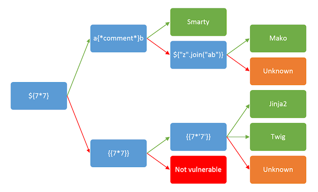
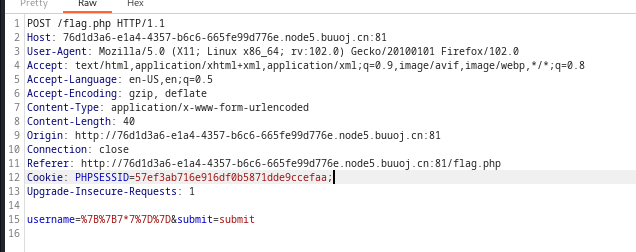
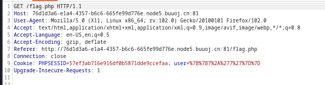
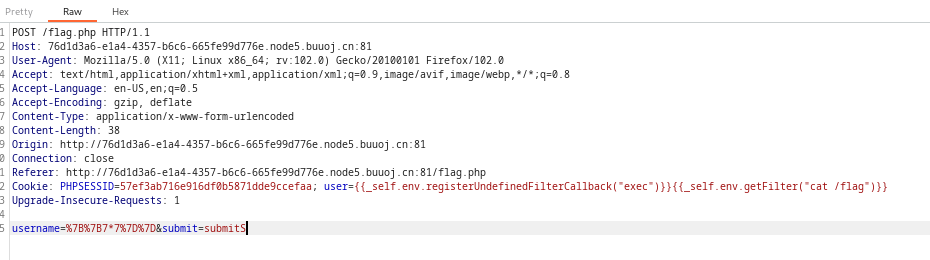

# Cookie Is So Stable


just a practice.

  

if you want to [learn more about SSTI](https://tryhackme.com/room/learnssti)

  


  

至于为什么是SSTI，在尝试SQL Injection和XSS没什么效果之后（其实专门找的for SSTI）

  

和写的笔记[SSTI](https://66lueflam144.github.io/SSTI/)中的内容一样，我们要分几个主要步骤进行：

  

{{&lt; admonition type=info title=&#34;steps&#34;&gt;}}

判断是否可SSTI&lt;br&gt;

判断注入点&lt;br&gt;

判断template engine类型&lt;br&gt;

Syntax&lt;br&gt;

Payload

{{&lt; /admonition &gt;}}

  
  
  

# 判断

  
  

可SSTI才来做的，所以next。

  

## template engine

  

把图片搬出来

  



  

- `{7*7}`

  


  

- `{{7*7}}`和`{{7*&#39;7&#39;}}`一样

  


  

依照之前经验，猜是Twig

  

&lt;br&gt;

  

## 注入点

  

然后我们看request

  

在submit阶段：

  



  

login状态：

  



  
  

看到cookie的改变，也就明白为什么叫做cookie is so stable了。

  

通过response也可以轻松看到显现点在哪里。

  

所以注入点找到，在cookie后的`user`变量。

  

## Syntax

  
  

打开这个库[SSTI payloads](https://github.com/swisskyrepo/PayloadsAllTheThings/tree/master/Server%20Side%20Template%20Injection)，找到关于Twig的部分。

  

我们需要利用的是`Code Execution`部分的`{{_self.env.registerUndefinedFilterCallback(&#34;exec&#34;)}}{{_self.env.getFilter(&#34;id&#34;)}}`不过要做一些修改。

  

我们想要得到的是`flag`，所以修改为:

  

```payload

{{_self.env.registerUndefinedFilterCallback(&#34;exec&#34;)}}{{_self.env.getFilter(&#34;cat /flag&#34;)}}

```

  

{{&lt; admonition type=info title=&#34;解释一下&#34;&gt;}}

  

&lt;b&gt;registerUnderfinedFilterCallback(&#34;exec&#34;)&lt;/b&gt;这一部分注册了一个名为 &#34;exec&#34; 的未定义过滤器回调函数。在模板引擎的上下文中，&#34;exec&#34; 通常会与执行某些命令或代码相关联。&lt;br&gt;

&lt;b&gt;getFilter(&#34;cat /flag&#34;)&lt;/b&gt;接着调用了 &#34;getFilter&#34; 方法，并传递了一个字符串参数 &#34;cat /flag&#34;。这意味着尝试使用注册的 &#34;exec&#34; 过滤器执行特定的命令，这里是 &#34;cat /flag&#34;，即查看一个文件的内容。

{{&lt; /admonition &gt;}}

  

&lt;br&gt;

  

&lt;hr&gt;

  

最后将payload加载到注入点上

  



  

在response的显现点得到flag

---

> Author:   
> URL: https://66lueflam144.github.io/posts/8ba7d5d/  

