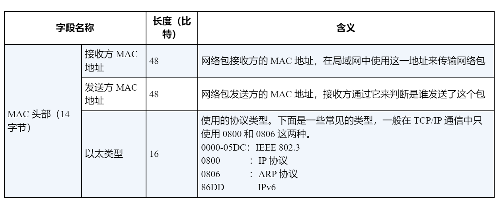
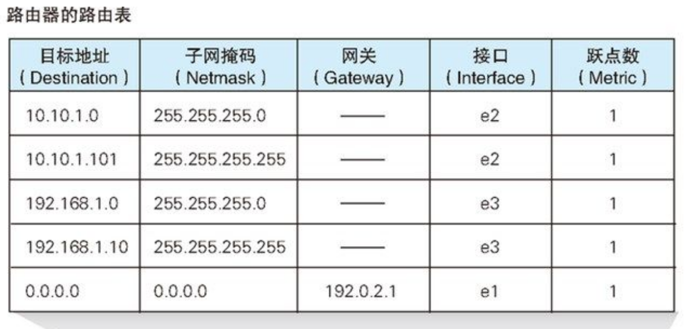

# 网络是怎样连接的2.0

&lt;!--more--&gt;
# 一个故事

简单来说就是如何从**伊邪那美和伊邪那歧**发展到**奥林匹克山上一家**的。

&lt;br&gt;

**伊邪那家族最开始只有两个人**

一对一交流，即使可能要绕柱走也没什么。

这个时候就是很安详的，you send i receive。

&lt;br&gt;

**子神加入**

- 多了一个，三人三线依旧够用。
- 再多一个，四人六线凑合。
- 再多一个，给大家画个五角星吧……
……
越来越多，联系越来越复杂，最后编成了无法解开的线团……&lt;br&gt;

所以出现了新装备——**集线器**

大家的线都连到集线器上面，通知大家吃午饭就方便多了

&lt;br&gt;因为只要往里面发一个“吃午饭”的消息，所有连到这个集线器上的人都可以收到这个消息。
就像一个公告栏。
就这么安稳的生活了一阵子。
&lt;br&gt;

&lt;br&gt;
&lt;hr&gt;

**蛐蛐别人于是升级1.0**

某天子神A想和子神B 蛐蛐 子神C，由于大家比较蠢得可以，A直接往集线器上发了蛐蛐消息，于是大家就都看见了。

A尴尬得连夜逃离家族。

两位祖宗觉得虽然但是——是集线器的错误。所以动手改造。

&lt;br&gt;

**改造内容如下**：
- 往集线器发消息前，一定要加一个source和destination标识，简单称为**MAC地址**，&lt;i&gt;遵守不可修改的最高宪法&lt;/i&gt;
- 收到消息的，确认destination是不是自己，不是就忽略，否则就查收。

&lt;br&gt;
大家觉得很好。
于是就这么愉快的过了段时间。

&lt;br&gt;
&lt;br&gt;

**偷看消息于是升级2.0**

由于世风日下，人心不古，发现居然有人偷看消息，家族紧急召开家族会议，围绕“虽然偷看不好但是一定是集线器的错”主题开展，对集线器再次升级。

**升级内容如下**：
- **指定一个MAC在升级后的集线器占一个端口**，按照source的MAC指定的端口发出，destination指定的MAC的端口接收，转过来也是一样的。
- 升级后的集线器叫交换机，里面内置**MAC地址表**。

考虑到家族人数逐渐指数级庞大，所以需要**多个交换机**。

&lt;br&gt;族长拿着生物遗传图谱来参考，以家庭为单位进行分组，一组连接一个交换机。

然后多个交换机之间进行连接，以完成跨家庭的消息通信。
&lt;br&gt;

例子：

在aa家的交换机的内置MAC表部分（请注意这个部分）就会是这样的：

| MAC    | 端口  |
| ------ | --- |
| aa-aa  | 1   |
| aa-bb  | 2   |
| aa-cc  | 3   |
| aa-dd  | 4   |
| bb-aa  | 5   |
| bb-bb  | 5   |
| bb-cc  | 5   |

&lt;br&gt;

注意，bb的和aa的不是一个家庭套餐，所以bb连接的是另一个交换机，而交换机互联，在这里独占的端口是5

bb家的交换机内置MAC表也同理。

&lt;br&gt;
&lt;br&gt;

**延迟过高引发不满**

因为家庭太多（从a到zzzzzzzzzzz），家庭成员也太多（从a到zzzzzzzzz），MAC表一眼望不到头，交换机在查询的时候堪比海里捞针，交换机终于发起了轰轰烈烈的罢工运动。

于是，家族又时隔很久，开了家族会议。

他们决定给交换机找助手。

于是找来了**路由器**，一个专门给交换机当交换机的交换机。（不是绕口令）&lt;br&gt;
同时为了表示支持路由器的工作，为其将消息格式也进行了升级，增加了一个叫**IP**的东西。

这么一个情景来理解路由器的日常工作

1. A和B在交换机1上，C和D在交换机2上
2. A想发消息给D
3. A发消息出去，交换机1 没在MAC表上找到匹配的D的MAC-端口
4. 交换机1 把消息发给路由器
5. 路由器面对的都是交换机，它只有交换机的地址，它怎么知道D在哪个交换机上？IP的意义就在在这里。
7. 路由器在接收到消息的时候，就查看IP，查询内置的路由表，来识别要转发到哪个交换机上。belike（192.169.0.1，看到前面的192.169.0就知道是哪台交换机作为接收者了，最后的1是指在交换机中的哪个端口）

&lt;br&gt;
HAPPY ENDING!!!
&lt;hr&gt;

# 故事的注解

&gt;这个故事有点偏专业术语点

首先来引用一句话

{{&lt; admonition tip &#34;包传输的过程&#34; true &gt;}}
从计算机发送出来的网络包，会通过集线器、路由器等设备被转发，最终到达目的地。&lt;br&gt;转发设备会根据包头部中的控制信息，在转发设备内部一个写有转发规则的表中进行查询，以此来判断包的目的地，讲包朝目的地方向进行转发。
{{&lt; /admonition &gt;}}

**以太网**
&gt;一种为多台计算机能够彼此自由和廉价地相互通信而设计的通信技术

关键词：
- MAC头部、MAC地址
- 以太类型：是一个在以太网帧中的占用两字节的字段，这一字段代表了在以太网帧中封装&#34;)了何种协议。（简单举例，IPV4）

三个性质：
1. 将包发送到 MAC 头部的接收方 MAC 地址代表的目的地
2. 用发送方 MAC 地址识别发送方
3. 用以太类型识别包的内容。

以太网并不关心包的**实际内容**，只关心发送。

在上面那个家族发展通讯的故事中，升级到2.0版本时候，组成的网络布局就是以太网级别。

&lt;br&gt;
&lt;hr&gt;

**MAC**

- 地址
网卡的 ROM 中保存着全世界唯一的 MAC 地址，这是在生产网卡时写入的，将这个值读出之后就可以对 MAC 模块进行设置，MAC 模块就知道自己对应的 MAC 地址了。

MAC地址长度为48bit，用十六进制表示

- 头部

&lt;br&gt;
&lt;hr&gt;

**集线器**

全称应该是”以太网集线器“，

- 将多条以太网双绞线或光纤集合连接在同一段物理介质下的设备。
- 集线器是运作在OSI模型中的物理层，可以让其链接的设备工作在同一网段。
- 集线器上有多个I/O端口，信号从任意一个端口进入后，会从其他端口出现。

&lt;br&gt;
&lt;hr&gt;

**交换机**

可以认为交换机的每个网线接口后面都是一块网卡。

但交换机的工作方式和网卡有一点不同。
- 网卡本身具有 MAC 地址，并通过核对收到的包的接收方 MAC 地址判断是不是发给自己的，如果不是发给自己的则丢弃；
- **交换机的端口不核对接收方 MAC 地址**，而是直接接收所有的包并存放到缓冲区中。因此，和网卡不同，&lt;u&gt;交换机的端口不具有 MAC 地址&lt;/u&gt; ！！！

交换机有MAC模块，负责讲接收到的经过处理过的信号转为数字信号，进行后续的处理，最后放入缓冲区。

&lt;br&gt;
&lt;hr&gt;

**交换机内部的MAC地址表的维护**

交换机在转发包的过程中，还需要对 MAC 地址表的内容进行维护，维护操作分为两种。

- 第一种，交换机收到网络包
	- 将sender的MAC地址和发进来的端口号记录在MAC地址表中
	- 这个记录以后可以作为以后向该sender发消息的地址
	- 交换机每次收到包（sender不限啊）都进行记录

- 第二种，删除记录。
	- 当该以太网内某台设备移动了，该记录就要删除，不然通信将出现错误
	- 删除一般是用时间来作为判定标准，过期的就会被自动删除。
	- 不删除导致的通信错误，通俗的讲，就是，人去世了，尝试给其打电话。

&lt;br&gt;
&lt;hr&gt;

**路由器**

路由器和交换机很相似，不过&lt;u&gt;路由器是基于 IP 设计的，而交换机是基于以太网设计的&lt;/u&gt;

一些对比更好区分：
- 计算机的网卡除了以太网和无线局域网之外很少见到支持其他通信技术的品种，
- 路由器的端口模块则支持除局域网之外的多种通信技术，如 ADSL、FTTH，以及各种宽带专线等，只要端口模块安装了支持这些技术的硬件即可

转发模块会根据接收到的包中的接收方 IP 地址，在路由表中进行查询，以此判断转发目标。然后，转发模块将包转移到转发目标对应的端口，端口再按照硬件的规则将包发送出去

路由器的端口具有 MAC 地址 ，因此它就能够成为以太网的发送方和接收方 。端口还具有 IP 地址，从这个意义上来说，它和计算机的网卡是一样的

路由器的各个端口都具有 MAC 地址和 IP 地址:
- 前者使其可以成为以太网的sender和receiver
- 后者，让其和网卡一样

&lt;br&gt;
&lt;hr&gt;

**路由表**

路由表的子网掩码列只表示在匹配网络包目标地址时需要对比的比特数量。
这句话的理解：

IP最后一个`.`后面的数字是主机号，前面的都是网络号，子网掩码与IP进行与运算，得到的就是子网。

- **A电脑**：192.168.0.1 &amp; 255.255.255.0 = 12.132.186.40
    
- **B电脑**：192.168.0.2 &amp; 255.255.255.0 = 12.132.186.40
    
- **C电脑**：192.168.1.1 &amp; 255.255.255.0 = 12.132.186.80
    
- **D电脑**：192.168.1.2 &amp; 255.255.255.0 = 12.132.186.80

&lt;br&gt;
&lt;hr&gt;

---

> Author:   
> URL: https://66lueflam144.github.io/posts/b576aef/  

