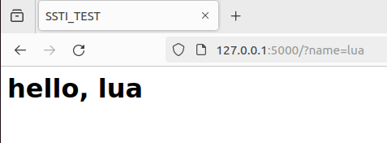
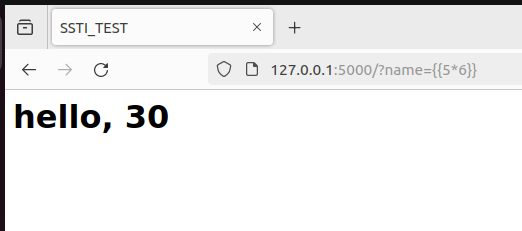

# SSTI


&lt;!--more--&gt;

## PYTHON

### Flask

示例代码

```python
from flask import Flask, request
from jinja2 import Template

app = Flask(__name__)
app.config[&#39;See&#39;] = &#34;passwd:12345&#34;

@app.route(&#34;/&#34;)

def index():
    name = request.args.get(&#39;name&#39;, &#39;guest&#39;)
    t = Template(&#39;&#39;&#39;
    &lt;html&gt;
        &lt;head&gt;
            &lt;title&gt;SSTI_TEST&lt;/title&gt;
        &lt;/head&gt;
        &lt;body&gt;
            &lt;h1&gt;hello, %s&lt;/h1&gt;
        &lt;/body&gt;
    &lt;/html&gt;
    &#39;&#39;&#39; % (name))
    return t.render()

if __name__ == &#34;__main__&#34;:
    app.run()
```

简单运行结果：





当`name={{5*6}}`的时候，就会显示`hello,30`。




说明name的参数被执行。

**SSTI的关键词就是，参数被执行。**

关于为什么会被执行，简单的说法就是，输入的内容，先加入渲染，然后一起输出。


一个不会出现SSTI的示例：
```python
from flask import Flask, request
from jinja2 import Template

app = Flask(__name__)
app.config[&#39;See&#39;] = &#34;passwd:12345&#34;

@app.route(&#34;/&#34;)

def index():
    return render_template(&#34;index.html&#34;, title=&#34;SSTI_TEST&#34;, name=request.args.get(&#34;name&#34;))


if __name__ == &#34;__main__&#34;:
    app.run()

```

```html
//index.html
&lt;html&gt;
  &lt;head&gt;
    &lt;title&gt;{{title}} - cl4y&lt;/title&gt;
  &lt;/head&gt;
 &lt;body&gt;
      &lt;h1&gt;Hello, {{name}} !&lt;/h1&gt;
  &lt;/body&gt;
&lt;/html&gt;
```

- 服务器先将前端的index.html渲染，然后从后端获取用户输入——就像往空缺的地方搭积木一样放进去，就只是放进去，不会参与解析渲染。

### Jinja2
&gt;一个python的模板引擎，被广泛利用

在上面的代码示例中就使用了Jinja2，不过造成SSTI的不是Jinja2本身代码哪里有错误，而是，用户的使用不当。
也就是：
&gt;Jinja2作为一个模板引擎，其设计允许在模板中执行复杂的表达式和调用Python函数，这为其提供了强大的功能性，但也带来了安全风险。如果未能正确处理用户输入，这些强大的功能就可能被攻击者利用，从而导致SSTI漏洞。

&lt;br&gt;

**Jinja2语法简介**：

```python
# 当前模板继承自 layout.html


# 定义了一个 body 块（block）

  &lt;ul&gt;
  # 用于遍历传递给模板的 `users` 列表。
  # 对于列表中的每一个 `user` 对象，循环将生成一个列表项（`&lt;li&gt;` 标签）
  
    # {{}}是Jinja2的变量的插值语法
    #将变量的值插入生成的HTML中
    &lt;li&gt;&lt;a href=&#34;{{ user.url }}&#34;&gt;{{ user.username }}&lt;/a&gt;&lt;/li&gt;
  
  &lt;/ul&gt;
# 块结束符


```

假设layout.html
```html
只留下了需要注意的部分
    &lt;nav&gt;
        &lt;ul&gt;
            &lt;li&gt;&lt;a href=&#34;/&#34;&gt;Home&lt;/a&gt;&lt;/li&gt;
            &lt;li&gt;&lt;a href=&#34;/about&#34;&gt;About&lt;/a&gt;&lt;/li&gt;
            &lt;li&gt;&lt;a href=&#34;/contact&#34;&gt;Contact&lt;/a&gt;&lt;/li&gt;
        &lt;/ul&gt;
    &lt;/nav&gt;
    
    &lt;main&gt;
        
        &lt;!-- 子模板会在这里插入具体内容 --&gt;
        
    &lt;/main&gt;
    
    
```
Jinja2渲染时候，会将标记着``的部分进行插值
假如传入的user列表如下：

```python
users = [
    {&#34;username&#34;: &#34;alice&#34;, &#34;url&#34;: &#34;/users/alice&#34;},
    {&#34;username&#34;: &#34;bob&#34;, &#34;url&#34;: &#34;/users/bob&#34;},
    {&#34;username&#34;: &#34;carol&#34;, &#34;url&#34;: &#34;/users/carol&#34;}
]
```

最终就会呈现下面的效果


```html
    &lt;nav&gt;
        &lt;ul&gt;
            &lt;li&gt;&lt;a href=&#34;/&#34;&gt;Home&lt;/a&gt;&lt;/li&gt;
            &lt;li&gt;&lt;a href=&#34;/about&#34;&gt;About&lt;/a&gt;&lt;/li&gt;
            &lt;li&gt;&lt;a href=&#34;/contact&#34;&gt;Contact&lt;/a&gt;&lt;/li&gt;
        &lt;/ul&gt;
    &lt;/nav&gt;
    
    &lt;main&gt;
        &lt;ul&gt;
            &lt;li&gt;&lt;a href=&#34;/users/alice&#34;&gt;alice&lt;/a&gt;&lt;/li&gt;
            &lt;li&gt;&lt;a href=&#34;/users/bob&#34;&gt;bob&lt;/a&gt;&lt;/li&gt;
            &lt;li&gt;&lt;a href=&#34;/users/carol&#34;&gt;carol&lt;/a&gt;&lt;/li&gt;
        &lt;/ul&gt;
    &lt;/main&gt;


```

---

> Author:   
> URL: https://66lueflam144.github.io/posts/f9ce7b3/  

